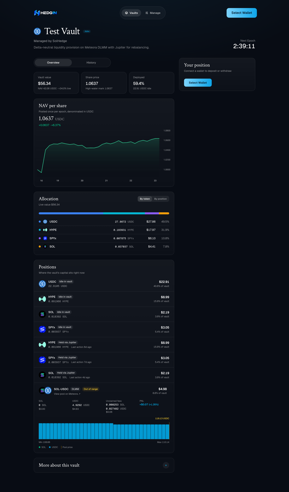
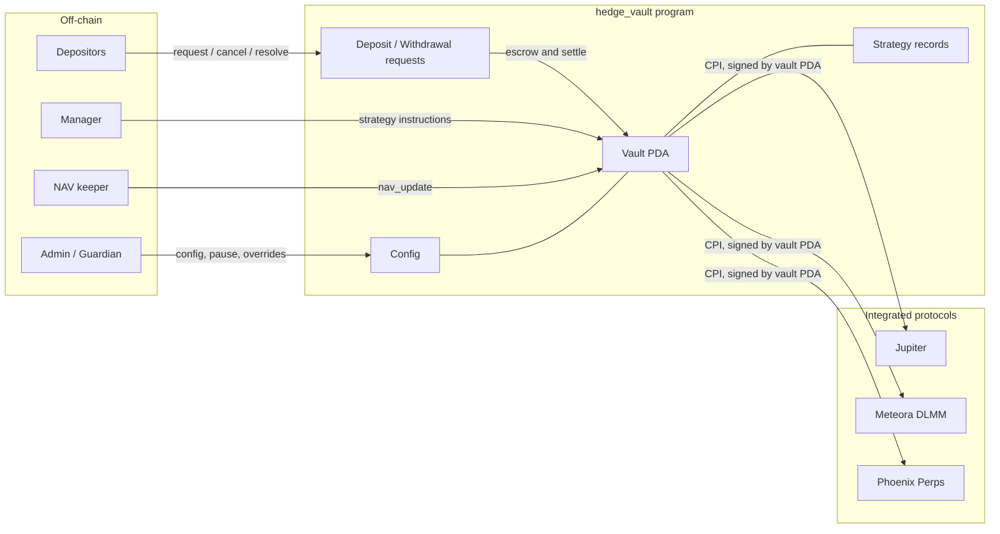
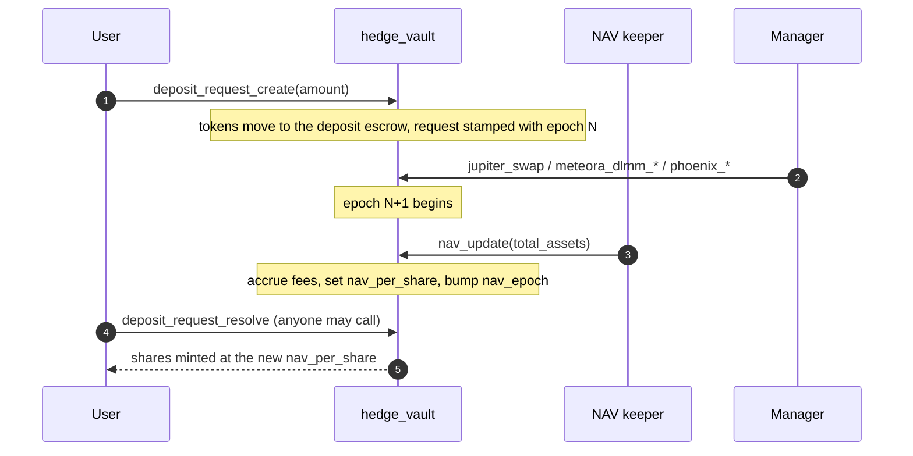
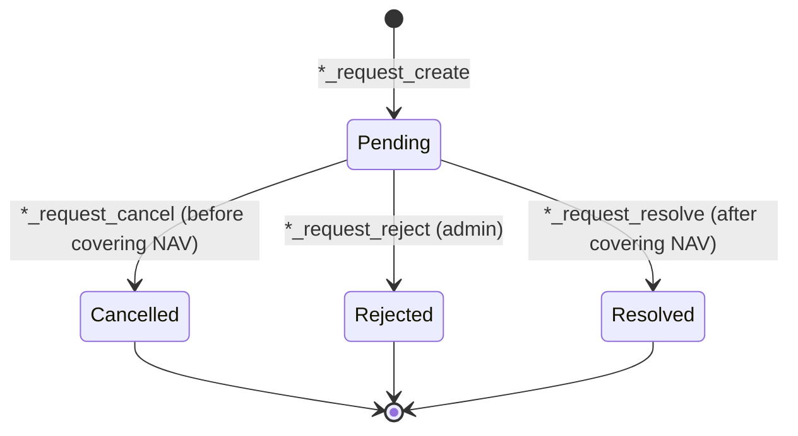
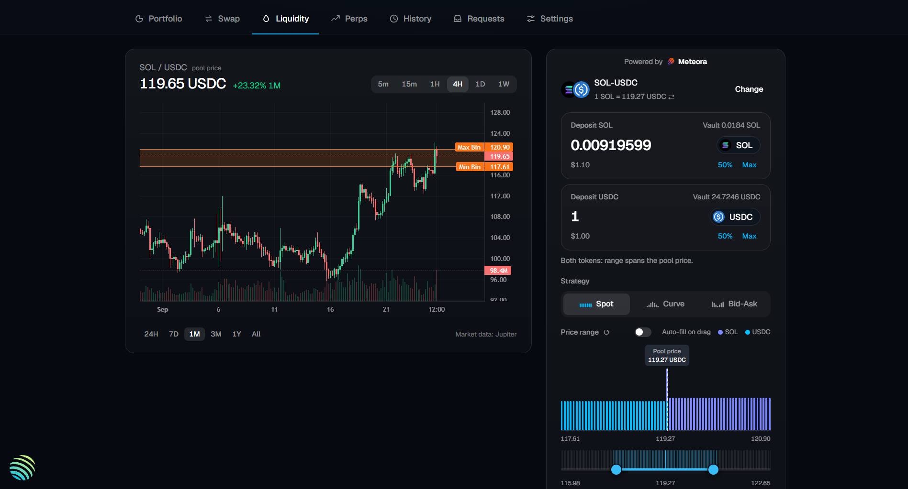
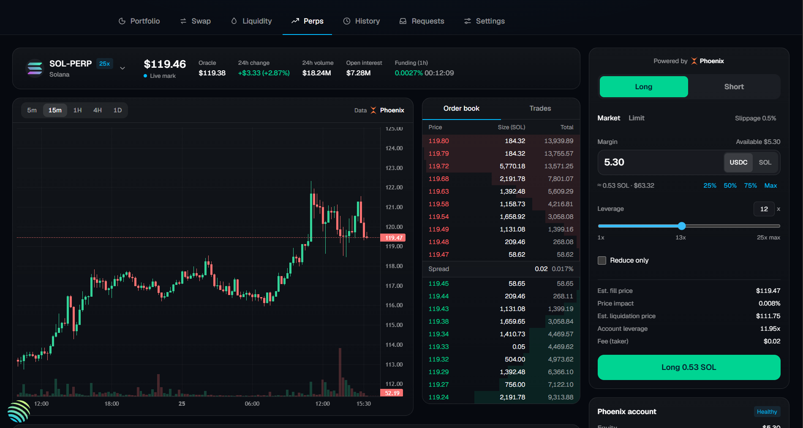
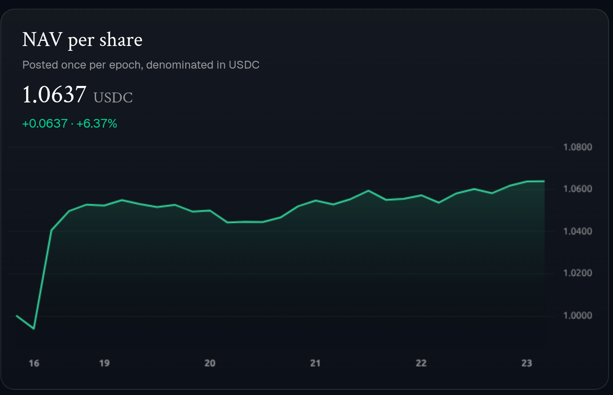

<div align="center">


# Hedgin Vault

**Managed vaults on Solana. Managers put deposits to work in Meteora DLMM, Jupiter and Phoenix Perps, and the program keeps custody.**

[-9945FF?logo=solana&logoColor=white)](https://solscan.io/account/r2ahBQ6gbPCJ9FxBymYcXuwXi8NmenRry7SE7QR7FAt)
[](https://www.anchor-lang.com/)
[](https://www.rust-lang.org/)
[](#testing)

`r2ahBQ6gbPCJ9FxBymYcXuwXi8NmenRry7SE7QR7FAt`

</div>

<p align="center">
  
</p>

---

## Contents

- [Overview](#overview)
- [Architecture](#architecture)
- [Roles](#roles)
- [Vault lifecycle](#vault-lifecycle)
- [Integrations](#integrations)
- [Fees](#fees)
- [Safety guards](#safety-guards)
- [Accounts](#accounts)
- [Instruction reference](#instruction-reference)
- [Getting started](#getting-started)
- [Testing](#testing)
- [Repository layout](#repository-layout)
- [Related repositories](#related-repositories)
- [Security](#security)

## Overview

Hedge Vault is an Anchor program for managed funds on Solana. Users deposit a single token (for
example USDC) and receive vault shares. A whitelisted **manager** moves that capital between DeFi
protocols, but only through instructions the program defines. The vault PDA owns every token
account and protocol position, so the manager can trade with the funds but can never withdraw them.

- **Protocol-gated strategies.** Managers can only reach Meteora DLMM, Jupiter and Phoenix
  Perpetuals, through CPIs the program checks. There is no arbitrary CPI.
- **Epoch-based NAV.** An off-chain keeper values the vault and posts `total_assets` once per
  4-hour epoch. The program derives `nav_per_share` (1e9 precision) and rejects moves larger than a
  configured deviation bound.
- **Async deposits and withdrawals.** Requests are escrowed, then settled at the first NAV posted
  after them. Nobody can deposit or exit at a stale price. Settlement is permissionless.
- **Fees as dilution.** Management (annualised AUM) and performance (above high-water mark) fees are
  accrued as share counters at each NAV update and minted on claim. Fee changes never touch
  depositor token balances directly.

## Architecture



The program holds custody and enforces the rules. Pricing is done off-chain: the keeper reads every
`Strategy` record, values the positions it points to, and posts one number per epoch.

## Roles

| Role | Holder | Can do |
| --- | --- | --- |
| **Admin** | `config.admin` | Configure the protocol, whitelist or remove managers, override NAV, reject requests, claim platform fees. Admin transfer is two-step (`admin_accept`). |
| **Guardian** | `config.guardian` | Pause the whole protocol (`config_pause`) or one vault (`vault_pause`). The admin unpauses the protocol, and the vault's manager unpauses a vault with `vault_update`. |
| **NAV updater** | `config.nav_updater` | Post `total_assets` once per epoch per vault (`nav_update`). |
| **Treasury** | `config.treasury_authority` | Receives platform fee shares and 10% of fees claimed from protocol positions. |
| **Manager** | Holder of a `["manager", authority]` PDA | Create and run vaults, open and close strategies, claim manager fees. |
| **Depositor** | Anyone | Create and cancel their own requests. Anyone can resolve a request. |

## Vault lifecycle

Time is split into 4-hour epochs (`unix_ts / 14_400`). A request made in epoch *N* settles at the
first NAV posted in a later epoch.



Withdrawals follow the same pattern. `withdrawal_request_create` escrows shares, and
`withdrawal_request_resolve` burns them and pays out at the next NAV. A request can be cancelled
until a NAV that covers it has been posted. Each request escrows the rent for the payout token
account, so a third party can resolve it without paying out of pocket.



## Integrations

Each open position is tracked by a `Strategy` account (`["strategy", vault, protocol_account]`). Its
`StrategyType` tells the keeper what to value and tells `vault_close_strategy` what must be empty
before the record can be closed.

| Strategy | Protocol | What the vault holds |
| --- | --- | --- |
| `JupiterSwap { target_mint }` | Jupiter aggregator | A vault-owned token account for `target_mint` |
| `MeteoraDlmm { position }` | Meteora DLMM | A concentrated-liquidity position owned by the vault PDA |
| `PhoenixPerp { trader_account }` | Phoenix Perpetuals | A cross-margin trader account whose authority is the vault PDA |

### Meteora DLMM: concentrated liquidity



- `meteora_dlmm_initialize_position` opens a position 1–70 bins wide.
  `meteora_dlmm_extend_position` adds 1–91 bins to the upper end per call, up to 1,400 bins total.
  The manager pays the extra rent.
- `meteora_dlmm_add_liquidity` and `meteora_dlmm_remove_liquidity` cover the full position.
  The `_range` variants take inclusive bin bounds for partial unwinds and fee claims.
- `meteora_dlmm_claim_fee` sends 10% of claimed fees to the treasury.
- Wide positions must be split across several transactions to stay within Solana's size and
  compute limits.

### Jupiter: swaps

`jupiter_initialize_strategy` registers a target mint. `jupiter_swap` then routes through Jupiter
with the vault PDA as signer. Embedded slippage is capped by `config.max_slippage_bps` (3% when
unset). Token-ledger routes are supported.

### Phoenix Perps: hedging



`phoenix_initialize_strategy` registers the vault PDA as a Phoenix trader.
`phoenix_deposit_funds` / `phoenix_withdraw_funds` move collateral,
`phoenix_place_market_order` / `phoenix_place_limit_order` / `phoenix_cancel_orders` trade, and
`phoenix_ember_withdraw` converts Phoenix's canonical collateral back to USDC.

## Fees

| Fee | Set by | Accrues |
| --- | --- | --- |
| Manager performance fee | Vault (`performance_fee_bps`) | On NAV gains above the high-water mark |
| Manager management fee | Vault (`management_fee_bps`) | Annualised on AUM, prorated per second |
| Platform performance / management fee | Config | Alongside the manager fees, to the treasury |
| Protocol claim fee | Constant, 10% | On fees claimed from DLMM positions |

Fees are settled at `nav_update` as share dilution into `unclaimed_manager_fee_shares` and
`unclaimed_platform_fee_shares`, and are minted by `vault_claim_manager_fee` and
`config_claim_platform_fee`. There are no deposit or withdrawal fees. A manager fee increase takes
effect only after a **7-day delay**, which gives depositors time to exit.

<p align="center">
  
</p>

## Safety guards

| Guard | Mechanism |
| --- | --- |
| Custody | All token accounts, positions and trader accounts are owned by the vault PDA |
| Allowed actions | Only program-defined CPIs into Jupiter, Meteora DLMM and Phoenix |
| NAV sanity | `nav_update` is rejected if assets fall below the vault's idle balance or move more than `max_nav_deviation_bps`. Only the admin can go past the bound, with `nav_override` |
| One NAV per epoch | `EPOCH_DURATION = 4h`. Requests settle only at a NAV posted after them |
| Slippage | Jupiter routes capped at `max_slippage_bps` |
| Fee changes | 7-day timelock on manager fee increases |
| Emergency stop | Guardian can pause the protocol or one vault. The guardian cannot unpause |
| Admin key rotation | Two-step nominate / `admin_accept` |
| Compliance | Admin can refund pending requests with `*_request_reject`, even while paused |

> `max_epoch_outflow_bps` (a per-epoch withdrawal cap) exists in `Config` but is currently not
> enforced.

## Accounts

| Account | Seeds | Purpose |
| --- | --- | --- |
| `Config` | `["config"]` | Protocol roles, platform fees, limits, status |
| `Manager` | `["manager", authority]` | Manager whitelist entry |
| `Vault` | `["vault", id]` | NAV, supply, fee counters, status. `id` comes from `config.next_vault_id` |
| Share mint | `["share_mint", vault]` | Vault share token |
| Deposit escrow | `["deposit_escrow", vault]` | Pending deposits |
| Share escrow | `["share_escrow", vault]` | Shares of pending withdrawals |
| `Strategy` | `["strategy", vault, protocol_account]` | One record per position: the target mint, DLMM position or Phoenix trader account |
| `DepositRequest` | `["deposit_request", vault, user]` | Pending deposit |
| `WithdrawalRequest` | `["withdrawal_request", vault, user]` | Pending withdrawal |

The full schema, with field sizes and an ER diagram, is in [`docs/accounts.md`](docs/accounts.md).

## Instruction reference

<details>
<summary><b>Admin</b></summary>

| Instruction | Description |
| --- | --- |
| `config_initialize` | Create the global config |
| `config_update` | Update roles, fees and limits. Unpause. Nominate a new admin |
| `config_migrate` | Grow a v1 config account to the current layout |
| `config_add_manager` / `config_remove_manager` | Whitelist or remove a manager |
| `config_claim_platform_fee` | Mint accrued platform fee shares to the treasury |
| `nav_override` | Post a NAV outside the deviation bound |
| `deposit_request_reject` / `withdrawal_request_reject` | Refund a pending request |
| `admin_accept` | Pending admin accepts the transfer |

</details>

<details>
<summary><b>Guardian and NAV updater</b></summary>

| Instruction | Description |
| --- | --- |
| `config_pause` | Pause the protocol |
| `vault_pause` | Pause one vault |
| `nav_update` | Post `total_assets` for the current epoch, settle fees |

</details>

<details>
<summary><b>Manager</b></summary>

| Instruction | Description |
| --- | --- |
| `vault_initialize` / `vault_update` / `vault_close` | Vault lifecycle |
| `vault_claim_manager_fee` | Mint accrued manager fee shares |
| `vault_close_strategy` | Close an emptied strategy record |
| `jupiter_initialize_strategy` / `jupiter_swap` | Jupiter swaps |
| `meteora_dlmm_initialize_position` / `meteora_dlmm_extend_position` | Open and widen a DLMM position |
| `meteora_dlmm_add_liquidity` / `meteora_dlmm_remove_liquidity` / `meteora_dlmm_remove_liquidity_range` | Manage DLMM liquidity |
| `meteora_dlmm_claim_fee` / `meteora_dlmm_claim_fee_range` | Claim DLMM fees (10% to treasury) |
| `phoenix_initialize_strategy` | Register the vault as a Phoenix trader |
| `phoenix_deposit_funds` / `phoenix_withdraw_funds` / `phoenix_ember_withdraw` | Move perp collateral |
| `phoenix_place_market_order` / `phoenix_place_limit_order` / `phoenix_cancel_orders` | Trade perps |

</details>

<details>
<summary><b>Depositor</b></summary>

| Instruction | Description |
| --- | --- |
| `deposit_request_create` / `deposit_request_cancel` / `deposit_request_resolve` | Deposit flow |
| `withdrawal_request_create` / `withdrawal_request_cancel` / `withdrawal_request_resolve` | Withdrawal flow |

</details>

## Getting started

**Prerequisites:** Rust 1.79+, Solana CLI, [Anchor 0.31.1](https://www.anchor-lang.com/docs/installation), Node.js and Yarn.

```sh
yarn install
anchor build
```

The build writes the program to `target/deploy/hedge_vault.so` and the IDL to `target/idl/hedge_vault.json`.
IDLs for the integrated protocols, consumed via `declare_program!`, live in [`idls/`](idls/).

## Testing

The program is tested in-process with [LiteSVM](https://github.com/LiteSVM/litesvm), against
fixtures and real mainnet program binaries.

```sh
anchor run test-litesvm           # core flows, fees, guards, Jupiter routes
anchor run test-litesvm-phoenix   # Phoenix perps lifecycle (first run fetches mainnet binaries)
```

### QA handlers

`tests/handler/` has one script per instruction for testing against a live cluster. Each script
builds one transaction, simulates it and prints the logs. It only sends when `SEND=true`.

1. Set the cluster and wallet under `[provider]` in `Anchor.toml`.
2. Fill in the addresses under test in `tests/handler/params.ts`.
3. Run a handler by instruction name:

```sh
anchor run config-initialize             # simulate only
SEND=true anchor run config-initialize   # simulate and send
```

Jupiter handlers use the public `lite-api.jup.ag` endpoint unless `JUPITER_API_BASE_URL` /
`JUPITER_API_KEY` are set (see `.env.example`).

## Repository layout

```
programs/hedge_vault/src/
├── lib.rs              # instruction entrypoints, grouped by role
├── instructions/       # one file per instruction (Accounts + handler)
├── state/              # Config, Manager, Vault, Strategy, requests
├── protocol/           # hand-rolled Jupiter and Phoenix CPI encoders
├── utils/              # seeds, safe math, token and payout helpers
├── constants.rs        # epoch length, precision, fee constants
├── error.rs
└── events.rs
idls/                   # Jupiter and Meteora DLMM IDLs
tests/litesvm/          # LiteSVM integration tests
tests/litesvm-phoenix/  # Phoenix perps LiteSVM tests
tests/handler/          # per-instruction QA scripts
docs/                   # account model, architecture notes
```

## Related repositories

| Repo | Purpose |
| --- | --- |
| [HedginVault/programs](https://github.com/HedginVault/programs) | Mirror of this program |
| [HedginVault/app](https://github.com/HedginVault/app) | Next.js app for depositors and managers |
| [HedginVault/keeper](https://github.com/HedginVault/keeper) | NAV keeper: values strategies and posts `nav_update` each epoch |

## Security

The program is deployed on **mainnet for testing only** and has **not been audited**. Do not
deposit funds you cannot afford to lose. Please report vulnerabilities privately to the
maintainers rather than opening a public issue.

Further reading: [account data model](docs/accounts.md) ·
[architecture evolution](docs/architecture-evolution.md)
