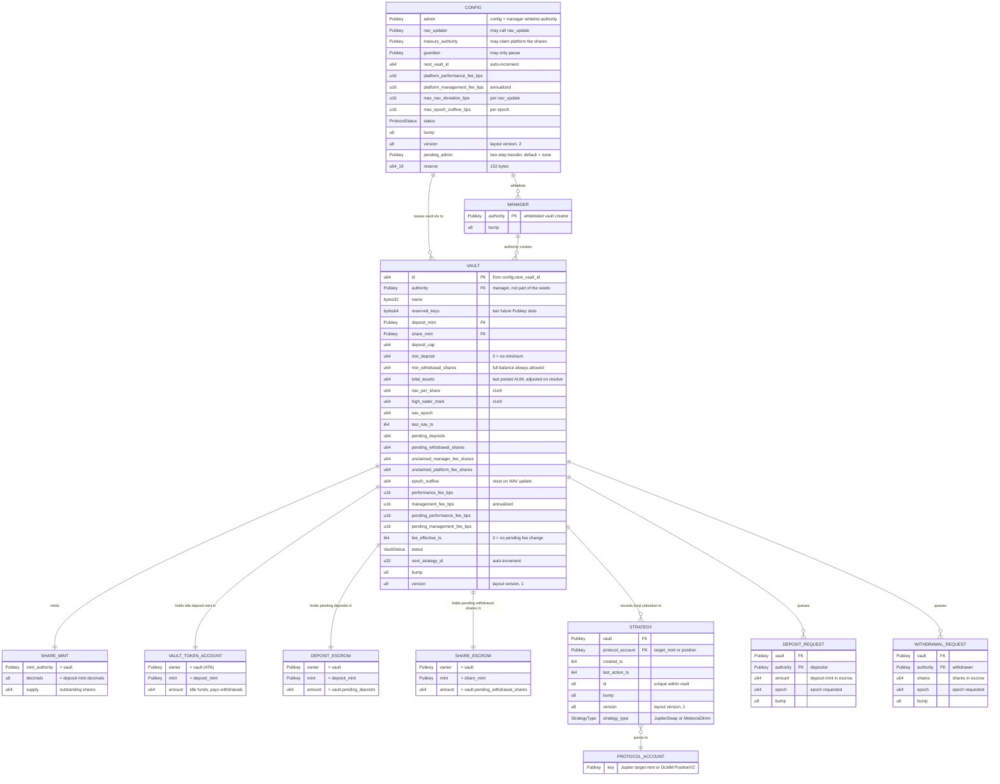
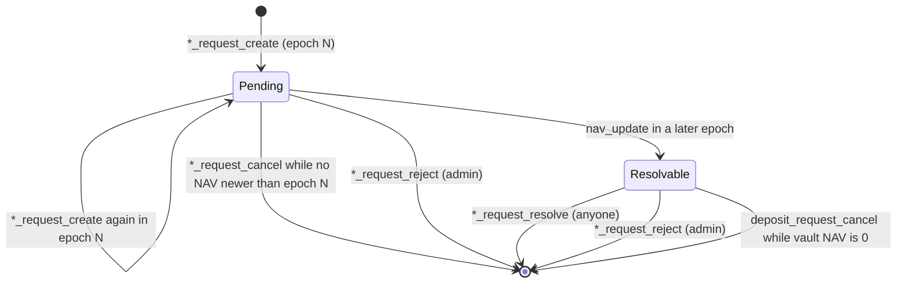
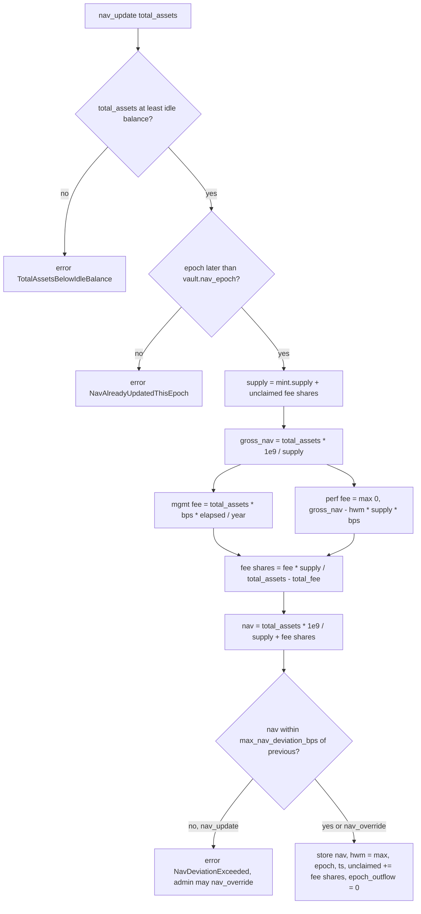

# Hedge Vault — Account Data Model

Every on-chain account the program owns, read like a database schema. All
accounts are PDAs of the program (`r2ahBQ6gbPCJ9FxBymYcXuwXi8NmenRry7SE7QR7FAt`)
except the SPL token accounts and share mint, which are owned by the token
programs but whose authority is a program PDA.

Sizes include the 8-byte Anchor discriminator. Amounts are raw token units
(no decimals applied). `bps` = basis points, 10 000 = 100 %.

## Entity relationship diagram

## Tables

### Config (singleton)

| | |
| --- | --- |
| Seeds | `["config"]` |
| Layout | zero-copy, 352 bytes (v2; the v1 account deployed at 160 bytes is grown once by `config_migrate`) |
| Created by | `config_initialize` (admin = signer) |
| Mutated by | `config_update`, `admin_accept`, `config_pause`, `config_migrate`, `vault_initialize` (`next_vault_id`) |
| Closed by | never |

| Field | Type | Description |
| --- | --- | --- |
| `admin` | `Pubkey` | Can update config and add/remove managers. |
| `nav_updater` | `Pubkey` | Only signer allowed to call `nav_update`. |
| `treasury_authority` | `Pubkey` | Only signer allowed to call `config_claim_platform_fee`. |
| `guardian` | `Pubkey` | Only signer allowed to call `config_pause`. Cannot unpause or change anything else. |
| `next_vault_id` | `u64` | Incremented on every `vault_initialize`; becomes `vault.id`. |
| `platform_performance_fee_bps` | `u16` | Platform cut of profit above the vault high water mark. |
| `platform_management_fee_bps` | `u16` | Annualized platform fee on total assets, prorated by seconds since last NAV. |
| `max_nav_deviation_bps` | `u16` | `nav_update` is rejected if NAV per share moves more than this from the previous value. `nav_override` (admin) ignores it. |
| `max_epoch_outflow_bps` | `u16` | Withdrawal resolutions fail once payouts since the last NAV update exceed this share of total assets. |
| `status` | `ProtocolStatus` | `Normal` (0), `Paused` (1), `ReduceOnly` (2). Starts `Paused`. |
| `bump` | `u8` | PDA bump. |
| `version` | `u8` | Layout version, currently 2. `config_migrate` sets it after growing a v1 account. |
| `pending_admin` | `Pubkey` | Nominated by `config_update`; becomes `admin` when it signs `admin_accept`. `Pubkey::default()` when no transfer is pending. Account bytes 168–199. |
| `reserve` | `[u64; 19]` | 152 zeroed bytes for future fields. Appended fields treat 0 as "not set". |

Status gates: `Normal` required for deposits, vault creation, strategy execute/exit and deposit resolution. `Paused` blocks withdrawal requests and resolutions too. `nav_update`, `nav_override` and fee claims are never gated.

Deposit mint rules (`vault_initialize`, rechecked on every `deposit_request_create`): Token-2022 mints are rejected if they carry a non-zero transfer fee, a transfer hook program, NonTransferable, frozen-by-default accounts, ConfidentialMintBurn, or any extension type the program cannot parse. PermanentDelegate is allowed and means the issuer can move vault balances.

NAV safety checks, in order: `total_assets >= vault_token_account.amount` (both update paths), one update per epoch, deviation bound (`nav_update` only), fee must be below total assets.

### Manager

| | |
| --- | --- |
| Seeds | `["manager", authority]` |
| Layout | borsh, 41 bytes |
| Created by | `config_add_manager` (admin) |
| Closed by | `config_remove_manager` (admin); existing vaults keep working |

| Field | Type | Description |
| --- | --- | --- |
| `authority` | `Pubkey` | Wallet allowed to call `vault_initialize`. |
| `bump` | `u8` | PDA bump. |

### Vault

| | |
| --- | --- |
| Seeds | `["vault", id (u64 LE)]` |
| Layout | zero-copy, 424 bytes (89 reserved), version 1 |
| Created by | `vault_initialize` (manager) |
| Mutated by | `vault_update`, `nav_update`, `nav_override`, request/cancel/resolve/reject, fee claims, strategy init |
| Closed by | `vault_close` when share supply, pending totals and unclaimed fee shares are all 0 |

| Field | Type | Description |
| --- | --- | --- |
| `id` | `u64` | Sequential id from config. |
| `authority` | `Pubkey` | Manager; signs all strategy and vault management instructions. Not part of the seeds, so it can be reassigned by a future instruction. |
| `name` | `[u8; 32]` | UTF-8, zero padded. |
| `reserved_keys` | `[u8; 64]` | Reserved for two future `Pubkey` fields (e.g. `pending_authority`, `delegate`). Metadata beyond `name` lives off-chain. |
| `deposit_mint` | `Pubkey` | Only mint accepted for deposits and paid on withdrawals. |
| `share_mint` | `Pubkey` | Tokenized share mint, see below. |
| `deposit_cap` | `u64` | `total_assets + pending_deposits` must stay below this on `deposit_request_create`. |
| `min_deposit` | `u64` | `deposit_request_create` rejects smaller amounts. 0 disables. |
| `min_withdrawal_shares` | `u64` | `withdrawal_request_create` rejects fewer shares unless the request is the withdrawer's full share balance. 0 disables. |
| `total_assets` | `u64` | AUM posted by the updater. `+amount` on deposit resolve, `-amount` on withdrawal resolve so NAV stays constant between updates. |
| `nav_per_share` | `u64` | Value of one share in deposit mint, scaled by 1e9. Starts at 1e9. |
| `high_water_mark` | `u64` | Highest `nav_per_share` after fees. Performance fee only on NAV above it. |
| `nav_epoch` | `u64` | `unix_ts / 86400` of the last NAV update. Requests resolve only if `nav_epoch > request.epoch`. |
| `last_nav_ts` | `i64` | Timestamp of last update, start of the management fee accrual window. |
| `pending_deposits` | `u64` | Mirrors the deposit escrow balance. |
| `pending_withdrawal_shares` | `u64` | Mirrors the share escrow balance. |
| `unclaimed_manager_fee_shares` | `u64` | Shares owed to the manager, counted as supply in NAV math until minted by `vault_claim_manager_fee`. |
| `unclaimed_platform_fee_shares` | `u64` | Same for the platform, minted by `config_claim_platform_fee`. |
| `epoch_outflow` | `u64` | Deposit mint paid to withdrawals since the last NAV update. Reset to 0 by `nav_update` / `nav_override`. Cap is `(total_assets + epoch_outflow) * max_epoch_outflow_bps / 10_000`. |
| `next_strategy_id` | `u32` | Incremented on every strategy init. |
| `performance_fee_bps` | `u16` | Manager cut of profit above high water mark. |
| `management_fee_bps` | `u16` | Annualized manager fee on total assets. |
| `pending_performance_fee_bps`, `pending_management_fee_bps` | `u16` | Fee pair scheduled by `vault_update` when either fee increases. |
| `fee_effective_ts` | `i64` | `nav_update` applies the pending pair once `now >= fee_effective_ts`, after charging the period at the old rate. Decreases apply immediately. 0 = nothing pending. |
| `status` | `VaultStatus` | `Normal` (0), `Paused` (1), `ReduceOnly` (2). Starts `Normal`. |
| `deposit_paused` | `u8` | Nonzero blocks `deposit_request_create` and `deposit_request_resolve`, independent of `status`. Set by the manager via `vault_update`. Cancel and reject stay open. |
| `withdrawal_paused` | `u8` | Same for `withdrawal_request_create` and `withdrawal_request_resolve`. |
| `bump` | `u8` | PDA bump. |
| `version` | `u8` | Layout version, currently 1. |

Derived value used by `nav_update`: `virtual_supply = share_mint.supply + unclaimed_manager_fee_shares + unclaimed_platform_fee_shares`.

### Vault-owned token accounts

| Account | Seeds / address | Mint | Purpose |
| --- | --- | --- | --- |
| Share mint | `["share_mint", vault]` | — | SPL Token mint, decimals = deposit mint decimals, mint authority = vault, no freeze authority. `supply` = shares held by users plus escrow. |
| Vault token account | ATA(vault, deposit_mint) | deposit mint | Idle funds. Source for strategy deployments and withdrawal payouts. |
| Strategy token accounts | ATA(vault, any mint) | any | Created on demand by `jupiter_swap` and `meteora_dlmm_remove_liquidity` (Jupiter target mints, DLMM token X/Y). |
| Deposit escrow | `["deposit_escrow", vault]` | deposit mint | Pending deposits. Balance always equals `vault.pending_deposits`. |
| Share escrow | `["share_escrow", vault]` | share mint | Pending withdrawal shares. Balance always equals `vault.pending_withdrawal_shares`. Shares are burned from here on resolve. |

### Strategy

| | |
| --- | --- |
| Seeds | `["strategy", vault, protocol_account]` |
| Layout | borsh, 97 bytes, version 1 |
| Created by | `jupiter_initialize_strategy`, `meteora_dlmm_initialize_position` (manager) |
| Mutated by | `jupiter_swap`, `meteora_dlmm_*` liquidity and claim fee actions (`last_action_ts` only) |
| Closed by | `vault_close_strategy`; also closes the protocol account if it is empty |

| Field | Type | Description |
| --- | --- | --- |
| `vault` | `Pubkey` | Parent vault. |
| `created_ts` | `i64` | Creation timestamp. |
| `last_action_ts` | `i64` | Last protocol action. |
| `id` | `u32` | Sequential within the vault. |
| `bump` | `u8` | PDA bump. |
| `version` | `u8` | Layout version, currently 1. |
| `strategy_type` | `StrategyType` | Enum, see below. |

`StrategyType` (borsh, 1 tag byte + 32 bytes):

| Tag | Variant | Payload | `protocol_account` seed |
| --- | --- | --- | --- |
| 0 | `JupiterSwap` | `target_mint: Pubkey` | target mint |
| 1 | `MeteoraDlmm` | `position: Pubkey` | DLMM `PositionV2` owned by the vault |

No amounts are stored. Utilization is read from the protocol accounts and token balances off-chain.

### DepositRequest

| | |
| --- | --- |
| Seeds | `["deposit_request", vault, depositor]` (one per user per vault) |
| Layout | borsh, 121 bytes (24 reserved) |
| Created by | `deposit_request_create` (depositor pays rent, plus the payout-account rent it escrows) |
| Mutated by | `deposit_request_create` again in the same epoch (amount accumulates) |
| Closed by | `deposit_request_cancel` (depositor, only while `vault.nav_epoch <= epoch` or vault NAV is 0), `deposit_request_resolve` (anyone, only when `vault.nav_epoch > epoch`) or `deposit_request_reject` (admin, any time before resolution); rent returns to `authority` |

| Field | Type | Description |
| --- | --- | --- |
| `authority` | `Pubkey` | Depositor; receives minted shares in their share ATA. |
| `vault` | `Pubkey` | Target vault. |
| `amount` | `u64` | Deposit mint held in deposit escrow. |
| `epoch` | `u64` | Epoch of the first request. A request from an older epoch must be resolved before a new one is accepted. |
| `bump` | `u8` | PDA bump. |
| `rent_escrow` | `u64` | Lamports held above this account's own rent, for creating the depositor's share account at settlement. Refunded with the rent when the request closes unused. 0 on requests created before the escrow existed. |

On resolve: `shares = amount * 1e9 / vault.nav_per_share`. Fails while NAV is 0 or if the result is 0 shares; while NAV is 0 the depositor may cancel.

### WithdrawalRequest

| | |
| --- | --- |
| Seeds | `["withdrawal_request", vault, withdrawer]` (one per user per vault) |
| Layout | borsh, 121 bytes (24 reserved) |
| Created by | `withdrawal_request_create` (withdrawer pays rent, plus the payout-account rent it escrows) |
| Mutated by | `withdrawal_request_create` again in the same epoch (shares accumulate) |
| Closed by | `withdrawal_request_cancel` (withdrawer, only while `vault.nav_epoch <= epoch`), `withdrawal_request_resolve` (anyone, only when `vault.nav_epoch > epoch`) or `withdrawal_request_reject` (admin, any time before resolution); rent returns to `authority` |

| Field | Type | Description |
| --- | --- | --- |
| `authority` | `Pubkey` | Withdrawer; receives deposit mint in their ATA. |
| `vault` | `Pubkey` | Target vault. |
| `shares` | `u64` | Shares held in share escrow. |
| `epoch` | `u64` | Epoch of the first request. |
| `bump` | `u8` | PDA bump. |
| `rent_escrow` | `u64` | Lamports held above this account's own rent, for creating the withdrawer's payout account at settlement, or their share account if the request is rejected instead. Refunded with the rent when the request closes unused. |

On resolve: `amount = shares * vault.nav_per_share / 1e9`, paid from the vault token account, which must hold at least that balance, and subject to the per-epoch outflow cap.

### Why a request carries rent

Settlement is permissionless and admin rejection is not signed by the owner, so neither can be asked
to fund a token account for somebody else. Creating the payout account with the request does not work
either: it sits empty until settlement, so its owner can close it to reclaim the rent and leave the
request unsettleable by anyone. Each request therefore escrows the rent for the one payout account it
may need, sized as the larger of a share account and a deposit mint account, and settlement creates
that account when it is missing: the settling party funds it and the escrow repays them in the same
instruction, so settlement costs them nothing.

## Request lifecycle

## NAV update per epoch

## Events

Every state transition emits an Anchor event (`emit!`, program log data) so indexers and the
NAV updater never need to diff account snapshots.

| Event | Emitted by | Key fields |
| --- | --- | --- |
| `ConfigInitialized`, `ConfigUpdated`, `ConfigMigrated`, `ProtocolPaused` | config instructions | authorities, fee and bound bps, status, version |
| `AdminNominated`, `AdminAccepted` | `config_update`, `admin_accept` | admin, pending_admin, previous_admin |
| `ManagerAdded`, `ManagerRemoved` | `config_add_manager`, `config_remove_manager` | authority |
| `VaultInitialized`, `VaultUpdated`, `VaultClosed` | vault instructions | vault, id, authority, mints, fees, cap, status |
| `NavUpdated` | `nav_update`, `nav_override` | vault, epoch, total_assets, nav_per_share, high_water_mark, fee shares, `overridden` |
| `ManagerFeeClaimed`, `PlatformFeeClaimed` | fee claims | vault, authority, shares |
| `DepositRequested`, `DepositCancelled`, `DepositResolved` | deposit flow | vault, authority, amount, pending_amount, epoch, shares, nav_per_share |
| `WithdrawalRequested`, `WithdrawalCancelled`, `WithdrawalResolved` | withdrawal flow | vault, authority, shares, pending_shares, epoch, amount, nav_per_share |
| `DepositRejected`, `WithdrawalRejected` | `*_request_reject` | vault, authority, amount or shares |
| `StrategyInitialized`, `StrategyClosed` | strategy lifecycle | vault, strategy, id, strategy_type |
| `JupiterSwapped` | `jupiter_swap` | vault, strategy, source/destination mint, amount |
| `MeteoraDlmmLiquidityAdded`, `MeteoraDlmmLiquidityRemoved` | DLMM liquidity | vault, strategy, position, amount_x/amount_y or bps_to_remove |
| `MeteoraDlmmFeeClaimed` | `meteora_dlmm_claim_fee` | vault, strategy, position, claimed amount_x/amount_y, treasury_amount_x/treasury_amount_y |
