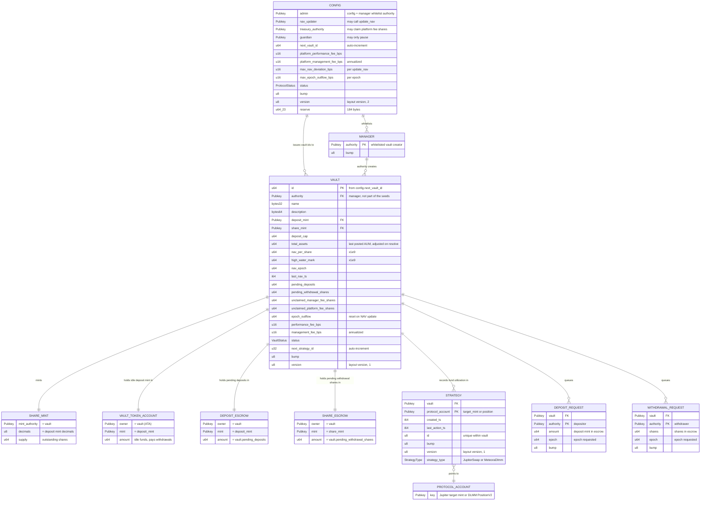
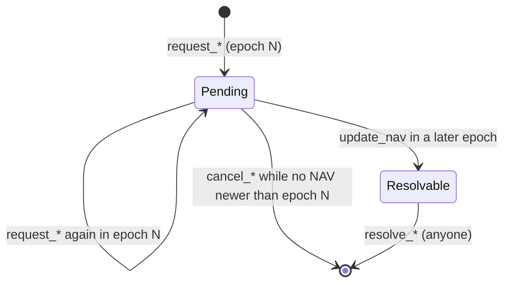

# Hedge Vault — Account Data Model

Every on-chain account the program owns, read like a database schema. All
accounts are PDAs of the program (`r2ahBQ6gbPCJ9FxBymYcXuwXi8NmenRry7SE7QR7FAt`)
except the SPL token accounts and share mint, which are owned by the token
programs but whose authority is a program PDA.

Sizes include the 8-byte Anchor discriminator. Amounts are raw token units
(no decimals applied). `bps` = basis points, 10 000 = 100 %.

## Entity relationship diagram

## Tables

### Config (singleton)

| | |
| --- | --- |
| Seeds | `["config"]` |
| Layout | zero-copy, 352 bytes (v2; the v1 account deployed at 160 bytes is grown once by `migrate_config`) |
| Created by | `initialize_config` (admin = signer) |
| Mutated by | `update_config`, `pause_protocol`, `migrate_config`, `initialize_vault` (`next_vault_id`) |
| Closed by | never |

| Field | Type | Description |
| --- | --- | --- |
| `admin` | `Pubkey` | Can update config and add/remove managers. |
| `nav_updater` | `Pubkey` | Only signer allowed to call `update_nav`. |
| `treasury_authority` | `Pubkey` | Only signer allowed to call `claim_platform_fee`. |
| `guardian` | `Pubkey` | Only signer allowed to call `pause_protocol`. Cannot unpause or change anything else. |
| `next_vault_id` | `u64` | Incremented on every `initialize_vault`; becomes `vault.id`. |
| `platform_performance_fee_bps` | `u16` | Platform cut of profit above the vault high water mark. |
| `platform_management_fee_bps` | `u16` | Annualized platform fee on total assets, prorated by seconds since last NAV. |
| `max_nav_deviation_bps` | `u16` | `update_nav` is rejected if NAV per share moves more than this from the previous value. `override_nav` (admin) ignores it. |
| `max_epoch_outflow_bps` | `u16` | Withdrawal resolutions fail once payouts since the last NAV update exceed this share of total assets. |
| `status` | `ProtocolStatus` | `Normal` (0), `Paused` (1), `ReduceOnly` (2). Starts `Paused`. |
| `bump` | `u8` | PDA bump. |
| `version` | `u8` | Layout version, currently 2. `migrate_config` sets it after growing a v1 account. |
| `reserve` | `[u64; 23]` | 184 zeroed bytes for future fields. Appended fields treat 0 as "not set". |

Status gates: `Normal` required for deposits, vault creation, strategy execute/exit and deposit resolution. `Paused` blocks withdrawal requests and resolutions too. `update_nav`, `override_nav` and fee claims are never gated.

NAV safety checks, in order: `total_assets >= vault_token_account.amount` (both update paths), one update per epoch, deviation bound (`update_nav` only), fee must be below total assets.

### Manager

| | |
| --- | --- |
| Seeds | `["manager", authority]` |
| Layout | borsh, 41 bytes |
| Created by | `add_manager` (admin) |
| Closed by | `remove_manager` (admin); existing vaults keep working |

| Field | Type | Description |
| --- | --- | --- |
| `authority` | `Pubkey` | Wallet allowed to call `initialize_vault`. |
| `bump` | `u8` | PDA bump. |

### Vault

| | |
| --- | --- |
| Seeds | `["vault", id (u64 LE)]` |
| Layout | zero-copy, 424 bytes (117 reserved), version 1 |
| Created by | `initialize_vault` (manager) |
| Mutated by | `update_vault`, `update_nav`, `override_nav`, request/cancel/resolve, fee claims, strategy init |
| Closed by | `close_vault` when share supply, pending totals and unclaimed fee shares are all 0 |

| Field | Type | Description |
| --- | --- | --- |
| `id` | `u64` | Sequential id from config. |
| `authority` | `Pubkey` | Manager; signs all strategy and vault management instructions. Not part of the seeds, so it can be reassigned by a future instruction. |
| `name` | `[u8; 32]` | UTF-8, zero padded. |
| `description` | `[u8; 64]` | UTF-8, zero padded. |
| `deposit_mint` | `Pubkey` | Only mint accepted for deposits and paid on withdrawals. |
| `share_mint` | `Pubkey` | Tokenized share mint, see below. |
| `deposit_cap` | `u64` | `total_assets + pending_deposits` must stay below this on `request_deposit`. |
| `total_assets` | `u64` | AUM posted by the updater. `+amount` on deposit resolve, `-amount` on withdrawal resolve so NAV stays constant between updates. |
| `nav_per_share` | `u64` | Value of one share in deposit mint, scaled by 1e9. Starts at 1e9. |
| `high_water_mark` | `u64` | Highest `nav_per_share` after fees. Performance fee only on NAV above it. |
| `nav_epoch` | `u64` | `unix_ts / 86400` of the last NAV update. Requests resolve only if `nav_epoch > request.epoch`. |
| `last_nav_ts` | `i64` | Timestamp of last update, start of the management fee accrual window. |
| `pending_deposits` | `u64` | Mirrors the deposit escrow balance. |
| `pending_withdrawal_shares` | `u64` | Mirrors the share escrow balance. |
| `unclaimed_manager_fee_shares` | `u64` | Shares owed to the manager, counted as supply in NAV math until minted by `claim_manager_fee`. |
| `unclaimed_platform_fee_shares` | `u64` | Same for the platform, minted by `claim_platform_fee`. |
| `epoch_outflow` | `u64` | Deposit mint paid to withdrawals since the last NAV update. Reset to 0 by `update_nav` / `override_nav`. Cap is `(total_assets + epoch_outflow) * max_epoch_outflow_bps / 10_000`. |
| `next_strategy_id` | `u32` | Incremented on every strategy init. |
| `performance_fee_bps` | `u16` | Manager cut of profit above high water mark. |
| `management_fee_bps` | `u16` | Annualized manager fee on total assets. |
| `status` | `VaultStatus` | `Normal` (0), `Paused` (1), `ReduceOnly` (2). Starts `Normal`. |
| `bump` | `u8` | PDA bump. |
| `version` | `u8` | Layout version, currently 1. |

Derived value used by `update_nav`: `virtual_supply = share_mint.supply + unclaimed_manager_fee_shares + unclaimed_platform_fee_shares`.

### Vault-owned token accounts

| Account | Seeds / address | Mint | Purpose |
| --- | --- | --- | --- |
| Share mint | `["share_mint", vault]` | — | SPL Token mint, decimals = deposit mint decimals, mint authority = vault, no freeze authority. `supply` = shares held by users plus escrow. |
| Vault token account | ATA(vault, deposit_mint) | deposit mint | Idle funds. Source for strategy deployments and withdrawal payouts. |
| Strategy token accounts | ATA(vault, any mint) | any | Created on demand by `jupiter_swap` and `meteora_dlmm_remove_liquidity` (Jupiter target mints, DLMM token X/Y). |
| Deposit escrow | `["deposit_escrow", vault]` | deposit mint | Pending deposits. Balance always equals `vault.pending_deposits`. |
| Share escrow | `["share_escrow", vault]` | share mint | Pending withdrawal shares. Balance always equals `vault.pending_withdrawal_shares`. Shares are burned from here on resolve. |

### Strategy

| | |
| --- | --- |
| Seeds | `["strategy", vault, protocol_account]` |
| Layout | borsh, 97 bytes, version 1 |
| Created by | `jupiter_initialize_strategy`, `meteora_dlmm_initialize_position` (manager) |
| Mutated by | `jupiter_swap`, `meteora_dlmm_*` liquidity and claim fee actions (`last_action_ts` only) |
| Closed by | `close_strategy`; also closes the protocol account if it is empty |

| Field | Type | Description |
| --- | --- | --- |
| `vault` | `Pubkey` | Parent vault. |
| `created_ts` | `i64` | Creation timestamp. |
| `last_action_ts` | `i64` | Last protocol action. |
| `id` | `u32` | Sequential within the vault. |
| `bump` | `u8` | PDA bump. |
| `version` | `u8` | Layout version, currently 1. |
| `strategy_type` | `StrategyType` | Enum, see below. |

`StrategyType` (borsh, 1 tag byte + 32 bytes):

| Tag | Variant | Payload | `protocol_account` seed |
| --- | --- | --- | --- |
| 0 | `JupiterSwap` | `target_mint: Pubkey` | target mint |
| 1 | `MeteoraDlmm` | `position: Pubkey` | DLMM `PositionV2` owned by the vault |

No amounts are stored. Utilization is read from the protocol accounts and token balances off-chain.

### DepositRequest

| | |
| --- | --- |
| Seeds | `["deposit_request", vault, depositor]` (one per user per vault) |
| Layout | borsh, 89 bytes |
| Created by | `request_deposit` (depositor pays rent) |
| Mutated by | `request_deposit` again in the same epoch (amount accumulates) |
| Closed by | `cancel_deposit_request` (depositor, only while `vault.nav_epoch <= epoch`) or `resolve_deposit_request` (anyone, only when `vault.nav_epoch > epoch`); rent returns to `authority` |

| Field | Type | Description |
| --- | --- | --- |
| `authority` | `Pubkey` | Depositor; receives minted shares in their share ATA. |
| `vault` | `Pubkey` | Target vault. |
| `amount` | `u64` | Deposit mint held in deposit escrow. |
| `epoch` | `u64` | Epoch of the first request. A request from an older epoch must be resolved before a new one is accepted. |
| `bump` | `u8` | PDA bump. |

On resolve: `shares = amount * 1e9 / vault.nav_per_share`.

### WithdrawalRequest

| | |
| --- | --- |
| Seeds | `["withdrawal_request", vault, withdrawer]` (one per user per vault) |
| Layout | borsh, 89 bytes |
| Created by | `request_withdrawal` (withdrawer pays rent) |
| Mutated by | `request_withdrawal` again in the same epoch (shares accumulate) |
| Closed by | `cancel_withdrawal_request` (withdrawer, only while `vault.nav_epoch <= epoch`) or `resolve_withdrawal_request` (anyone, only when `vault.nav_epoch > epoch`); rent returns to `authority` |

| Field | Type | Description |
| --- | --- | --- |
| `authority` | `Pubkey` | Withdrawer; receives deposit mint in their ATA. |
| `vault` | `Pubkey` | Target vault. |
| `shares` | `u64` | Shares held in share escrow. |
| `epoch` | `u64` | Epoch of the first request. |
| `bump` | `u8` | PDA bump. |

On resolve: `amount = shares * vault.nav_per_share / 1e9`, paid from the vault token account, which must hold at least that balance, and subject to the per-epoch outflow cap.

## Request lifecycle

## NAV update per epoch

## Events

Every state transition emits an Anchor event (`emit!`, program log data) so indexers and the
NAV updater never need to diff account snapshots.

| Event | Emitted by | Key fields |
| --- | --- | --- |
| `ConfigInitialized`, `ConfigUpdated`, `ConfigMigrated`, `ProtocolPaused` | config instructions | authorities, fee and bound bps, status, version |
| `ManagerAdded`, `ManagerRemoved` | `add_manager`, `remove_manager` | authority |
| `VaultInitialized`, `VaultUpdated`, `VaultClosed` | vault instructions | vault, id, authority, mints, fees, cap, status |
| `NavUpdated` | `update_nav`, `override_nav` | vault, epoch, total_assets, nav_per_share, high_water_mark, fee shares, `overridden` |
| `ManagerFeeClaimed`, `PlatformFeeClaimed` | fee claims | vault, authority, shares |
| `DepositRequested`, `DepositCancelled`, `DepositResolved` | deposit flow | vault, authority, amount, pending_amount, epoch, shares, nav_per_share |
| `WithdrawalRequested`, `WithdrawalCancelled`, `WithdrawalResolved` | withdrawal flow | vault, authority, shares, pending_shares, epoch, amount, nav_per_share |
| `StrategyInitialized`, `StrategyClosed` | strategy lifecycle | vault, strategy, id, strategy_type |
| `JupiterSwapped` | `jupiter_swap` | vault, strategy, source/destination mint, amount |
| `MeteoraDlmmLiquidityAdded`, `MeteoraDlmmLiquidityRemoved` | DLMM liquidity | vault, strategy, position, amount_x/amount_y or bps_to_remove |
| `MeteoraDlmmFeeClaimed` | `meteora_dlmm_claim_fee` | vault, strategy, position, claimed amount_x/amount_y, treasury_amount_x/treasury_amount_y |
