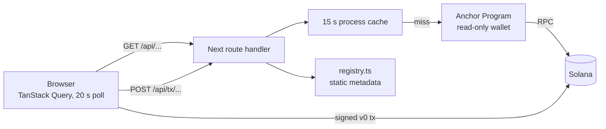
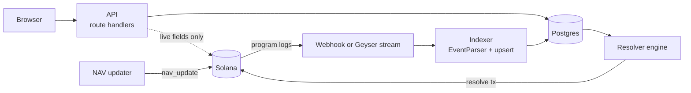
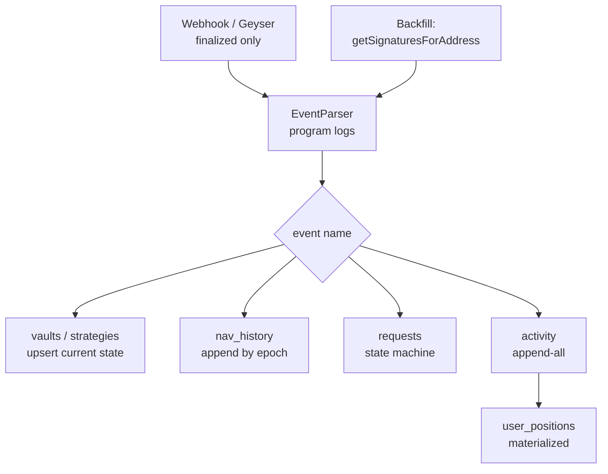
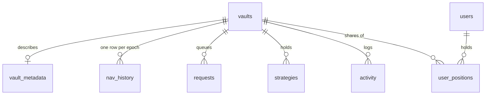
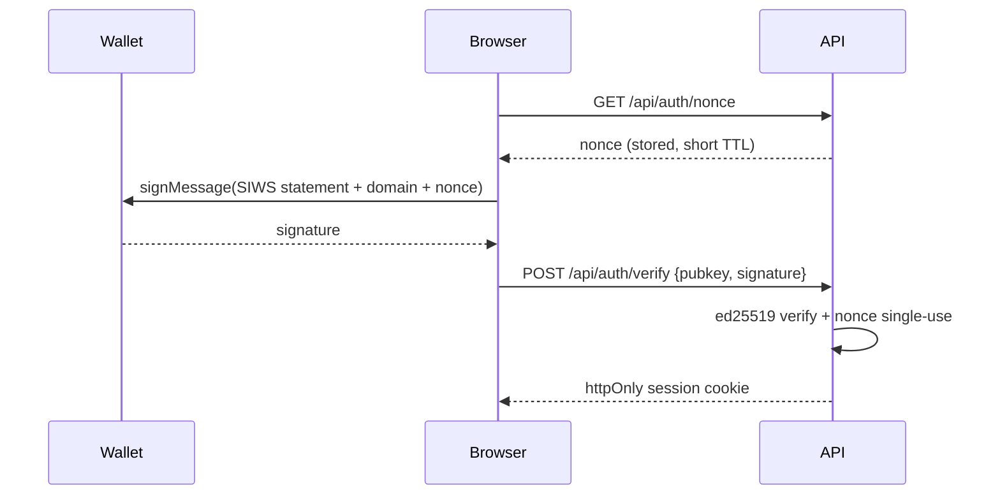
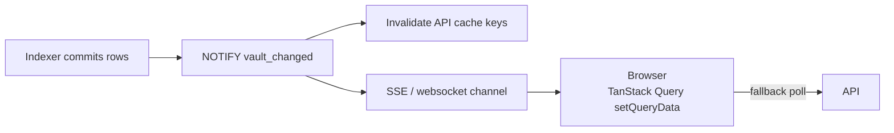
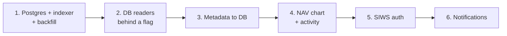

# Hedge Vault — Fullstack Architecture

How the web app in `app/` grows from a stateless chain reader into a fullstack product with an
event indexer, a Postgres database and per-user features — without changing the program and
without changing the JSON the browser already consumes.

Each section follows the same shape: **the problem today → the target design (diagram) → how it
works**. The program stays the system of record; everything described here is a derived, rebuildable
copy of what the chain already emits.

Sections: [1 Where V1 stands](#1-where-v1-stands) · [2 Target architecture](#2-target-architecture) ·
[3 Indexer](#3-indexer) · [4 Schema](#4-schema) · [5 API evolution](#5-api-evolution) ·
[6 Auth](#6-auth) · [7 Caching and invalidation](#7-caching-and-invalidation) ·
[8 Features unlocked](#8-features-unlocked) · [9 Migration](#9-migration)

Related: [`docs/accounts.md`](accounts.md) (on-chain data model and the event table),
[`docs/architecture-evolution.md`](architecture-evolution.md) (how the program itself evolves),
[`docs/superpowers/specs/2026-09-14-app-layer-design.md`](superpowers/specs/2026-09-14-app-layer-design.md)
(the V1 app spec), [`app/README.md`](../app/README.md) (how to run it).

---

## 1. Where V1 stands

V1 has no database. Every number on the screen is read from the chain at the moment it is asked
for, and every off-chain fact about a vault is a constant in a TypeScript file.

**How it works today.**

- **Reads.** `src/server/readers/*` decode accounts into the view models in `src/lib/types.ts`.
  Each reader is wrapped in `cached(key, ttl, fn)` (`src/server/cache.ts`): a per-process TTL map,
  15 s for config, vaults, vault detail and strategies, 10 s for positions and request queues, with
  per-key single-flight and a 60 s stale-serve window when a refresh fails. Responses carry
  `Cache-Control: no-store`, so the browser always asks the server and the server decides whether to
  ask the chain.
- **Writes.** Every `POST /api/tx/*` loads a `VaultCtx`, builds instructions, checks
  `assertAuthority` for manager-only actions, then `assemble()` compiles a v0 message, **simulates
  it**, and returns base64. The server never signs; the wallet does, and sends to
  `NEXT_PUBLIC_RPC_URL`. A failed simulation becomes a `422` with the decoded Anchor error code and
  the program logs, so the user sees `DepositCapReached`, not "transaction reverted".
- **Abuse control.** Every `POST /api/tx/**` builder and `GET /api/jupiter/quote` costs RPC or a
  third-party call, so both pass through an in-process per-IP token bucket
  (`src/server/ratelimit.ts`, 30 requests / 10 s) and answer `429 RateLimited` past it. The quote
  route additionally requires a `vault` and only quotes pairs with that vault's deposit mint on one
  side — the only swap `jupiter_swap` will accept. One bucket map per instance; a shared store is
  part of the same move to Redis described in §7.
- **Off-chain data.** `src/server/registry.ts` maps a vault address to description, strategy blurb,
  manager name and tags. Token symbols, logos and USD prices come from Jupiter
  (`/tokens/v2/search`, `/price/v3`) with a 60 min metadata cache and a 60 s price cache; four
  mainnet mints are answered with zero RPC from a constant table. Meteora DLMM pools are hydrated
  with `DLMM.createMultiple` and cached 5 minutes, so N positions in one pool cost one hydration.
- **Manager scope.** `/api/manager/[wallet]` fetches the Manager PDA and runs a
  `getProgramAccounts` memcmp on the vault `authority` offset (16). The UI guard compares the
  connected wallet to `vault.authority`; the real enforcement is `assertAuthority` on the server and
  the program's `validate_authority()` check in each handler.

**What this costs.**

- **No history.** The chain stores only the *current* `nav_per_share`, `high_water_mark` and
  `nav_epoch`. A NAV chart, returns since inception, a user's PnL or an activity feed are simply not
  answerable — the data is in old transactions nobody keeps.
- **N+1 on anything per-vault.** `/api/vaults` is one `getProgramAccounts`, but a list of *positions*
  across vaults, or a request queue per vault, is one round of RPC per vault. The strategies reader
  already costs 5+ batched calls plus one SDK `getPosition` per DLMM position.
- **RPC rate limits are the ceiling.** A public endpoint throttles at a few requests per second; the
  15 s cache is the only thing between a traffic spike and a 429. Cold caches after a deploy or a
  scale-to-zero make the first request the slow one.
- **Nothing is per-user until a wallet connects.** There is no notion of a user at all: no saved
  preferences, no email, no "your vaults", no way to answer "what did I earn" for a wallet that is
  not currently connected.
- **No notifications.** A request becomes claimable when the manager posts the next NAV. Nobody can
  tell the user that, because nothing is watching.
- **Metadata is a deploy.** Adding a vault description means editing `registry.ts`, and a manager
  cannot describe their own vault.

Every one of these is the same missing piece: **a durable, queryable copy of what the program has
already emitted.**

---

## 2. Target architecture

The program emits an Anchor event for every state transition (see the event table in
[`docs/accounts.md`](accounts.md#events)). Those events are a complete, ordered log of everything
that ever happened. Persist them once and the API stops being an RPC proxy and becomes a database
query.

Four processes, one database:

- **Indexer.** Subscribes to transactions mentioning the program id, parses events out of the logs,
  and upserts rows. The only writer of chain-derived tables.
- **API.** The same Next.js route handlers, returning the same view models, sourced from Postgres
  instead of RPC. A small number of fields stay on the RPC path (see §5).
- **Resolver engine.** Already planned as separate work (`architecture-evolution.md` §7). It reads
  `requests WHERE state = 'resolvable'` — a query, instead of a `getProgramAccounts` scan per vault —
  and sends `deposit_request_resolve` / `withdrawal_request_resolve` on users' behalf.
- **NAV updater.** Unchanged: it posts `nav_update` per vault per epoch. The `NavUpdated` event it
  produces is what fills `nav_history`, so the chart is a free side effect of the crank that already
  has to run.

The database is a **cache of the chain, not a second source of truth**. Nothing is written to it
that cannot be rebuilt by replaying events from slot 0, except the two tables that hold genuinely
off-chain data (`vault_metadata`, `users`). That rule is what makes reorgs, bugs and schema changes
survivable: drop the derived tables and backfill.

---

## 3. Indexer

The problem: transaction logs are ephemeral and RPC only answers "what is true now". The indexer
turns the log stream into rows exactly once, and must be safe to run twice.

**Ingestion.** Two sources, one parser. Live: a Helius webhook filtered on the program id, or a
Geyser/Yellowstone transaction subscription for lower latency. Backfill: walk
`getSignaturesForAddress(PROGRAM_ID)` backwards from the newest indexed signature to genesis,
`getTransaction` each one. Both paths hand raw log arrays to the same parse-and-apply function, so
the backfill exercises the same code as production.

**Parsing.** Anchor's `EventParser` over `meta.logMessages` with the program's IDL — the same IDL the
app already bundles at `app/src/idl/hedge_vault.json`, kept in sync by `yarn sync-idl`. No manual
borsh layouts, no discriminator tables to maintain: when the program adds an event, the indexer
learns it on the next `anchor build`.

**Idempotency.** Every row is keyed by `(signature, event_index)` — the position of the event within
the transaction's log stream. Applying a transaction twice is a no-op via
`INSERT ... ON CONFLICT DO NOTHING` on `activity`, and derived tables are updated in the same
transaction with `ON CONFLICT DO UPDATE` guarded by `slot >= existing.slot`, so an out-of-order
replay can never move state backwards.

**Reorgs.** Only `finalized` transactions are indexed. Finalized means two thirds of stake has voted
on a descendant block; it does not roll back. The cost is ~13 s of extra latency versus `confirmed`
— irrelevant for a vault whose NAV moves once per 24 h epoch. Anything that must feel instant (the
user's own transaction landing) is handled client-side, by invalidating TanStack Query on
confirmation, exactly as V1 does today.

**Events consumed.** From [`docs/accounts.md`](accounts.md#events):

| Group | Events | Writes to |
| --- | --- | --- |
| Protocol | `ConfigInitialized`, `ConfigUpdated`, `ConfigMigrated`, `ProtocolPaused`, `AdminNominated`, `AdminAccepted`, `ManagerAdded`, `ManagerRemoved` | protocol state, `activity` |
| Vault lifecycle | `VaultInitialized`, `VaultUpdated`, `VaultClosed` | `vaults`, `activity` |
| NAV | `NavUpdated` (from `nav_update` and `nav_override`, carries `overridden`) | `nav_history`, `vaults`, `activity` |
| Fees | `ManagerFeeClaimed`, `PlatformFeeClaimed` | `vaults`, `activity` |
| Deposits | `DepositRequested`, `DepositCancelled`, `DepositResolved`, `DepositRejected` | `requests`, `user_positions`, `activity` |
| Withdrawals | `WithdrawalRequested`, `WithdrawalCancelled`, `WithdrawalResolved`, `WithdrawalRejected` | `requests`, `user_positions`, `activity` |
| Strategies | `StrategyInitialized`, `StrategyClosed` | `strategies`, `activity` |
| Protocol actions | `JupiterSwapped`, `MeteoraDlmmLiquidityAdded`, `MeteoraDlmmLiquidityRemoved`, `MeteoraDlmmFeeClaimed` | `strategies`, `activity` |

`DepositResolved` and `WithdrawalResolved` carry `shares` / `amount` and `nav_per_share`, which is
exactly what a cost basis needs — `user_positions` is materialized from them, never from a balance
scan.

---

## 4. Schema

Postgres. Amounts are `numeric(39,0)` (raw base units, u64/u128 safe — never a float, never a JS
number); public keys are `text` base58; timestamps are unix seconds as `bigint` where they come from
the chain and `timestamptz` where they are ours.

| Table | Columns | Notes |
| --- | --- | --- |
| `vaults` | `address pk`, `id`, `authority`, `name`, `deposit_mint`, `share_mint`, `status`, `performance_fee_bps`, `management_fee_bps`, `pending_performance_fee_bps`, `pending_management_fee_bps`, `fee_effective_ts`, `deposit_cap`, `min_deposit`, `min_withdrawal_shares`, `created_at`, `closed_at` | Current state, rebuilt from `VaultInitialized` / `VaultUpdated` / `VaultClosed`. Index on `authority` (the manager list) and on `status`. |
| `vault_metadata` | `vault_address pk`, `description`, `strategy`, `manager_name`, `tags jsonb`, `logo_url`, `updated_by`, `updated_at` | Replaces `registry.ts`. The only vault data that is not derived from the chain; `updated_by` is the wallet that signed the edit. |
| `nav_history` | `vault_address`, `epoch`, `ts`, `total_assets`, `nav_per_share`, `high_water_mark`, `manager_fee_shares`, `platform_fee_shares`, `overridden bool`, `signature` | Unique `(vault_address, epoch)`. One row per `NavUpdated`. The chart, returns since inception and drawdown all read this one table. |
| `requests` | `id pk`, `vault_address`, `owner`, `kind` (`deposit`\|`withdrawal`), `amount_or_shares`, `epoch`, `created_ts`, `state` (`pending`\|`resolvable`\|`resolved`\|`cancelled`\|`rejected`), `resolved_ts`, `resolved_amount`, `resolved_nav`, `signature` | A request is unique per `(vault, owner, kind)` while open, so `id` is that tuple plus `created_ts`. `state` is advanced by the resolve/cancel/reject events; `pending → resolvable` is derived from `vaults.nav_epoch > requests.epoch` at read time, not stored stale. Index on `(vault_address, state)` for the resolver and the manager queue, `(owner, state)` for the user. |
| `activity` | `id pk`, `vault_address`, `owner`, `kind` (the event name), `payload jsonb`, `ts`, `signature`, `event_index`, `slot` | Every event, verbatim. Unique `(signature, event_index)` — this is the idempotency key for the whole pipeline. Everything else in the schema can be rebuilt from here. |
| `users` | `wallet pk`, `first_seen`, `last_seen`, `email nullable`, `notification_prefs jsonb` | The only table written by a user action rather than by the indexer. A row appears the first time a wallet signs in (§6). |
| `user_positions` | `wallet`, `vault_address`, `shares`, `cost_basis`, `updated_at` | Primary key `(wallet, vault_address)`. Materialized from `DepositResolved` (shares in, cost basis += amount) and `WithdrawalResolved` (shares out, cost basis reduced pro rata). Share-mint transfers between wallets are not program events, so this is authoritative only for shares acquired through the vault — the live share-ATA balance stays the display number, and `cost_basis` is used for PnL with that caveat. |
| `strategies` | `address pk`, `vault_address`, `id`, `type` (`jupiter`\|`dlmm`), `protocol_account` (target mint or DLMM position), `opened_ts`, `closed_ts` | From `StrategyInitialized` / `StrategyClosed`. Live valuation still comes from the DLMM SDK and Jupiter prices; this table gives the *set* of strategies and their history without a `getProgramAccounts` scan. |

---

## 5. API evolution

The contract does not change. `src/lib/types.ts` stays the single definition of what crosses the
wire, `src/lib/api.ts` stays the single typed client, and every component keeps compiling. What
changes is the body of each reader in `src/server/readers/*`.

Three source categories:

- **DB** — the indexer carries the field; read it from Postgres.
- **DB + RPC** — mostly Postgres, with a live RPC read for fields no event carries.
- **RPC** — no event exists (third-party protocol state); unchanged.

| Endpoint | V1 source | Future source | Notes |
| --- | --- | --- | --- |
| `GET /api/config` | `Config` account, 15 s cache | **DB + RPC** | Config events fill it; RPC stays the fallback until the config events are backfilled. |
| `GET /api/vaults` | `getProgramAccounts` + Jupiter tokens | **DB** | One indexed query, sorted and paginated. Removes the only unbounded program scan on the hot path. |
| `GET /api/vaults/[address]` | 2 RPC | **DB + RPC** | Everything but `idleBalance` and `shareSupply` from `vaults`; those two are live token-account/mint reads, batched into one `getMultipleAccounts`. |
| `GET /api/vaults/[address]/position?owner=` | 2 RPC | **DB + RPC** | `depositRequest` / `withdrawalRequest` from `requests`; `shares` and `depositTokenBalance` stay live ATA reads (transfers are not program events). |
| `GET /api/vaults/[address]/requests` | 3 RPC (the vault + one `getProgramAccounts` memcmp per request type) | **DB** | `WHERE vault_address = $1 AND state IN ('pending','resolvable')`. Enables a queue across all vaults, which V1 cannot do. |
| `GET /api/vaults/[address]/strategies` | 5+ RPC + DLMM SDK | **DB + RPC** | Strategy set and metadata from `strategies`; bin amounts, pending fees and prices stay live (DLMM SDK + Jupiter). |
| `GET /api/manager/[wallet]` | Manager PDA + memcmp scan | **DB** | `WHERE authority = $1`. The memcmp offset dependency on the zero-copy layout disappears. |
| `GET /api/dlmm/pool/[lbPair]` | DLMM SDK, 5 min cache | **RPC** | Third-party state, not our program. Unchanged. |
| `GET /api/jupiter/quote` | Jupiter API + 1 RPC (the vault) | **DB + external** | Quotes must be live by definition. The route requires a `vault` and rejects any pair where neither side is that vault's deposit mint, so it cannot be used as a free Jupiter proxy; the vault lookup becomes a DB read. |
| `POST /api/tx/**` (18 routes) | build + simulate + RPC | **RPC** | Unchanged and must stay unchanged: a transaction is built against the *current* blockhash and simulated against *current* state. The DB is never in the write path. |
| — *new* — `GET /api/vaults/[address]/nav?from=&to=` | — | **DB** | `nav_history`. Powers the chart. |
| — *new* — `GET /api/vaults/[address]/activity` | — | **DB** | `activity`, filtered and paginated. |
| — *new* — `GET /api/portfolio?owner=` | — | **DB + RPC** | `user_positions` joined to `vaults`, with live balances. |
| — *new* — `PUT /api/vaults/[address]/metadata` | — | **DB**, SIWS | Manager-authored metadata; replaces editing `registry.ts`. |

Two rules keep this honest:

1. **The DB never gates a write.** Build, simulate and send always talk to the chain. A stalled
   indexer degrades charts and history; it must never be able to produce an invalid transaction or
   block a withdrawal.
2. **Live-only fields stay live.** Token balances move by plain SPL transfers, which emit no event of
   ours. Any field derived from a token account is read from RPC, batched, and cached for seconds.

---

## 6. Auth

Public data needs no identity; V1 has none. But notification preferences and manager-authored
metadata are writes to *our* database by a *specific* wallet, and a wallet address in a request body
proves nothing — anyone can type someone else's address.

**Sign-In With Solana.** A signed message, not a transaction: no fee, no chain write. The statement
includes the domain, the nonce and an issued-at timestamp, so a signature cannot be replayed against
another site or reused. Verification is `ed25519` against the claimed public key; the nonce is
deleted on use. The result is an httpOnly, SameSite cookie holding a short-lived session for that
wallet, which also creates the `users` row on first sign-in.

**What it gates:** notification preferences (`users.notification_prefs`, `users.email`), vault
metadata edits, and any future per-user server state. Everything a visitor reads today stays public
and unauthenticated.

**What it does not change:** manager authorization. Permission to act on a vault is
`vault.authority == signer`, enforced by the program's `validate_authority()` check in each handler
and re-checked by
`assertAuthority` before the server will even assemble the transaction. A session says *who you
are*; the chain says *what you may do*. For a metadata edit the API checks both: a valid session for
wallet `X`, and `vaults.authority = X` in the database.

---

## 7. Caching and invalidation

V1's cache is a time bet: 15 s of staleness, because there is no way to know when the chain changed.
With an indexer, we *do* know — the write that changed the state is the same write that can bust the
cache.

- **Server.** Postgres `LISTEN`/`NOTIFY` on indexer commit (or Redis pub/sub across instances) drops
  the affected keys. Because reads now hit a local database rather than a rate-limited RPC endpoint,
  TTLs can fall to 1–5 s or vanish entirely; the cache stops being a rate-limit shield and becomes a
  latency optimization.
- **Browser.** TanStack Query stays — the same `queryKeys` in `src/hooks/queries.ts`, the same
  `useInvalidateVault` after a transaction confirms. What is added is a push channel: SSE (one-way,
  trivial behind a CDN, enough for NAV and request-state updates) upgraded to a websocket only if
  bidirectional traffic ever appears. On a pushed event the client calls `setQueryData` for a cheap
  field or invalidates the key for anything structural.
- **Polling stays as the floor.** The 20 s `refetchInterval` is kept as a fallback so a dropped
  socket degrades to today's behaviour rather than to a frozen page.

---

## 8. Features unlocked

None of these require a program change. They are all queries against tables the indexer already
fills.

| Feature | Reads | Was impossible in V1 because |
| --- | --- | --- |
| NAV chart, returns since inception, max drawdown | `nav_history` | Only the current NAV exists on chain. |
| Portfolio: holdings, cost basis, realized and unrealized PnL | `user_positions` + `nav_history` | Nothing records what a user paid. |
| Per-vault activity feed | `activity` | Logs are discarded after the transaction. |
| Manager analytics: fee accrual over time, strategy utilization, TVL curve | `nav_history` + `strategies` + `activity` | No time dimension at all. |
| "Your request is claimable" notifications (email, Telegram) | `requests` + `users` | No user record, nothing watching for the next `NavUpdated`. |
| Manager-authored vault descriptions | `vault_metadata` | Metadata was a source file, so a deploy. |
| Vault discovery: search, sort by realized performance, filter by tag | `vaults` + `nav_history` + `vault_metadata` | Ordering by anything but on-chain current state means fetching every vault into memory. |
| Admin console (protocol config, pause, NAV override, request rejection) | same API, admin session | Out of scope for V1; identity and audit trail were missing. |

---

## 9. Migration

Ordered so that each step is independently shippable and independently revertible, and so nothing
user-facing depends on the indexer until the indexer has proven itself against live traffic.

1. **Deploy Postgres and the indexer; backfill.** Nothing reads it yet. Run the backfill from the
   program's first signature, then leave the live stream running and verify: every vault in
   `vaults` matches a fresh RPC fetch; every `nav_history` epoch is contiguous; `activity` has no
   gaps in `(signature, event_index)`. This is the only step that can be wrong in a way that is hard
   to notice, so it gets the longest soak.
2. **Add DB-backed readers behind a feature flag.** Each reader in `src/server/readers/*` gains a
   DB implementation next to the RPC one, selected per-endpoint by env flag. Because both return the
   same view model, the flag can be flipped one endpoint at a time and compared in production
   (shadow-read the DB, log any divergence from RPC, ship when divergence is zero).
3. **Move metadata from `registry.ts` to `vault_metadata`.** Seed the table from the current
   registry file, switch the reader, delete `registry.ts`. Then add the SIWS-gated manager edit form
   once step 5 lands — until then the table is operator-edited, which is already better than a
   deploy.
4. **Add the NAV chart and activity feed.** The first features that exist *only* because of the
   database, and the first real proof the pipeline is correct: a chart with a missing epoch is
   visible immediately.
5. **Add SIWS auth and the `users` table.** Session cookie, nonce endpoint, and the metadata edit
   form behind it.
6. **Add notifications.** A worker watching `requests` for `pending → resolvable` transitions and
   `users.notification_prefs` for who wants to hear about it. Last, because it is the only feature
   that reaches outside the system and the only one where being wrong is loud.

Throughout: the program is untouched, `src/lib/types.ts` is untouched, and at every step the RPC
path remains as a fallback that can be re-enabled by flipping a flag.
