# Hedge Vault — Architecture Evolution

How the program should grow from the mainnet v1
(`r2ahBQ6gbPCJ9FxBymYcXuwXi8NmenRry7SE7QR7FAt`) into a multi-manager, policy-controlled
fund platform without ever breaking deployed state. Each section follows the same shape:
**problem today → target design (diagram) → how it works → data changes → migration.**

Sections: [1 Principles](#1-first-principles) · [2 Overview](#2-evolution-overview) ·
[3 Account data](#3-account-data-evolution) · [4 Roles](#4-roles-and-access-control) ·
[5 Policy](#5-policy-and-action-control) · [6 NAV](#6-nav-pipeline) ·
[7 Settlement](#7-request-settlement) · [8 Protocols](#8-protocol-expansion) ·
[9 Observability](#9-observability-and-off-chain-services) · [10 Security ops](#10-operational-security) ·
[11 Roadmap](#11-roadmap)

---

## 1. First principles

The program is a custody and share-accounting kernel. Pricing, strategy selection and
reporting live off-chain and can be replaced at any time. That split decides what may
change freely and what may not.

**Must hold forever**

- PDA seeds and account discriminators. Clients, indexers and other programs derive them.
- Meaning and width of every existing field. Shares in circulation are valued through them.
- The share mint per vault. It is the depositor's claim; it cannot be swapped.
- Invariants:
  - `deposit_escrow.amount == vault.pending_deposits`
  - `share_escrow.amount == vault.pending_withdrawal_shares`
  - `nav_per_share` changes only inside `update_nav` / `override_nav`
  - a request resolves only at a NAV posted in a later epoch than its creation

**Will change most, so must be additive**

- Who may do what (roles, delegation, policy).
- Which protocols the vault can touch.
- How NAV is attested and how much the updater is trusted.

**Design rules that follow**

- Add capabilities as new PDAs keyed off existing ones, not as fields crammed into Vault.
- Every account carries a `version` so readers can branch.
- Reserve bytes before you need them; a realloc migration costs a release, padding costs nothing.

---

## 2. Evolution overview

### 2.1 Today

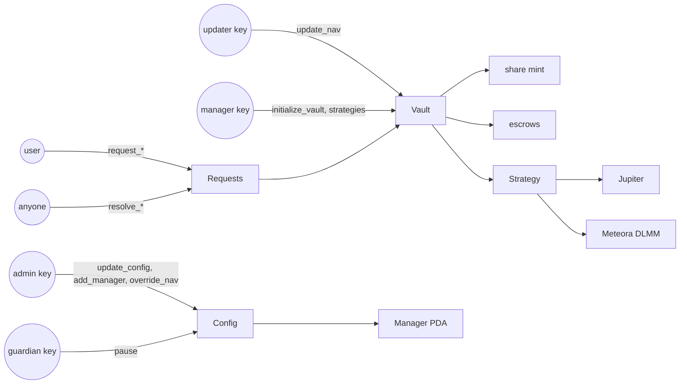

Single keys everywhere, no limits on what a manager may do with funds, one updater, no
events for indexers, and a `Config` with 6 spare bytes.

### 2.2 Target

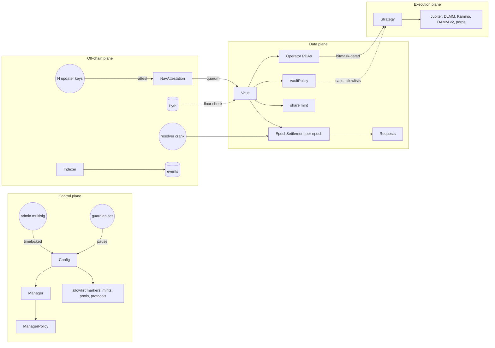

Every new box is a new PDA type or an off-chain service. Vault and the share mint are
unchanged in meaning; they only gain fields inside bytes already reserved.

### 2.3 Phases

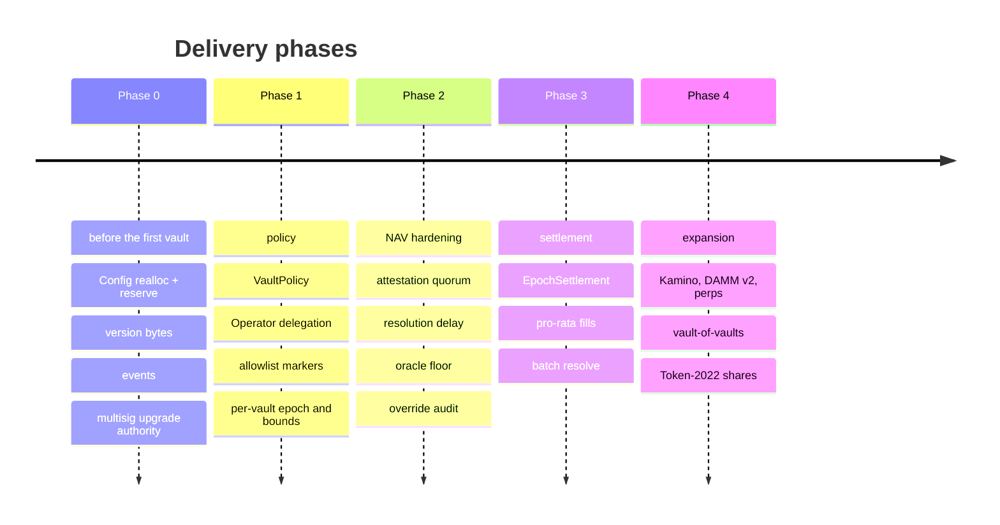

---

## 3. Account data evolution

### 3.1 Why layout is the hard constraint

Two serialization models are in use and they grow differently.

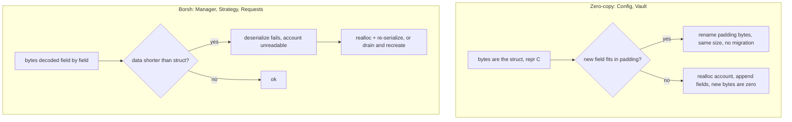

- **Zero-copy** accounts tolerate appended bytes because old offsets never move. A field
  added at the end with value `0` must therefore mean "legacy behaviour" (for example
  `epoch_duration == 0` → use the global constant).
- **Zero-copy alignment**: `repr(C)` plus `Pod` forbids implicit padding, so appended
  fields must be ordered widest first (Pubkey/i64, then u32, then u16, then u8) and end on an
  8-byte boundary.
- **Borsh** accounts break the moment the struct is longer than the data. Short-lived ones
  (requests) are simply drained; long-lived ones (Manager, Strategy) need an explicit
  migration or a version byte read before the rest of the struct.

### 3.2 Byte budgets today

| Account | Kind | Size | Free bytes | Lifetime |
| --- | --- | --- | --- | --- |
| Config | zero-copy | 160 | 6 | forever, singleton |
| Vault | zero-copy | 424 | 121 | years |
| Manager | borsh | 41 | 0 | until removed |
| Strategy | borsh | 97 | 6 (before enum) | until closed |
| DepositRequest / WithdrawalRequest | borsh | 89 | 0 | one or two epochs |

Config v1, byte offsets including the 8-byte discriminator:

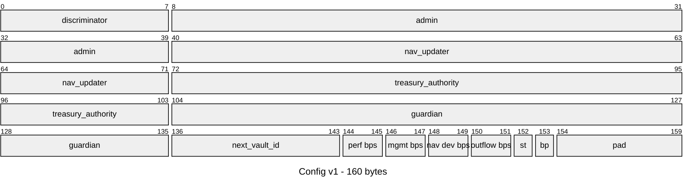

Vault v1:

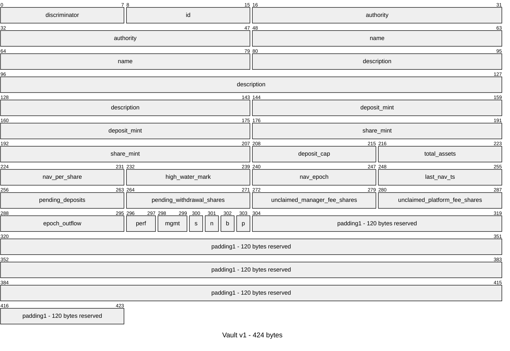

### 3.3 Growth mechanics and the migration flow

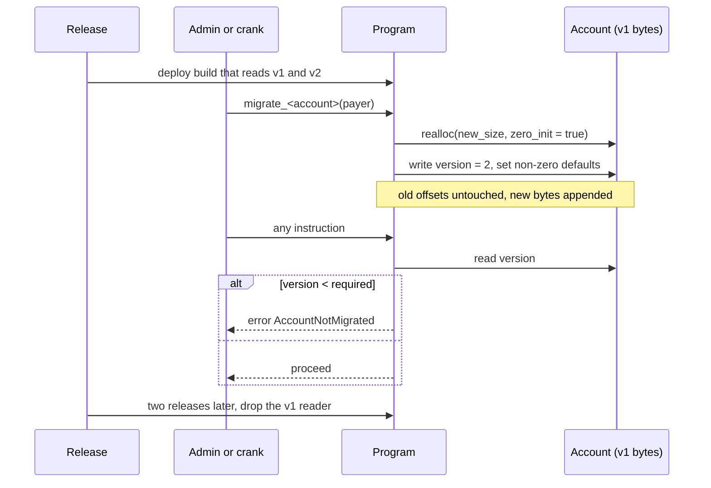

Rules:

- **Append only.** Never reorder, never change a width. Consume padding first, realloc second.
- **Version byte everywhere.** Vault and Strategy have spare bytes for it today; Config gets
  it in the v2 realloc.
- **Realloc limits.** Max +10 240 bytes per instruction, payer funds the extra rent. Every
  account here is far below that.
- **Zero means legacy.** Any appended numeric field must treat `0` as "not set".
- **Drain rule for requests.** Pause → post NAV → resolve everything → upgrade → unpause.
  No migration code for accounts that live one epoch.
- **Never shrink.** Rent refunds are not worth a layout fork.

### 3.4 Config v2 target layout

Config has 6 spare bytes and is already initialized on mainnet, so a realloc is unavoidable.
It is cheapest before any vault exists, because nothing else references its bytes yet.

Shipped in Phase 0 as version + reserve only. Later phases carve named fields out of the
reserve in place (zero-copy, no further realloc), widest first to keep `Pod` alignment.

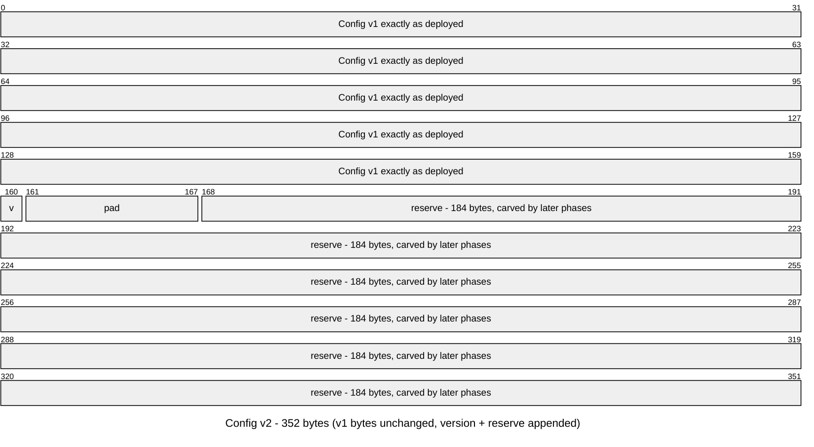

Planned carve-up of the reserve, in order of appearance:

| Future field | Bytes | Phase | Purpose | Zero means |
| --- | --- | --- | --- | --- |
| `pending_admin` | 32 | 1 | two-step admin transfer | no transfer pending |
| `pending_change_ts` | 8 | 1 | timelock anchor | none pending |
| `default_epoch_duration` | 8 | 1 | base for per-vault epochs | use 86 400 |
| `timelock_secs` | 4 | 1 | delay on sensitive config changes | immediate |
| `resolution_delay_secs` | 4 | 2 | wait after a NAV post before resolution | no delay |
| `min_nav_updaters` | 1 | 2 | attestation quorum | single updater |
| remaining | 127 | — | phases 3–4 | — |

Migration: `migrate_config`, admin-signed, checks the account is exactly the 160-byte v1
layout and the signer is its admin, tops up rent, resizes to 352, sets `version = 2`.
One transaction, done once.

### 3.5 Vault budget plan

Vault has 121 free bytes. The plan below spends 77 and keeps 44. It fits only because of one
rule: **no Pubkeys inside Vault.** Every link is a PDA derived from the vault key
(`["policy", vault]`, `["operator", vault, key]`, `["settlement", vault, epoch]`), so a
32-byte pointer costs zero bytes.

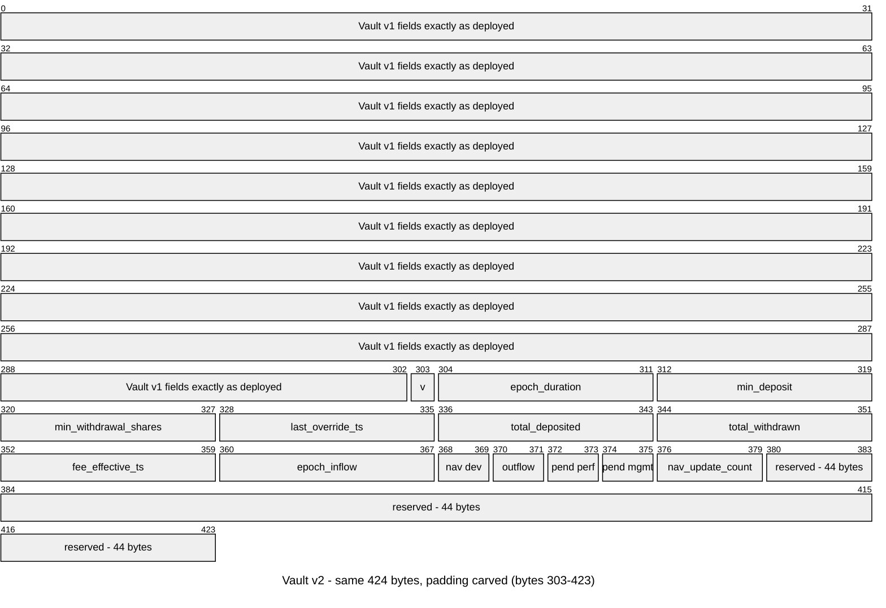

| Field | Phase | Enforced / used in |
| --- | --- | --- |
| `version` | 0 | every instruction |
| `epoch_duration` | 1 | `Vault::epoch`, replaces the global constant when non-zero |
| `max_nav_deviation_bps`, `max_epoch_outflow_bps` (per-vault override) | 1 | `update_nav`, `resolve_withdrawal_request` |
| `min_deposit`, `min_withdrawal_shares` | 1 | `request_*`, dust protection |
| `pending_*_fee_bps`, `fee_effective_ts` | 1 | `update_vault` schedules, `update_nav` applies after timelock |
| `last_override_ts`, `nav_update_count` | 2 | override audit, rate limit |
| `total_deposited`, `total_withdrawn` | 3 | lifetime stats for UI and fee analytics |
| `epoch_inflow` | 3 | deposit cap per epoch |

No realloc is needed for Vault through Phase 3.

### 3.6 Manager, Strategy, Requests

**Manager (41 bytes, 0 free).** Keep it as a pure whitelist marker. Limits go into a
`ManagerPolicy` PDA `["manager_policy", authority]` (max vaults, max aggregate deposit cap,
expiry, allowed protocols). The marker never migrates; policy can be recreated freely.

**Strategy (97 bytes, 6 free before the enum).**

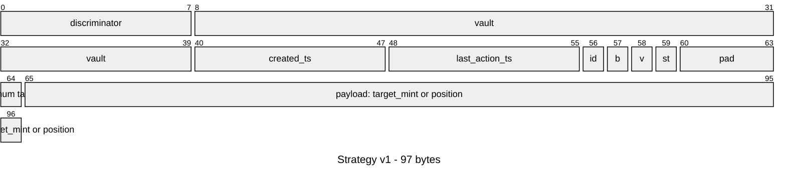

- `version` and `status` (active / winding down / closed) take 2 of the 6 padding bytes now.
- Cumulative `deployed` / `withdrawn` counters (record keeping, not accounting) need a
  realloc. Bundle it with the first new protocol variant so managers migrate once.
- New protocols are new enum variants. `StrategyType::space()` sizes each account at
  creation, so a bigger payload only affects new strategies.

**Requests (89 bytes, 0 free, live one or two epochs).** Use the drain rule for the next
layout change and add `padding: [u8; 16]` at that point so later changes need no drain.
Candidate fields: `sequence` for FIFO, `min_shares_out` / `min_amount_out` for user-side NAV
slippage, `filled` for pro-rata settlement.

---

## 4. Roles and access control

### 4.1 Problem today

Four protocol roles and every manager are single hot keys. A manager's bot must hold the
manager key to trade. The program upgrade authority is one key.

### 4.2 Target authority graph

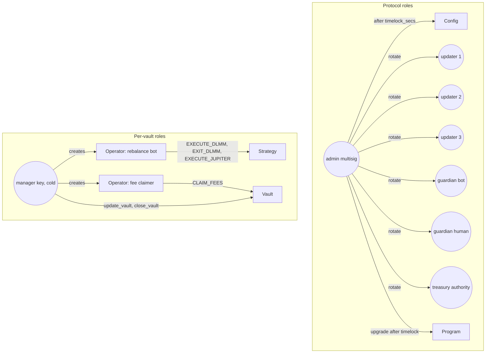

### 4.3 Role matrix

| Action | Today | Target |
| --- | --- | --- |
| change config, fees, bounds | admin key, immediate | multisig, `timelock_secs` delay, two-step admin transfer |
| pause | guardian key | any guardian in the set, plus an automated pause bot |
| unpause | admin | admin multisig |
| post NAV | one updater key | N-of-M attestations (Section 6) |
| override NAV | admin | admin multisig, audited, rate limited |
| create vault | whitelisted manager | manager within `ManagerPolicy` |
| execute / exit strategy | vault authority | vault authority or Operator with matching bit, within `VaultPolicy` |
| claim manager fee | vault authority | vault authority or Operator `CLAIM_FEES` |
| resolve requests | anyone | anyone, ordered by settlement (Section 7) |
| upgrade program | single key | multisig + timelock + verified build hash |

### 4.4 Operator delegation, how it works

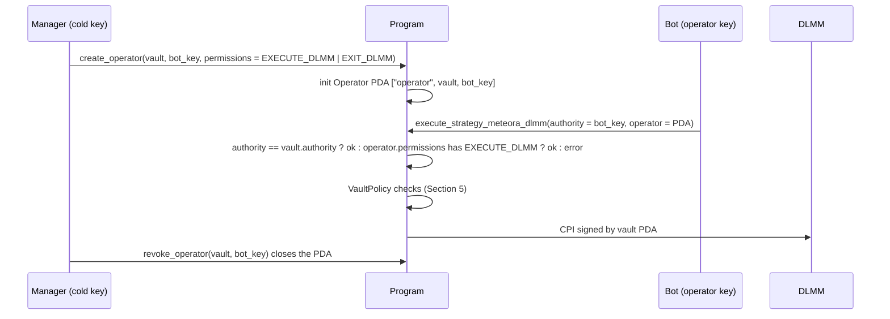

- `Operator` layout: `vault: Pubkey`, `authority: Pubkey`, `permissions: u64`,
  `expires_at: i64`, `bump: u8`, 32 bytes reserve. Created and closed by the vault authority.
- Permission bits: `INIT_STRATEGY`, `CLOSE_STRATEGY`, `EXECUTE_JUPITER`, `EXIT_JUPITER`,
  `EXECUTE_DLMM`, `EXIT_DLMM`, `CLAIM_FEES`, `UPDATE_VAULT_DESCRIPTION`. Bits 8–63 reserved.
- Accounting code does not change; only the authority check at the top of each strategy
  handler gains one branch.

### 4.5 Multisig and timelock

- Admin key → Squads multisig. No program change needed; `config.admin` is just a pubkey.
- Timelock inside the program (`timelock_secs`): sensitive `update_config` fields are
  written as `pending_*` with `pending_change_ts`, applied by a second call after the delay.
  Guardians can pause during the window. Non-sensitive fields (description) stay immediate.
- Upgrade authority → the same multisig behind a timelock program, plus a verified build so
  the on-chain hash is reproducible from the repo.

---

## 5. Policy and action control

### 5.1 Problem today

A manager can swap the vault's deposit mint into any token, open a DLMM position in any pool
of any width, and deploy 100 % of assets into one strategy. Depositors rely entirely on the
manager's judgement.

### 5.2 Target enforcement path

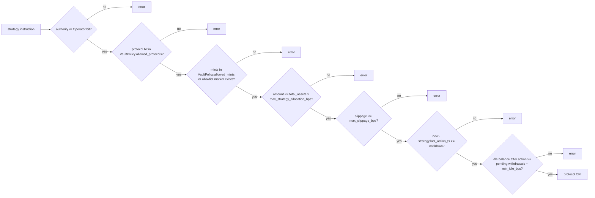

### 5.3 VaultPolicy account

PDA `["policy", vault]`, zero-copy, fixed size so it never needs ad hoc migration. Created
by the admin with protocol-level floors; the manager may only tighten values.

| Field | Type | Checked in |
| --- | --- | --- |
| `allowed_protocols` | `u64` bitmask (bit per StrategyType variant) | `initialize_strategy_*` |
| `allowed_mints` | `[Pubkey; 8]` | Jupiter execute destination, DLMM init pair mints |
| `max_strategy_allocation_bps` | `u16` | execute: `amount <= total_assets * bps / 10_000` |
| `max_slippage_bps` | `u16` | Jupiter `slippage_bps`, DLMM `max_active_bin_slippage` |
| `max_strategies` | `u8` | `initialize_strategy_*` against `vault.next_strategy_id` |
| `action_cooldown_secs` | `u32` | execute/exit via `strategy.last_action_ts` |
| `min_idle_bps` | `u16` | execute: keep idle funds for pending withdrawals |
| `manager_can_tighten` | `u8` bool | `update_policy` |
| reserve | 64 bytes | |

`total_assets` used in the allocation check is the last posted NAV figure, at most one epoch
stale. That is acceptable for a cap; it is not accounting.

### 5.4 Unbounded allowlists

Eight mints per policy is enough for most vaults, but pools and markets are unbounded. Use
marker PDAs exactly like Manager:

- `["allowlist", kind, key]` where `kind` is `mint`, `dlmm_pool`, `kamino_reserve`, …
- Admin creates and closes them. Instructions require the marker account to exist.
- Zero data, ~0.001 SOL rent each, no size limit, no migration ever.

---

## 6. NAV pipeline

### 6.1 Today

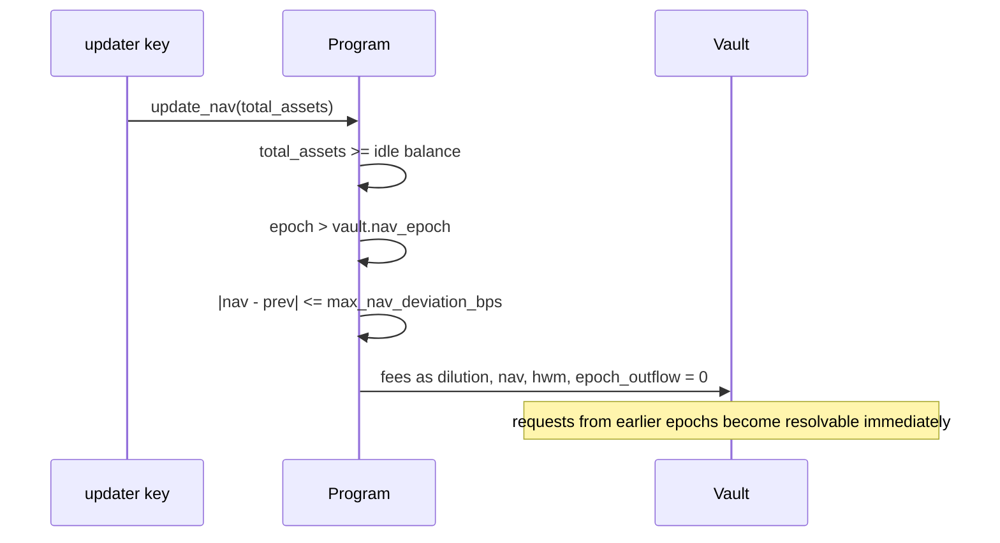

Single key, single sanity floor, no correction window.

### 6.2 Target

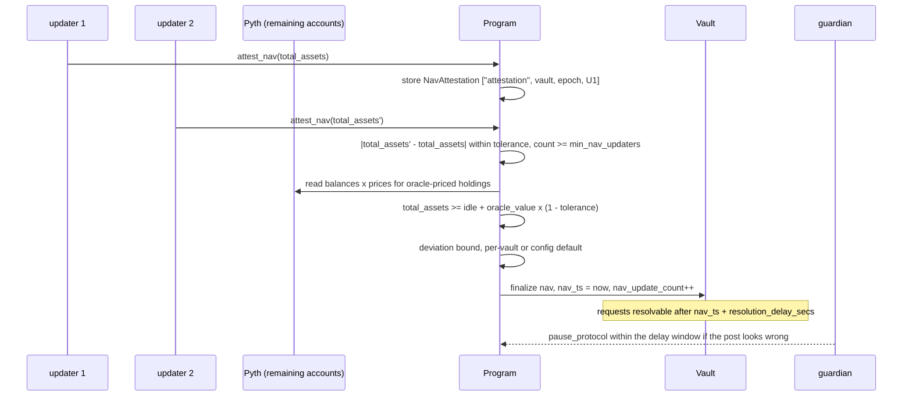

### 6.3 Components

- **Per-vault epoch.** `epoch = (now - vault_epoch_offset) / vault.epoch_duration` when set,
  else the global constant. High-volatility vaults can run 4–8 h epochs.
- **Attestation quorum.** `NavAttestation` PDAs are cheap (vault, epoch, updater, value,
  ts). The last attestation that completes the quorum finalizes; others are closed for rent.
  A stolen key can no longer post alone.
- **Oracle floor.** Extends the idle-balance floor to deployed funds for assets with a
  Pyth feed. It bounds under-reporting; over-reporting is still bounded by the deviation cap
  and outflow cap.
- **Resolution delay.** The only change to request logic: `is_resolvable` also requires
  `now >= vault.last_nav_ts + resolution_delay_secs`.
- **Override audit.** `override_nav` writes `last_override_ts`, emits a reason hash, and
  policy can cap overrides to one per N epochs.

### 6.4 Epoch lifecycle

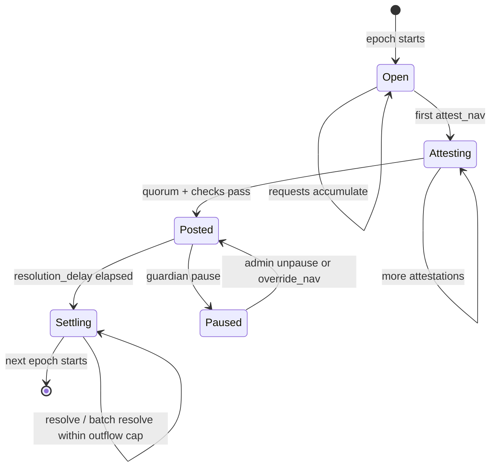

---

## 7. Request settlement

### 7.1 Problem today

The outflow cap turns resolution into a race. Whoever cranks first is paid; later requests
wait a full epoch even if they were older.

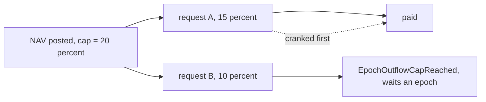

### 7.2 Target: EpochSettlement with pro-rata fills

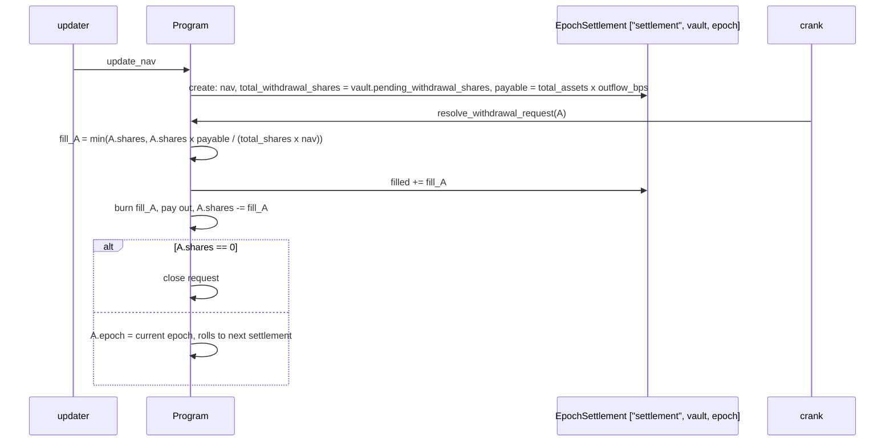

- Fills are proportional and order-independent, so the crank order no longer matters.
- Unfilled shares stay escrowed and roll forward automatically; no user action needed.
- Deposits do not need settlement objects; they are never capped.
- `batch_resolve` takes N requests as remaining accounts for the crank.
- Optional strict FIFO instead of pro-rata: add `sequence` to requests and require
  `sequence == settlement.next_sequence`.
- Per-user request key becomes `["deposit_request", vault, user, nonce]` if merging by epoch
  proves too restrictive.

---

## 8. Protocol expansion

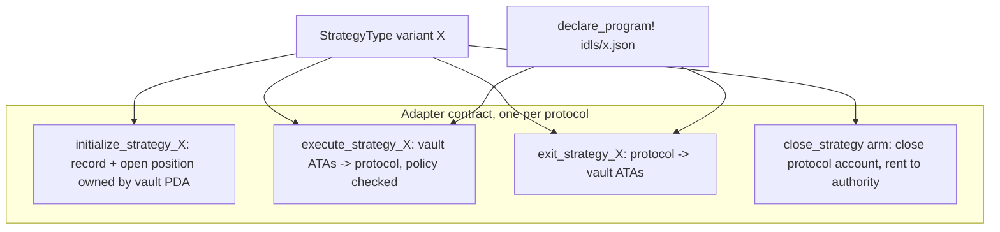

- Keep the MirrorFi shape. Each protocol is one enum variant, three instructions, one IDL,
  and one arm in `close_strategy`.
- Adapter checklist: position owned by the vault PDA; only vault ATAs move tokens; no CPI can
  alter who signs for the vault; every account the protocol writes is passed explicitly.
- Compute and size: DLMM already needs ~1.4M CU headroom and bin-array remaining accounts.
  Ship an address lookup table per protocol with the handlers.
- Vault-of-vaults needs no program change: a parent vault's deposit mint is a child vault's
  share mint, and its NAV is `child_nav × shares`, computed off-chain like any other asset.
- Token-2022 share mints (transfer hooks for allowlisted holders) are a per-vault option:
  `initialize_vault` picks the token program; everything else already uses `token_interface`.

---

## 9. Observability and off-chain services

The program emits no events today. Indexers and the updater would have to diff account
snapshots, which does not scale past a handful of vaults.

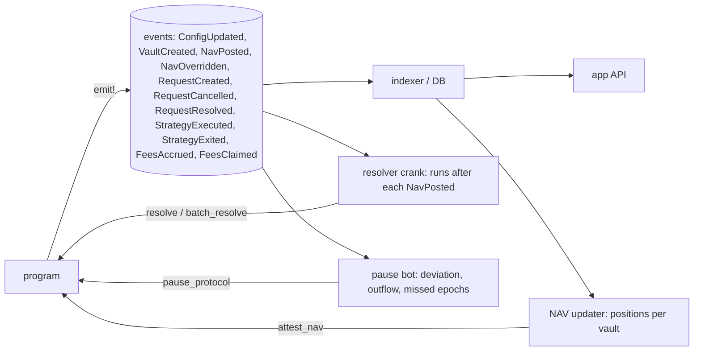

- Events are additive and free to add in Phase 0.
- Service inventory: NAV updater (per vault, per epoch, N keys), resolver crank, pause bot,
  indexer. Each is stateless against the chain because events carry every transition.

---

## 10. Operational security

```mermaid
flowchart TB
    Deployer((deployer key, today)) -.->|migrate to| MS((admin multisig))
    MS --> TL[timelock program] --> UA[upgrade authority]
    UA --> Prog[program]
    Repo[repo tag] -->|solana-verify| Hash[on-chain build hash]
    Hash --- Prog
    MS --> Config
    Config --> Roles[admin, updaters, guardians, treasury on distinct keys]
```

- Today all four config authorities are the same wallet, set as placeholders. Split them
  before the first external deposit.
- Incident runbook: guardian pauses → admin rotates the compromised key via `update_config`
  → `override_nav` if a bad NAV landed → review settlements → unpause.
- Publish `security.txt` and the IDL on-chain so integrators and auditors resolve the
  program without the repo.

---

## 11. Roadmap

| Phase | Deliverables | Account deltas | Migration |
| --- | --- | --- | --- |
| 0 — before first vault | **implemented:** `migrate_config`, `version` in Config/Vault/Strategy, events on every transition. **operational:** admin + upgrade authority to multisig, split the four placeholder keys | Config 160 → 352 | `anchor upgrade`, then `anchor run migrate-config` |
| 1 — policy | `VaultPolicy`, `Operator`, `ManagerPolicy`, allowlist markers; per-vault epoch, bounds, min sizes, timelocked fees | Vault uses 41 padding bytes; 4 new PDA types | none, zero means legacy |
| 2 — NAV hardening | `attest_nav` quorum, `resolution_delay_secs`, oracle floor, override audit | Config v2 fields; `NavAttestation` PDA; Vault uses 12 bytes | none |
| 3 — settlement | `EpochSettlement`, pro-rata fills, `batch_resolve`, request padding | Requests +16 bytes; Vault uses 24 bytes; 1 new PDA | drain window for requests |
| 4 — expansion | Kamino, DAMM v2, perps variants; strategy counters; vault-of-vaults; Token-2022 shares | Strategy realloc | crank per strategy |

**Phase 0 is time-sensitive.** `next_vault_id` is 0 on mainnet: migrating Config and
adding version bytes now means no vault, request or strategy ever exists on a layout
without a version. Everything after that is additive.
