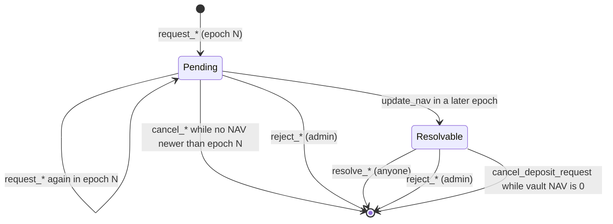

# Foundation Vault Security Fixes Implementation Plan

> **For agentic workers:** REQUIRED SUB-SKILL: Use superpowers:subagent-driven-development (recommended) or superpowers:executing-plans to implement this plan task-by-task. Steps use checkbox (`- [ ]`) syntax for tracking.

**Goal:** Close the gaps found by comparing hedge_vault with the Solana Foundation async vault: unsafe Token-2022 deposit mints, NAV-zero and zero-share deposits, one-step admin transfer, instant manager fee increases, missing minimum request sizes, no admin reject path, and no automated tests.

**Architecture:** All program changes stay in the MirrorFi idiom: rules live as small methods on the zero-copy state (`Vault`, `Config`, requests) so they are unit-testable with `cargo test`, and handlers only load accounts, call those methods and do CPIs. New Vault and Config fields are carved out of existing padding at the byte offsets already planned in `docs/architecture-evolution.md` §3.4–3.5, so no account grows. End-to-end behaviour is checked by a new LiteSVM Rust crate that loads the built `.so`.

**Tech Stack:** Anchor 0.31.1, solana-program 2.3, spl-token-2022 6.0.0 (via anchor-spl), LiteSVM 0.7.1 + solana-sdk 2 (tests only), TypeScript handler scripts (ts-mocha).

**Spec:** Base design `docs/superpowers/specs/2026-09-13-hedge-vault-design.md`. The changes come from the Foundation vault comparison (2026-09-13); the decisions confirmed by the user are listed below.

## Decisions (confirm before execution)

| # | Decision | Source |
| --- | --- | --- |
| D1 | Settlement / NAV-lock fix (price chosen by resolve timing) is **out of scope**, parked for a later plan. | user |
| D2 | No vaults exist on mainnet. Only `Config` (v2, 352 bytes) is live, so Vault field meaning may change freely; Config changes must read correctly from its zeroed reserve. | user |
| D3 | Deposit mint: reject non-zero TransferFee (checked at `initialize_vault` and every `request_deposit`), TransferHook with a program set, NonTransferable, DefaultAccountState=Frozen, ConfidentialMintBurn and **any extension type the program cannot parse**. Allow PermanentDelegate, MintCloseAuthority, metadata/group pointers, InterestBearing, ConfidentialTransfer. | user (recommended option) |
| D4 | Include per-vault `min_deposit` / `min_withdrawal_shares`; a withdrawal of the full share balance is always allowed. | user |
| D5 | Include LiteSVM integration tests as a separate crate (exception to the handler-scripts-only convention). | user |
| D6 | Include `reject_deposit_request` / `reject_withdrawal_request`, signed by `config.admin`, allowed until the request is resolved, not gated by protocol status. | user |
| D7 | Two-step admin transfer: `update_config.pending_admin` nominates, `accept_admin` (signed by the nominee) completes. | default, not objected |
| D8 | Manager fee changes: if both resulting fees are ≤ the live fees they apply immediately; otherwise the pair is scheduled and applied by the first NAV update at or after `now + 7 days`. The update that applies it still charges the old rate for its period. | default, not objected |
| D9 | NAV zero: remove the `shares = amount` fallback; `request_deposit` and `resolve_deposit_request` fail while `nav_per_share == 0`; deposit requests become cancellable while NAV is zero; a resolve that would mint 0 shares fails (admin reject is the escape hatch). | default, not objected |
| D10 | Rust unit tests for NAV, fee, request and extension rules. | default, not objected |

## Global Constraints

- Anchor `0.31.1`, `rust-version = "1.79.0"` for the program crate. Test-only dependencies must never enter `programs/hedge_vault/Cargo.toml` or the root `Cargo.lock`.
- MirrorFi style: one file per instruction, `#[derive(Accounts)]` struct + `impl<'info> X<'info> { pub fn handler }`, destructure `ctx.accounts` first, re-derive PDAs with `*_seeds!` + `Type::validate_address`, `validate!(cond, HedgeVaultError::X)?` instead of `require!`, business rules as methods on state structs.
- Core instructions keep `verb_noun` names (`accept_admin`, `reject_deposit_request`); only protocol instructions are protocol-first.
- Zero-copy sizes are fixed: `size_of::<Vault>() == 416` (account 424), `size_of::<Config>() == 344` (account 352). Only padding/reserve bytes are renamed.
- Vault carve-out, account offsets including the 8-byte discriminator, must match `docs/architecture-evolution.md` §3.5: `min_deposit` 320, `min_withdrawal_shares` 328, `fee_effective_ts` 360, `pending_performance_fee_bps` 380, `pending_management_fee_bps` 382. Other planned fields stay as named reserved bytes.
- Config carve-out: `pending_admin` at account bytes 168–199 (§3.4). `Pubkey::default()` means no transfer pending.
- New error variants go in their section of `HedgeVaultError`. Codes shift; acceptable pre-launch because clients use the regenerated IDL and tests compare with `u32::from(HedgeVaultError::X)`.
- Every instruction whose args or accounts change gets its `tests/handler/<name>.ts` script updated, and every new instruction gets a script plus an `anchor run <name-with-dashes>` entry in `Anchor.toml`.
- Commands (run from repo root `/root/solana/solhedge/hedge_vault`):
  - unit: `cargo test -p hedge_vault`
  - build: `anchor build`
  - integration: `cargo test --manifest-path tests/litesvm/Cargo.toml` (requires a fresh `anchor build`)
- Commit messages end with:
  ```
  Co-Authored-By: Claude Opus 5 <noreply@anthropic.com>
  Claude-Session: https://claude.ai/code/session_01YPGAaVwG1nAzXeQBvX62pg
  ```

## File Structure

| File | Change | Responsibility |
| --- | --- | --- |
| `programs/hedge_vault/src/state/vault.rs` | modify | new fields, min checks, NAV-zero checks, fee scheduling, unit tests |
| `programs/hedge_vault/src/state/config.rs` | modify | `pending_admin`, nominate/accept, unit tests |
| `programs/hedge_vault/src/state/deposit_request.rs` | modify | NAV-zero cancel rule, unit tests |
| `programs/hedge_vault/src/utils/token.rs` | create | deposit mint extension allowlist + unit tests |
| `programs/hedge_vault/src/utils/mod.rs` | modify | export `token` |
| `programs/hedge_vault/src/constants.rs` | modify | `FEE_INCREASE_DELAY` |
| `programs/hedge_vault/src/error.rs` | modify | new variants |
| `programs/hedge_vault/src/events.rs` | modify | admin + reject events, extended `VaultUpdated` |
| `programs/hedge_vault/src/instructions/accept_admin.rs` | create | complete admin transfer |
| `programs/hedge_vault/src/instructions/reject_deposit_request.rs` | create | admin refund of a deposit request |
| `programs/hedge_vault/src/instructions/reject_withdrawal_request.rs` | create | admin refund of a withdrawal request |
| `programs/hedge_vault/src/instructions/{initialize_vault,update_vault,update_config,request_deposit,request_withdrawal,cancel_deposit_request,resolve_deposit_request,mod}.rs` | modify | wiring |
| `programs/hedge_vault/src/lib.rs` | modify | new instruction entrypoints |
| `tests/litesvm/Cargo.toml`, `tests/litesvm/src/lib.rs` | create | detached LiteSVM harness |
| `tests/litesvm/tests/*.rs` | create | one integration file per behaviour |
| `tests/handler/*.ts`, `Anchor.toml` | modify/create | QA scripts |
| `docs/accounts.md`, `docs/architecture-evolution.md`, `docs/superpowers/specs/2026-09-13-hedge-vault-design.md` | modify | document shipped fields and rules |

---

### Task 1: Pin current NAV, fee and request math with unit tests

These are characterization tests: they must pass on the current code and guard every later task.

**Files:**
- Modify: `programs/hedge_vault/src/state/vault.rs` (append a test module at the end of the file)

**Interfaces:**
- Consumes: `Vault::new(NewVaultArgs)`, `Vault::update_nav(UpdateNavArgs) -> Result<NavUpdate>`, `request_deposit`, `resolve_deposit`, `resolve_withdrawal`.
- Produces: test helpers `new_vault(perf, mgmt)`, `nav_args(total_assets, share_supply, now)`, `assert_err(result, error)` inside `state::vault::tests`, extended by Tasks 3–5.

- [ ] **Step 1: Write the tests**

Append to `programs/hedge_vault/src/state/vault.rs`:

```rust
#[cfg(test)]
mod tests {
    use super::*;

    const DAY: i64 = 86_400;
    const USDC: u64 = 1_000_000;

    fn new_vault(performance_fee_bps: u16, management_fee_bps: u16) -> Vault {
        Vault::new(NewVaultArgs {
            id: 0,
            authority: Pubkey::default(),
            name: [0; 32],
            description: [0; 64],
            deposit_mint: Pubkey::default(),
            share_mint: Pubkey::default(),
            deposit_cap: u64::MAX,
            performance_fee_bps,
            management_fee_bps,
            current_ts: 0,
            bump: 0,
        })
    }

    fn nav_args(total_assets: u64, share_supply: u64, now: i64) -> UpdateNavArgs {
        UpdateNavArgs {
            total_assets,
            share_supply,
            platform_performance_fee_bps: 0,
            platform_management_fee_bps: 0,
            max_nav_deviation_bps: None,
            now,
        }
    }

    fn assert_err<T: core::fmt::Debug>(result: Result<T>, error: HedgeVaultError) {
        assert_eq!(result.unwrap_err(), anchor_lang::error::Error::from(error));
    }

    #[test]
    fn layout_size_is_stable() {
        assert_eq!(core::mem::size_of::<Vault>(), 416);
    }

    #[test]
    fn update_nav_with_no_supply_resets_nav() {
        let mut v = new_vault(0, 0);
        v.update_nav(nav_args(0, 0, DAY)).unwrap();

        assert_eq!(v.nav_per_share, NAV_PRECISION);
        assert_eq!(v.nav_epoch, 1);
        assert_eq!(v.last_nav_ts, DAY);
    }

    #[test]
    fn update_nav_is_limited_to_once_per_epoch() {
        let mut v = new_vault(0, 0);
        v.update_nav(nav_args(0, 0, DAY)).unwrap();

        assert_err(
            v.update_nav(nav_args(0, 0, DAY + 1)).map(|_| ()),
            HedgeVaultError::NavAlreadyUpdatedThisEpoch,
        );
    }

    #[test]
    fn profit_above_high_water_mark_accrues_performance_fee() {
        let mut v = new_vault(2_000, 0);
        v.update_nav(nav_args(0, 0, DAY)).unwrap();

        let update = v.update_nav(nav_args(110 * USDC, 100 * USDC, 2 * DAY)).unwrap();

        // profit 10 USDC, 20% fee = 2 USDC, minted as 2 * 100 / 108 shares
        assert_eq!(update.manager_fee_shares, 1_851_851);
        assert_eq!(update.platform_fee_shares, 0);
        assert_eq!(v.unclaimed_manager_fee_shares, 1_851_851);
        assert_eq!(v.nav_per_share, 1_080_000_009);
        assert_eq!(v.high_water_mark, 1_080_000_009);
    }

    #[test]
    fn management_fee_prorates_over_a_year() {
        let mut v = new_vault(0, 200);
        v.update_nav(nav_args(0, 0, DAY)).unwrap();

        let update = v
            .update_nav(nav_args(100 * USDC, 100 * USDC, DAY + SECONDS_PER_YEAR))
            .unwrap();

        // 2% of 100 USDC = 2 USDC, minted as 2 * 100 / 98 shares
        assert_eq!(update.manager_fee_shares, 2_040_816);
        assert_eq!(v.nav_per_share, 980_000_003);
        assert_eq!(v.high_water_mark, NAV_PRECISION);
    }

    #[test]
    fn nav_deviation_bound_rejects_large_moves() {
        let mut v = new_vault(0, 0);
        v.update_nav(nav_args(0, 0, DAY)).unwrap();

        let mut args = nav_args(120 * USDC, 100 * USDC, 2 * DAY);
        args.max_nav_deviation_bps = Some(1_000);

        assert_err(
            v.update_nav(args).map(|_| ()),
            HedgeVaultError::NavDeviationExceeded,
        );
    }

    #[test]
    fn request_deposit_enforces_cap() {
        let mut v = new_vault(0, 0);
        v.deposit_cap = 100 * USDC;

        v.request_deposit(60 * USDC).unwrap();
        assert_err(
            v.request_deposit(50 * USDC),
            HedgeVaultError::DepositCapReached,
        );
    }

    #[test]
    fn resolve_deposit_mints_at_current_nav() {
        let mut v = new_vault(0, 0);
        v.nav_per_share = 2 * NAV_PRECISION;
        v.pending_deposits = 50 * USDC;

        let shares = v.resolve_deposit(50 * USDC).unwrap();

        assert_eq!(shares, 25 * USDC);
        assert_eq!(v.pending_deposits, 0);
        assert_eq!(v.total_assets, 50 * USDC);
    }

    #[test]
    fn resolve_withdrawal_enforces_epoch_outflow_cap() {
        let mut v = new_vault(0, 0);
        v.total_assets = 100 * USDC;
        v.pending_withdrawal_shares = 55 * USDC;

        assert_eq!(v.resolve_withdrawal(30 * USDC, 5_000).unwrap(), 30 * USDC);
        assert_err(
            v.resolve_withdrawal(25 * USDC, 5_000),
            HedgeVaultError::EpochOutflowCapReached,
        );
    }
}
```

- [ ] **Step 2: Run the tests**

Run: `cargo test -p hedge_vault state::vault`
Expected: `test result: ok. 9 passed`

- [ ] **Step 3: Commit**

```bash
git add programs/hedge_vault/src/state/vault.rs
git commit -m "test: pin vault NAV, fee and request math"
```

---

### Task 2: LiteSVM harness with a deposit/withdraw round trip

**Files:**
- Create: `tests/litesvm/Cargo.toml`
- Create: `tests/litesvm/src/lib.rs`
- Create: `tests/litesvm/tests/round_trip.rs`
- Modify: `Anchor.toml` (`[scripts]`)

**Interfaces:**
- Consumes: the built `target/deploy/hedge_vault.so` and the program crate's `accounts::*`, `instruction::*` and arg types.
- Produces (crate `hedge_vault_litesvm`): `TestContext { svm, admin }` with `new()`, `send(&[Instruction], &[&Keypair])`, `new_user()`, `warp_days(i64)`, `create_mint(&Pubkey, Option<u16>) -> Pubkey`, `fund(&Pubkey, &Pubkey, &Pubkey, u64) -> Pubkey`, `token_balance(&Pubkey) -> u64`, `config() -> Config`, `vault(&Pubkey) -> Vault`, `deposit_request(&Pubkey) -> Option<DepositRequest>`, `withdrawal_request(&Pubkey) -> Option<WithdrawalRequest>`, `update_config(UpdateConfigArgs)`, `update_config_args()`, `vault_args()`, `initialize_vault(Pubkey, Pubkey, InitializeVaultArgs) -> (TestVault, TransactionResult)`, `setup_vault() -> TestVault`, `update_vault(&TestVault, UpdateVaultArgs)`, `update_nav(&TestVault, u64)`, `request_deposit`, `cancel_deposit_request`, `resolve_deposit_request`, `request_withdrawal`, `resolve_withdrawal_request`. Free functions: PDA helpers, `ata`, `ix`, `assert_error`. Constants `DAY`, `USDC`, `START_TS`, `TOKEN_PROGRAM`, `TOKEN_2022_PROGRAM`.

- [ ] **Step 1: Create the crate manifest**

`tests/litesvm/Cargo.toml`:

```toml
[package]
name = "hedge-vault-litesvm"
version = "0.1.0"
edition = "2021"
publish = false

# Detached from the program workspace so test dependencies never change the program's Cargo.lock.
[workspace]

[dependencies]
hedge_vault = { path = "../../programs/hedge_vault", features = ["no-entrypoint"] }
anchor-lang = "0.31.1"
anchor-spl = "0.31.1"
bytemuck = "1"
litesvm = "=0.7.1"
solana-sdk = "2"
```

LiteSVM 0.7.1 is pinned on purpose: 0.6.x resolves `solana-account-info` 2.2.1, which lacks `AccountInfo::resize` used by `migrate_config`, and 0.8+ moves to Solana 3 crates.

- [ ] **Step 2: Write the harness**

`tests/litesvm/src/lib.rs`:

```rust
//! LiteSVM harness for hedge_vault integration tests.
//! Loads `target/deploy/hedge_vault.so`, so run `anchor build` before `cargo test`.

pub use anchor_lang::prelude::Pubkey;
pub use anchor_spl::{token::ID as TOKEN_PROGRAM, token_2022::ID as TOKEN_2022_PROGRAM};
pub use hedge_vault::error::HedgeVaultError;
pub use solana_sdk::{signature::Keypair, signer::Signer};

use anchor_lang::{system_program, AccountDeserialize, InstructionData, ToAccountMetas};
use anchor_spl::{
    associated_token::{
        get_associated_token_address_with_program_id,
        spl_associated_token_account::instruction::create_associated_token_account,
    },
    token_2022::spl_token_2022::{
        self,
        extension::{transfer_fee::instruction::initialize_transfer_fee_config, ExtensionType},
        state::Mint,
    },
};
use hedge_vault::{
    accounts, instruction, Config, DepositRequest, InitializeConfigArgs, InitializeVaultArgs,
    ProtocolStatus, UpdateConfigArgs, UpdateVaultArgs, Vault, WithdrawalRequest,
};
use litesvm::{types::TransactionResult, LiteSVM};
use solana_sdk::{
    clock::Clock,
    instruction::{Instruction, InstructionError},
    system_instruction,
    transaction::{Transaction, TransactionError},
};

pub const DAY: i64 = 86_400;
pub const USDC: u64 = 1_000_000;
pub const START_TS: i64 = 100 * DAY;

const PROGRAM_PATH: &str = concat!(
    env!("CARGO_MANIFEST_DIR"),
    "/../../target/deploy/hedge_vault.so"
);

// PDAs

pub fn pda(seeds: &[&[u8]]) -> Pubkey {
    Pubkey::find_program_address(seeds, &hedge_vault::ID).0
}

pub fn config_pda() -> Pubkey {
    pda(&[b"config"])
}

pub fn manager_pda(authority: &Pubkey) -> Pubkey {
    pda(&[b"manager", authority.as_ref()])
}

pub fn vault_pda(id: u64) -> Pubkey {
    pda(&[b"vault", &id.to_le_bytes()])
}

pub fn share_mint_pda(vault: &Pubkey) -> Pubkey {
    pda(&[b"share_mint", vault.as_ref()])
}

pub fn deposit_escrow_pda(vault: &Pubkey) -> Pubkey {
    pda(&[b"deposit_escrow", vault.as_ref()])
}

pub fn share_escrow_pda(vault: &Pubkey) -> Pubkey {
    pda(&[b"share_escrow", vault.as_ref()])
}

pub fn deposit_request_pda(vault: &Pubkey, authority: &Pubkey) -> Pubkey {
    pda(&[b"deposit_request", vault.as_ref(), authority.as_ref()])
}

pub fn withdrawal_request_pda(vault: &Pubkey, authority: &Pubkey) -> Pubkey {
    pda(&[b"withdrawal_request", vault.as_ref(), authority.as_ref()])
}

pub fn ata(owner: &Pubkey, mint: &Pubkey, token_program: &Pubkey) -> Pubkey {
    get_associated_token_address_with_program_id(owner, mint, token_program)
}

pub fn ix(accounts: impl ToAccountMetas, data: impl InstructionData) -> Instruction {
    Instruction {
        program_id: hedge_vault::ID,
        accounts: accounts.to_account_metas(None),
        data: data.data(),
    }
}

/// Asserts the transaction failed in its first instruction with `error`.
pub fn assert_error(result: TransactionResult, error: HedgeVaultError) {
    let failed = result.expect_err("transaction should have failed");
    assert_eq!(
        failed.err,
        TransactionError::InstructionError(0, InstructionError::Custom(error.into())),
        "logs: {:#?}",
        failed.meta.logs
    );
}

#[derive(Clone, Copy)]
pub struct TestVault {
    pub address: Pubkey,
    pub deposit_mint: Pubkey,
    pub deposit_token_program: Pubkey,
    pub share_mint: Pubkey,
}

/// VM with the program loaded. The admin keypair pays every transaction and holds
/// every config role (admin, nav updater, treasury, guardian) and is a whitelisted manager.
pub struct TestContext {
    pub svm: LiteSVM,
    pub admin: Keypair,
}

impl TestContext {
    pub fn new() -> Self {
        let mut svm = LiteSVM::new();
        svm.add_program_from_file(hedge_vault::ID, PROGRAM_PATH)
            .expect("run `anchor build` first");

        let mut clock = svm.get_sysvar::<Clock>();
        clock.unix_timestamp = START_TS;
        svm.set_sysvar::<Clock>(&clock);

        let admin = Keypair::new();
        svm.airdrop(&admin.pubkey(), 100_000_000_000).unwrap();

        let mut ctx = Self { svm, admin };
        let admin = ctx.admin.pubkey();

        let initialize_config = ix(
            accounts::InitializeConfig {
                admin,
                config: config_pda(),
                system_program: system_program::ID,
            },
            instruction::InitializeConfig {
                args: InitializeConfigArgs {
                    nav_updater: admin,
                    treasury_authority: admin,
                    guardian: admin,
                    platform_performance_fee_bps: 0,
                    platform_management_fee_bps: 0,
                    max_nav_deviation_bps: 10_000,
                    max_epoch_outflow_bps: 10_000,
                },
            },
        );
        ctx.send(&[initialize_config], &[]).unwrap();

        let mut unpause = Self::update_config_args();
        unpause.status = Some(ProtocolStatus::Normal);
        ctx.update_config(unpause).unwrap();

        let add_manager = ix(
            accounts::AddManager {
                admin,
                config: config_pda(),
                authority: admin,
                manager: manager_pda(&admin),
                system_program: system_program::ID,
            },
            instruction::AddManager {},
        );
        ctx.send(&[add_manager], &[]).unwrap();

        ctx
    }

    /// Signs with the admin as fee payer plus `signers`, then expires the blockhash so
    /// an identical transaction can be sent again.
    pub fn send(&mut self, instructions: &[Instruction], signers: &[&Keypair]) -> TransactionResult {
        let mut all_signers = vec![&self.admin];
        all_signers.extend_from_slice(signers);

        let tx = Transaction::new_signed_with_payer(
            instructions,
            Some(&self.admin.pubkey()),
            &all_signers,
            self.svm.latest_blockhash(),
        );
        let result = self.svm.send_transaction(tx);
        self.svm.expire_blockhash();

        result
    }

    pub fn new_user(&mut self) -> Keypair {
        let user = Keypair::new();
        self.svm.airdrop(&user.pubkey(), 10_000_000_000).unwrap();
        user
    }

    pub fn warp_days(&mut self, days: i64) {
        let mut clock = self.svm.get_sysvar::<Clock>();
        clock.unix_timestamp += days * DAY;
        self.svm.set_sysvar::<Clock>(&clock);
    }

    /// 6-decimal mint with the admin as mint authority. `transfer_fee_bps` adds a
    /// Token-2022 TransferFeeConfig extension (use with `TOKEN_2022_PROGRAM`).
    pub fn create_mint(&mut self, token_program: &Pubkey, transfer_fee_bps: Option<u16>) -> Pubkey {
        let mint = Keypair::new();
        let admin = self.admin.pubkey();

        let extensions: &[ExtensionType] = match transfer_fee_bps {
            Some(_) => &[ExtensionType::TransferFeeConfig],
            None => &[],
        };
        let space = ExtensionType::try_calculate_account_len::<Mint>(extensions).unwrap();

        let mut instructions = vec![system_instruction::create_account(
            &admin,
            &mint.pubkey(),
            self.svm.minimum_balance_for_rent_exemption(space),
            space as u64,
            token_program,
        )];
        if let Some(bps) = transfer_fee_bps {
            instructions.push(
                initialize_transfer_fee_config(token_program, &mint.pubkey(), None, None, bps, u64::MAX)
                    .unwrap(),
            );
        }
        instructions.push(
            spl_token_2022::instruction::initialize_mint2(token_program, &mint.pubkey(), &admin, None, 6)
                .unwrap(),
        );

        self.send(&instructions, &[&mint]).unwrap();

        mint.pubkey()
    }

    /// Creates `owner`'s ATA for `mint` and mints `amount` into it.
    pub fn fund(&mut self, owner: &Pubkey, mint: &Pubkey, token_program: &Pubkey, amount: u64) -> Pubkey {
        let account = ata(owner, mint, token_program);
        let admin = self.admin.pubkey();

        let create = create_associated_token_account(&admin, owner, mint, token_program);
        let mint_to =
            spl_token_2022::instruction::mint_to(token_program, mint, &account, &admin, &[], amount)
                .unwrap();
        self.send(&[create, mint_to], &[]).unwrap();

        account
    }

    pub fn token_balance(&self, address: &Pubkey) -> u64 {
        match self.svm.get_account(address) {
            Some(account) if account.data.len() >= 72 => {
                u64::from_le_bytes(account.data[64..72].try_into().unwrap())
            }
            _ => 0,
        }
    }

    pub fn config(&self) -> Config {
        let data = self.svm.get_account(&config_pda()).unwrap().data;
        bytemuck::pod_read_unaligned(&data[8..8 + core::mem::size_of::<Config>()])
    }

    pub fn vault(&self, vault: &Pubkey) -> Vault {
        let data = self.svm.get_account(vault).unwrap().data;
        bytemuck::pod_read_unaligned(&data[8..8 + core::mem::size_of::<Vault>()])
    }

    pub fn deposit_request(&self, address: &Pubkey) -> Option<DepositRequest> {
        let account = self.svm.get_account(address)?;
        DepositRequest::try_deserialize(&mut account.data.as_slice()).ok()
    }

    pub fn withdrawal_request(&self, address: &Pubkey) -> Option<WithdrawalRequest> {
        let account = self.svm.get_account(address)?;
        WithdrawalRequest::try_deserialize(&mut account.data.as_slice()).ok()
    }

    // Config

    pub fn update_config_args() -> UpdateConfigArgs {
        UpdateConfigArgs {
            new_admin: None,
            nav_updater: None,
            treasury_authority: None,
            guardian: None,
            platform_performance_fee_bps: None,
            platform_management_fee_bps: None,
            max_nav_deviation_bps: None,
            max_epoch_outflow_bps: None,
            status: None,
        }
    }

    pub fn update_config(&mut self, args: UpdateConfigArgs) -> TransactionResult {
        let update = ix(
            accounts::UpdateConfig {
                admin: self.admin.pubkey(),
                config: config_pda(),
            },
            instruction::UpdateConfig { args },
        );
        self.send(&[update], &[])
    }

    // Vault

    pub fn vault_args() -> InitializeVaultArgs {
        InitializeVaultArgs {
            name: [0; 32],
            description: [0; 64],
            performance_fee_bps: 0,
            management_fee_bps: 0,
            deposit_cap: 1_000_000 * USDC,
        }
    }

    pub fn initialize_vault(
        &mut self,
        deposit_mint: Pubkey,
        deposit_token_program: Pubkey,
        args: InitializeVaultArgs,
    ) -> (TestVault, TransactionResult) {
        let admin = self.admin.pubkey();
        let address = vault_pda(self.config().next_vault_id);
        let share_mint = share_mint_pda(&address);

        let initialize = ix(
            accounts::InitializeVault {
                authority: admin,
                config: config_pda(),
                manager: manager_pda(&admin),
                vault: address,
                deposit_mint,
                share_mint,
                vault_token_account: ata(&address, &deposit_mint, &deposit_token_program),
                deposit_escrow: deposit_escrow_pda(&address),
                share_escrow: share_escrow_pda(&address),
                system_program: system_program::ID,
                deposit_mint_token_program: deposit_token_program,
                share_token_program: TOKEN_PROGRAM,
                associated_token_program: anchor_spl::associated_token::ID,
            },
            instruction::InitializeVault { args },
        );
        let result = self.send(&[initialize], &[]);

        let vault = TestVault {
            address,
            deposit_mint,
            deposit_token_program,
            share_mint,
        };
        (vault, result)
    }

    /// Vault with a fresh SPL Token deposit mint and default args.
    pub fn setup_vault(&mut self) -> TestVault {
        let mint = self.create_mint(&TOKEN_PROGRAM, None);
        let (vault, result) = self.initialize_vault(mint, TOKEN_PROGRAM, Self::vault_args());
        result.unwrap();
        vault
    }

    pub fn update_vault(&mut self, v: &TestVault, args: UpdateVaultArgs) -> TransactionResult {
        let update = ix(
            accounts::UpdateVault {
                authority: self.admin.pubkey(),
                vault: v.address,
            },
            instruction::UpdateVault { args },
        );
        self.send(&[update], &[])
    }

    pub fn update_nav(&mut self, v: &TestVault, total_assets: u64) -> TransactionResult {
        let update = ix(
            accounts::UpdateNav {
                nav_updater: self.admin.pubkey(),
                config: config_pda(),
                vault: v.address,
                deposit_mint: v.deposit_mint,
                share_mint: v.share_mint,
                vault_token_account: ata(&v.address, &v.deposit_mint, &v.deposit_token_program),
                deposit_mint_token_program: v.deposit_token_program,
            },
            instruction::UpdateNav { total_assets },
        );
        self.send(&[update], &[])
    }

    // Requests

    pub fn request_deposit(&mut self, v: &TestVault, user: &Keypair, amount: u64) -> TransactionResult {
        let depositor = user.pubkey();
        let request = ix(
            accounts::RequestDeposit {
                depositor,
                config: config_pda(),
                vault: v.address,
                deposit_request: deposit_request_pda(&v.address, &depositor),
                deposit_mint: v.deposit_mint,
                share_mint: v.share_mint,
                depositor_token_account: ata(&depositor, &v.deposit_mint, &v.deposit_token_program),
                depositor_share_token_account: ata(&depositor, &v.share_mint, &TOKEN_PROGRAM),
                deposit_escrow: deposit_escrow_pda(&v.address),
                system_program: system_program::ID,
                deposit_mint_token_program: v.deposit_token_program,
                share_token_program: TOKEN_PROGRAM,
                associated_token_program: anchor_spl::associated_token::ID,
            },
            instruction::RequestDeposit { amount },
        );
        self.send(&[request], &[user])
    }

    pub fn cancel_deposit_request(&mut self, v: &TestVault, user: &Keypair) -> TransactionResult {
        let depositor = user.pubkey();
        let cancel = ix(
            accounts::CancelDepositRequest {
                depositor,
                vault: v.address,
                deposit_request: deposit_request_pda(&v.address, &depositor),
                deposit_mint: v.deposit_mint,
                depositor_token_account: ata(&depositor, &v.deposit_mint, &v.deposit_token_program),
                deposit_escrow: deposit_escrow_pda(&v.address),
                deposit_mint_token_program: v.deposit_token_program,
                system_program: system_program::ID,
            },
            instruction::CancelDepositRequest {},
        );
        self.send(&[cancel], &[user])
    }

    pub fn resolve_deposit_request(&mut self, v: &TestVault, depositor: &Pubkey) -> TransactionResult {
        let resolve = ix(
            accounts::ResolveDepositRequest {
                resolver: self.admin.pubkey(),
                config: config_pda(),
                vault: v.address,
                depositor: *depositor,
                deposit_request: deposit_request_pda(&v.address, depositor),
                deposit_mint: v.deposit_mint,
                share_mint: v.share_mint,
                depositor_share_token_account: ata(depositor, &v.share_mint, &TOKEN_PROGRAM),
                vault_token_account: ata(&v.address, &v.deposit_mint, &v.deposit_token_program),
                deposit_escrow: deposit_escrow_pda(&v.address),
                deposit_mint_token_program: v.deposit_token_program,
                share_token_program: TOKEN_PROGRAM,
                system_program: system_program::ID,
            },
            instruction::ResolveDepositRequest {},
        );
        self.send(&[resolve], &[])
    }

    pub fn request_withdrawal(&mut self, v: &TestVault, user: &Keypair, shares: u64) -> TransactionResult {
        let withdrawer = user.pubkey();
        let request = ix(
            accounts::RequestWithdrawal {
                withdrawer,
                config: config_pda(),
                vault: v.address,
                withdrawal_request: withdrawal_request_pda(&v.address, &withdrawer),
                deposit_mint: v.deposit_mint,
                share_mint: v.share_mint,
                withdrawer_share_token_account: ata(&withdrawer, &v.share_mint, &TOKEN_PROGRAM),
                withdrawer_token_account: ata(&withdrawer, &v.deposit_mint, &v.deposit_token_program),
                share_escrow: share_escrow_pda(&v.address),
                system_program: system_program::ID,
                deposit_mint_token_program: v.deposit_token_program,
                share_token_program: TOKEN_PROGRAM,
                associated_token_program: anchor_spl::associated_token::ID,
            },
            instruction::RequestWithdrawal { shares },
        );
        self.send(&[request], &[user])
    }

    pub fn resolve_withdrawal_request(&mut self, v: &TestVault, withdrawer: &Pubkey) -> TransactionResult {
        let resolve = ix(
            accounts::ResolveWithdrawalRequest {
                resolver: self.admin.pubkey(),
                config: config_pda(),
                vault: v.address,
                withdrawer: *withdrawer,
                withdrawal_request: withdrawal_request_pda(&v.address, withdrawer),
                deposit_mint: v.deposit_mint,
                share_mint: v.share_mint,
                withdrawer_token_account: ata(withdrawer, &v.deposit_mint, &v.deposit_token_program),
                vault_token_account: ata(&v.address, &v.deposit_mint, &v.deposit_token_program),
                share_escrow: share_escrow_pda(&v.address),
                deposit_mint_token_program: v.deposit_token_program,
                share_token_program: TOKEN_PROGRAM,
                system_program: system_program::ID,
            },
            instruction::ResolveWithdrawalRequest {},
        );
        self.send(&[resolve], &[])
    }
}
```

- [ ] **Step 3: Write the round-trip test**

`tests/litesvm/tests/round_trip.rs`:

```rust
use hedge_vault_litesvm::*;

#[test]
fn deposit_and_withdraw_round_trip() {
    let mut ctx = TestContext::new();
    let v = ctx.setup_vault();
    let user = ctx.new_user();
    let user_assets = ctx.fund(&user.pubkey(), &v.deposit_mint, &v.deposit_token_program, 1_000 * USDC);
    let user_shares = ata(&user.pubkey(), &v.share_mint, &TOKEN_PROGRAM);

    ctx.request_deposit(&v, &user, 100 * USDC).unwrap();
    ctx.warp_days(1);
    ctx.update_nav(&v, 0).unwrap();
    ctx.resolve_deposit_request(&v, &user.pubkey()).unwrap();

    assert_eq!(ctx.token_balance(&user_shares), 100 * USDC);
    assert!(ctx.deposit_request(&deposit_request_pda(&v.address, &user.pubkey())).is_none());

    ctx.request_withdrawal(&v, &user, 40 * USDC).unwrap();
    ctx.warp_days(1);
    // 10% gain: 110 USDC backing 100 shares
    ctx.update_nav(&v, 110 * USDC).unwrap();
    ctx.resolve_withdrawal_request(&v, &user.pubkey()).unwrap();

    assert_eq!(ctx.token_balance(&user_shares), 60 * USDC);
    assert_eq!(ctx.token_balance(&user_assets), 944 * USDC);
    assert_eq!(ctx.vault(&v.address).pending_withdrawal_shares, 0);
}
```

- [ ] **Step 4: Add the run script**

In `Anchor.toml` under `[scripts]`, after the `test = ...` line, add:

```toml
test-litesvm = "anchor build && cargo test --manifest-path tests/litesvm/Cargo.toml"
```

- [ ] **Step 5: Build and run**

Run: `anchor build && cargo test --manifest-path tests/litesvm/Cargo.toml`
Expected: `test deposit_and_withdraw_round_trip ... ok` (first build of LiteSVM takes a few minutes). Confirm `git diff --stat Cargo.lock` is empty.

- [ ] **Step 6: Commit**

```bash
git add tests/litesvm/Cargo.toml tests/litesvm/Cargo.lock tests/litesvm/src/lib.rs tests/litesvm/tests/round_trip.rs Anchor.toml
git commit -m "test: add LiteSVM harness with deposit/withdraw round trip"
```

---

### Task 3: Reject unsafe Token-2022 deposit mints

**Files:**
- Create: `programs/hedge_vault/src/utils/token.rs`
- Modify: `programs/hedge_vault/src/utils/mod.rs`
- Modify: `programs/hedge_vault/src/error.rs` (Vault section)
- Modify: `programs/hedge_vault/src/instructions/initialize_vault.rs`
- Modify: `programs/hedge_vault/src/instructions/request_deposit.rs`
- Test: `tests/litesvm/tests/deposit_mint_extensions.rs`

**Interfaces:**
- Produces: `pub fn validate_deposit_mint_extensions(mint: &AccountInfo, epoch: u64) -> Result<()>` (no-op for SPL Token mints) and `pub fn check_deposit_mint_extensions(data: &[u8], epoch: u64) -> Result<()>`; error `HedgeVaultError::InvalidDepositMintExtension`.

- [ ] **Step 1: Write the failing integration tests**

`tests/litesvm/tests/deposit_mint_extensions.rs`:

```rust
use hedge_vault_litesvm::*;

#[test]
fn rejects_deposit_mint_with_transfer_fee() {
    let mut ctx = TestContext::new();
    let mint = ctx.create_mint(&TOKEN_2022_PROGRAM, Some(50));

    let (_, result) = ctx.initialize_vault(mint, TOKEN_2022_PROGRAM, TestContext::vault_args());

    assert_error(result, HedgeVaultError::InvalidDepositMintExtension);
}

#[test]
fn accepts_token_2022_mint_with_zero_transfer_fee() {
    let mut ctx = TestContext::new();
    let mint = ctx.create_mint(&TOKEN_2022_PROGRAM, Some(0));
    let (v, result) = ctx.initialize_vault(mint, TOKEN_2022_PROGRAM, TestContext::vault_args());
    result.unwrap();

    let user = ctx.new_user();
    ctx.fund(&user.pubkey(), &v.deposit_mint, &v.deposit_token_program, 1_000 * USDC);
    ctx.request_deposit(&v, &user, 100 * USDC).unwrap();

    assert_eq!(ctx.token_balance(&deposit_escrow_pda(&v.address)), 100 * USDC);
    assert_eq!(ctx.vault(&v.address).pending_deposits, 100 * USDC);
}
```

The first test fails to compile because `HedgeVaultError::InvalidDepositMintExtension` does not exist yet. That is the expected failure.

- [ ] **Step 2: Run to verify failure**

Run: `cargo test --manifest-path tests/litesvm/Cargo.toml --test deposit_mint_extensions`
Expected: compile error `no variant or associated item named InvalidDepositMintExtension`.

- [ ] **Step 3: Add the error variant**

In `programs/hedge_vault/src/error.rs`, in the `// Vault` section after `NoFeeToClaim`:

```rust
    #[msg("Deposit mint has a Token-2022 extension the vault does not support")]
    InvalidDepositMintExtension,
```

- [ ] **Step 4: Write the allowlist with unit tests**

`programs/hedge_vault/src/utils/token.rs`:

```rust
use anchor_lang::prelude::*;
use anchor_spl::token_2022::spl_token_2022::{
    self,
    extension::{
        default_account_state::DefaultAccountState, transfer_fee::TransferFeeConfig,
        transfer_hook::TransferHook, BaseStateWithExtensions, ExtensionType, StateWithExtensions,
    },
    state::{AccountState, Mint},
};

use crate::{error::HedgeVaultError, validate};

/// Rejects Token-2022 deposit mints whose extensions break the vault's exclusive custody of
/// escrow and vault balances. SPL Token mints have no extensions and always pass.
pub fn validate_deposit_mint_extensions(mint: &AccountInfo, epoch: u64) -> Result<()> {
    if mint.owner != &spl_token_2022::ID {
        return Ok(());
    }

    let data = mint.try_borrow_data()?;

    check_deposit_mint_extensions(&data, epoch)
}

/// Allowlist over the mint's extension types. Types this program cannot parse are rejected.
pub fn check_deposit_mint_extensions(data: &[u8], epoch: u64) -> Result<()> {
    let mint = StateWithExtensions::<Mint>::unpack(data)
        .map_err(|_| HedgeVaultError::InvalidDepositMintExtension)?;
    let extension_types = mint
        .get_extension_types()
        .map_err(|_| HedgeVaultError::InvalidDepositMintExtension)?;

    for extension_type in extension_types {
        match extension_type {
            // a fee would make the escrow receive less than the recorded pending amount
            ExtensionType::TransferFeeConfig => {
                let fee = mint.get_extension::<TransferFeeConfig>()?.get_epoch_fee(epoch);
                validate!(
                    u16::from(fee.transfer_fee_basis_points) == 0,
                    HedgeVaultError::InvalidDepositMintExtension
                )?;
            }
            ExtensionType::TransferHook => {
                let hook = mint.get_extension::<TransferHook>()?;
                validate!(
                    Option::<Pubkey>::from(hook.program_id).is_none(),
                    HedgeVaultError::InvalidDepositMintExtension
                )?;
            }
            // frozen-by-default escrow and vault accounts could never receive deposits
            ExtensionType::DefaultAccountState => {
                let default_state = mint.get_extension::<DefaultAccountState>()?;
                validate!(
                    default_state.state != AccountState::Frozen as u8,
                    HedgeVaultError::InvalidDepositMintExtension
                )?;
            }
            // issuer trust or display only, public balances in vault accounts are unaffected
            ExtensionType::MintCloseAuthority
            | ExtensionType::ConfidentialTransferMint
            | ExtensionType::ConfidentialTransferFeeConfig
            | ExtensionType::InterestBearingConfig
            | ExtensionType::PermanentDelegate
            | ExtensionType::MetadataPointer
            | ExtensionType::TokenMetadata
            | ExtensionType::GroupPointer
            | ExtensionType::TokenGroup
            | ExtensionType::GroupMemberPointer
            | ExtensionType::TokenGroupMember => {}
            _ => return err!(HedgeVaultError::InvalidDepositMintExtension),
        }
    }

    Ok(())
}

#[cfg(test)]
mod tests {
    use super::*;
    use anchor_lang::solana_program::{program_option::COption, program_pack::Pack};
    use anchor_spl::token_2022::spl_token_2022::{
        extension::{
            metadata_pointer::MetadataPointer, non_transferable::NonTransferable,
            permanent_delegate::PermanentDelegate, BaseStateWithExtensionsMut,
            StateWithExtensionsMut,
        },
        state::Account,
    };

    fn base_mint() -> Mint {
        Mint {
            mint_authority: COption::None,
            supply: 0,
            decimals: 6,
            is_initialized: true,
            freeze_authority: COption::None,
        }
    }

    fn mint_with(
        extensions: &[ExtensionType],
        init: impl FnOnce(&mut StateWithExtensionsMut<Mint>),
    ) -> Vec<u8> {
        let len = ExtensionType::try_calculate_account_len::<Mint>(extensions).unwrap();
        let mut data = vec![0u8; len];
        {
            let mut state = StateWithExtensionsMut::<Mint>::unpack_uninitialized(&mut data).unwrap();
            init(&mut state);
            state.base = base_mint();
            state.pack_base();
            state.init_account_type().unwrap();
        }
        data
    }

    fn assert_rejected(data: &[u8]) {
        assert_eq!(
            check_deposit_mint_extensions(data, 0).unwrap_err(),
            anchor_lang::error::Error::from(HedgeVaultError::InvalidDepositMintExtension)
        );
    }

    #[test]
    fn accepts_mint_without_extensions() {
        let mut data = vec![0u8; Mint::LEN];
        base_mint().pack_into_slice(&mut data);

        check_deposit_mint_extensions(&data, 0).unwrap();
    }

    #[test]
    fn accepts_zero_transfer_fee() {
        let data = mint_with(&[ExtensionType::TransferFeeConfig], |state| {
            state.init_extension::<TransferFeeConfig>(true).unwrap();
        });

        check_deposit_mint_extensions(&data, 0).unwrap();
    }

    #[test]
    fn rejects_non_zero_transfer_fee() {
        let data = mint_with(&[ExtensionType::TransferFeeConfig], |state| {
            let config = state.init_extension::<TransferFeeConfig>(true).unwrap();
            config.newer_transfer_fee.transfer_fee_basis_points = 50.into();
        });

        assert_rejected(&data);
    }

    #[test]
    fn accepts_transfer_hook_without_program() {
        let data = mint_with(&[ExtensionType::TransferHook], |state| {
            state.init_extension::<TransferHook>(true).unwrap();
        });

        check_deposit_mint_extensions(&data, 0).unwrap();
    }

    #[test]
    fn rejects_transfer_hook_program() {
        let data = mint_with(&[ExtensionType::TransferHook], |state| {
            let hook = state.init_extension::<TransferHook>(true).unwrap();
            bytemuck::bytes_of_mut(&mut hook.program_id).copy_from_slice(Pubkey::new_unique().as_ref());
        });

        assert_rejected(&data);
    }

    #[test]
    fn rejects_non_transferable() {
        let data = mint_with(&[ExtensionType::NonTransferable], |state| {
            state.init_extension::<NonTransferable>(true).unwrap();
        });

        assert_rejected(&data);
    }

    #[test]
    fn rejects_frozen_default_account_state() {
        let data = mint_with(&[ExtensionType::DefaultAccountState], |state| {
            state.init_extension::<DefaultAccountState>(true).unwrap().state =
                AccountState::Frozen as u8;
        });

        assert_rejected(&data);
    }

    #[test]
    fn accepts_permanent_delegate() {
        let data = mint_with(&[ExtensionType::PermanentDelegate], |state| {
            state.init_extension::<PermanentDelegate>(true).unwrap();
        });

        check_deposit_mint_extensions(&data, 0).unwrap();
    }

    #[test]
    fn rejects_unknown_extension_type() {
        let mut data = mint_with(&[ExtensionType::MetadataPointer], |state| {
            state.init_extension::<MetadataPointer>(true).unwrap();
        });
        // first TLV entry starts after the padded base (Account::LEN) and the account type byte
        data[Account::LEN + 1..Account::LEN + 3].copy_from_slice(&u16::MAX.to_le_bytes());

        assert_rejected(&data);
    }
}
```

In `programs/hedge_vault/src/utils/mod.rs` add after the `system` exports:

```rust
pub mod token;
pub use token::*;
```

- [ ] **Step 5: Run unit tests**

Run: `cargo test -p hedge_vault utils::token`
Expected: `test result: ok. 9 passed`

- [ ] **Step 6: Wire into `initialize_vault`**

In `programs/hedge_vault/src/instructions/initialize_vault.rs`:

Add `validate_deposit_mint_extensions` to the `use crate::{ ... }` list.

Insert right after the two `validate!(args.*_fee_bps <= MAX_BPS ...)` blocks:

```rust
        let clock = Clock::get()?;
        validate_deposit_mint_extensions(&deposit_mint.to_account_info(), clock.epoch)?;
```

Delete the line `let now = Clock::get()?.unix_timestamp;` and change `current_ts: now,` to `current_ts: clock.unix_timestamp,`.

- [ ] **Step 7: Wire into `request_deposit`**

In `programs/hedge_vault/src/instructions/request_deposit.rs`, add `validate_deposit_mint_extensions` to the `use crate::{ ... }` list, and replace:

```rust
        let now = Clock::get()?.unix_timestamp;
```

with:

```rust
        // the issuer can enable a transfer fee after the vault is created
        let clock = Clock::get()?;
        validate_deposit_mint_extensions(&deposit_mint.to_account_info(), clock.epoch)?;
        let now = clock.unix_timestamp;
```

- [ ] **Step 8: Build and run all tests**

Run: `cargo test -p hedge_vault && anchor build && cargo test --manifest-path tests/litesvm/Cargo.toml`
Expected: all unit tests pass; `rejects_deposit_mint_with_transfer_fee`, `accepts_token_2022_mint_with_zero_transfer_fee` and `deposit_and_withdraw_round_trip` pass.

- [ ] **Step 9: Commit**

```bash
git add programs/hedge_vault/src/utils/token.rs programs/hedge_vault/src/utils/mod.rs programs/hedge_vault/src/error.rs programs/hedge_vault/src/instructions/initialize_vault.rs programs/hedge_vault/src/instructions/request_deposit.rs tests/litesvm/tests/deposit_mint_extensions.rs
git commit -m "fix: reject Token-2022 deposit mints with unsafe extensions"
```

---

### Task 4: Block deposits at zero NAV and zero-share resolutions

**Files:**
- Modify: `programs/hedge_vault/src/error.rs` (Vault and Requests sections)
- Modify: `programs/hedge_vault/src/state/vault.rs` (`request_deposit`, `resolve_deposit`, tests)
- Modify: `programs/hedge_vault/src/state/deposit_request.rs` (`is_cancellable`, tests)
- Modify: `programs/hedge_vault/src/instructions/cancel_deposit_request.rs`
- Modify: `programs/hedge_vault/src/instructions/resolve_deposit_request.rs`

**Interfaces:**
- Produces: `DepositRequest::is_cancellable(&self, vault_nav_epoch: u64, vault_nav_per_share: u64) -> Result<()>`; errors `VaultNavIsZero`, `ZeroSharesMinted`.

- [ ] **Step 1: Write failing unit tests**

Append inside `mod tests` in `programs/hedge_vault/src/state/vault.rs`:

```rust
    #[test]
    fn request_deposit_rejected_when_nav_is_zero() {
        let mut v = new_vault(0, 0);
        v.nav_per_share = 0;

        assert_err(v.request_deposit(10 * USDC), HedgeVaultError::VaultNavIsZero);
    }

    #[test]
    fn resolve_deposit_rejected_when_nav_is_zero() {
        let mut v = new_vault(0, 0);
        v.nav_per_share = 0;
        v.pending_deposits = 10 * USDC;

        assert_err(v.resolve_deposit(10 * USDC), HedgeVaultError::VaultNavIsZero);
    }

    #[test]
    fn resolve_deposit_rejects_zero_shares() {
        let mut v = new_vault(0, 0);
        v.nav_per_share = 2 * NAV_PRECISION;
        v.pending_deposits = 1;

        assert_err(v.resolve_deposit(1), HedgeVaultError::ZeroSharesMinted);
    }
```

Append to the end of `programs/hedge_vault/src/state/deposit_request.rs`:

```rust
#[cfg(test)]
mod tests {
    use super::*;
    use crate::NAV_PRECISION;

    fn request(epoch: u64) -> DepositRequest {
        DepositRequest::new(NewDepositRequestArgs {
            authority: Pubkey::default(),
            vault: Pubkey::default(),
            epoch,
            bump: 0,
        })
    }

    #[test]
    fn cancellable_until_a_nav_is_posted_for_the_request() {
        let r = request(5);

        assert!(r.is_cancellable(5, NAV_PRECISION).is_ok());
        assert!(r.is_cancellable(6, NAV_PRECISION).is_err());
    }

    #[test]
    fn cancellable_while_vault_nav_is_zero() {
        assert!(request(5).is_cancellable(6, 0).is_ok());
    }
}
```

- [ ] **Step 2: Run to verify failure**

Run: `cargo test -p hedge_vault`
Expected: compile errors for missing `VaultNavIsZero`, `ZeroSharesMinted` and the `is_cancellable` arity.

- [ ] **Step 3: Add error variants**

In `programs/hedge_vault/src/error.rs`, `// Vault` section after `InvalidDepositMintExtension`:

```rust
    #[msg("Vault NAV is zero, deposits are closed until NAV is restored")]
    VaultNavIsZero,
```

`// Requests` section after `RequestNotCancellable`:

```rust
    #[msg("Deposit is too small to mint any shares at the current NAV")]
    ZeroSharesMinted,
```

- [ ] **Step 4: Implement the vault rules**

In `programs/hedge_vault/src/state/vault.rs`, replace `request_deposit` and `resolve_deposit` with:

```rust
    pub fn request_deposit(&mut self, amount: u64) -> Result<()> {
        validate!(self.nav_per_share > 0, HedgeVaultError::VaultNavIsZero)?;

        self.pending_deposits.safe_add_assign(amount)?;

        validate!(
            self.total_assets.safe_add(self.pending_deposits)? <= self.deposit_cap,
            HedgeVaultError::DepositCapReached
        )?;

        Ok(())
    }
```

```rust
    /// Returns shares to mint for a resolved deposit at the current NAV.
    pub fn resolve_deposit(&mut self, amount: u64) -> Result<u64> {
        // a zero NAV means existing shares are worthless, minting against them would hand the deposit to old holders
        validate!(self.nav_per_share > 0, HedgeVaultError::VaultNavIsZero)?;

        let shares = (amount as u128)
            .safe_mul(NAV_PRECISION as u128)?
            .safe_div(self.nav_per_share as u128)?
            .safe_to_u64()?;
        validate!(shares > 0, HedgeVaultError::ZeroSharesMinted)?;

        self.pending_deposits.safe_sub_assign(amount)?;
        self.total_assets.safe_add_assign(amount)?;

        Ok(shares)
    }
```

- [ ] **Step 5: Implement the cancel rule**

In `programs/hedge_vault/src/state/deposit_request.rs`, replace `is_cancellable` with:

```rust
    /// Cancellable until a NAV is posted for the request, or while the vault NAV is zero and
    /// the deposit cannot resolve.
    pub fn is_cancellable(&self, vault_nav_epoch: u64, vault_nav_per_share: u64) -> Result<()> {
        validate!(
            vault_nav_per_share == 0 || vault_nav_epoch <= self.epoch,
            HedgeVaultError::RequestNotCancellable
        )?;

        Ok(())
    }
```

In `programs/hedge_vault/src/instructions/cancel_deposit_request.rs`, replace:

```rust
        // once a NAV for the request is posted it must be resolved at that price
        deposit_request.is_cancellable(vault.nav_epoch)?;
```

with:

```rust
        // once a NAV for the request is posted it must be resolved, unless NAV is zero
        deposit_request.is_cancellable(vault.nav_epoch, vault.nav_per_share)?;
```

In `programs/hedge_vault/src/instructions/resolve_deposit_request.rs`, `shares > 0` is now guaranteed by `resolve_deposit`, so replace:

```rust
        if shares > 0 {
            mint_to(
                CpiContext::new(
                    share_token_program.to_account_info(),
                    MintTo {
                        mint: share_mint.to_account_info(),
                        to: depositor_share_token_account.to_account_info(),
                        authority: vault_acc_info,
                    },
                )
                .with_signer(&[vault_seeds]),
                shares,
            )?;
        }
```

with:

```rust
        mint_to(
            CpiContext::new(
                share_token_program.to_account_info(),
                MintTo {
                    mint: share_mint.to_account_info(),
                    to: depositor_share_token_account.to_account_info(),
                    authority: vault_acc_info,
                },
            )
            .with_signer(&[vault_seeds]),
            shares,
        )?;
```

- [ ] **Step 6: Run tests**

Run: `cargo test -p hedge_vault && anchor build && cargo test --manifest-path tests/litesvm/Cargo.toml`
Expected: all pass (unit count +5).

- [ ] **Step 7: Commit**

```bash
git add programs/hedge_vault/src/error.rs programs/hedge_vault/src/state/vault.rs programs/hedge_vault/src/state/deposit_request.rs programs/hedge_vault/src/instructions/cancel_deposit_request.rs programs/hedge_vault/src/instructions/resolve_deposit_request.rs
git commit -m "fix: close deposits at zero NAV and reject zero-share resolutions"
```

---

### Task 5: Vault layout carve-out and minimum request sizes

**Files:**
- Modify: `programs/hedge_vault/src/state/vault.rs` (struct, `NewVaultArgs`, `new`, `request_deposit`, `request_withdrawal`, tests)
- Modify: `programs/hedge_vault/src/error.rs` (Vault section)
- Modify: `programs/hedge_vault/src/events.rs` (`VaultUpdated`)
- Modify: `programs/hedge_vault/src/instructions/initialize_vault.rs`
- Modify: `programs/hedge_vault/src/instructions/update_vault.rs`
- Modify: `programs/hedge_vault/src/instructions/request_withdrawal.rs`
- Modify: `tests/litesvm/src/lib.rs` (`vault_args`, new `update_vault_args`)
- Modify: `tests/handler/initialize_vault.ts`, `tests/handler/update_vault.ts`
- Test: `tests/litesvm/tests/min_amounts.rs`

**Interfaces:**
- Produces: Vault fields `min_deposit: u64`, `min_withdrawal_shares: u64`, `fee_effective_ts: i64`, `pending_performance_fee_bps: u16`, `pending_management_fee_bps: u16` (the last three are used by Task 6); `NewVaultArgs.min_deposit`, `NewVaultArgs.min_withdrawal_shares`; `InitializeVaultArgs.{min_deposit, min_withdrawal_shares}: u64`; `UpdateVaultArgs.{min_deposit, min_withdrawal_shares}: Option<u64>`; `Vault::request_withdrawal(&mut self, shares: u64, share_balance: u64)`; errors `DepositBelowMinimum`, `WithdrawalBelowMinimum`; harness `TestContext::update_vault_args()`.

- [ ] **Step 1: Write failing tests**

In `programs/hedge_vault/src/state/vault.rs` tests, update `new_vault` to pass the new args (add after `deposit_cap: u64::MAX,`):

```rust
            min_deposit: 0,
            min_withdrawal_shares: 0,
```

and append:

```rust
    #[test]
    fn request_deposit_enforces_minimum() {
        let mut v = new_vault(0, 0);
        v.min_deposit = 10 * USDC;

        assert_err(v.request_deposit(USDC), HedgeVaultError::DepositBelowMinimum);
        v.request_deposit(10 * USDC).unwrap();
    }

    #[test]
    fn request_withdrawal_enforces_minimum_unless_full_balance() {
        let mut v = new_vault(0, 0);
        v.min_withdrawal_shares = 50 * USDC;

        assert_err(
            v.request_withdrawal(40 * USDC, 100 * USDC),
            HedgeVaultError::WithdrawalBelowMinimum,
        );
        v.request_withdrawal(40 * USDC, 40 * USDC).unwrap();
        v.request_withdrawal(50 * USDC, 100 * USDC).unwrap();

        assert_eq!(v.pending_withdrawal_shares, 90 * USDC);
    }
```

`tests/litesvm/tests/min_amounts.rs`:

```rust
use hedge_vault_litesvm::*;

#[test]
fn enforces_minimum_request_sizes() {
    let mut ctx = TestContext::new();
    let mint = ctx.create_mint(&TOKEN_PROGRAM, None);
    let mut args = TestContext::vault_args();
    args.min_deposit = 10 * USDC;
    args.min_withdrawal_shares = 50 * USDC;
    let (v, result) = ctx.initialize_vault(mint, TOKEN_PROGRAM, args);
    result.unwrap();

    let user = ctx.new_user();
    ctx.fund(&user.pubkey(), &v.deposit_mint, &v.deposit_token_program, 1_000 * USDC);

    assert_error(ctx.request_deposit(&v, &user, USDC), HedgeVaultError::DepositBelowMinimum);
    ctx.request_deposit(&v, &user, 100 * USDC).unwrap();
    ctx.warp_days(1);
    ctx.update_nav(&v, 0).unwrap();
    ctx.resolve_deposit_request(&v, &user.pubkey()).unwrap();

    assert_error(
        ctx.request_withdrawal(&v, &user, 40 * USDC),
        HedgeVaultError::WithdrawalBelowMinimum,
    );
    // full balance is always allowed
    ctx.request_withdrawal(&v, &user, 100 * USDC).unwrap();
}

#[test]
fn manager_updates_minimums() {
    let mut ctx = TestContext::new();
    let v = ctx.setup_vault();

    let mut args = TestContext::update_vault_args();
    args.min_deposit = Some(5 * USDC);
    args.min_withdrawal_shares = Some(7 * USDC);
    ctx.update_vault(&v, args).unwrap();

    let vault = ctx.vault(&v.address);
    assert_eq!(vault.min_deposit, 5 * USDC);
    assert_eq!(vault.min_withdrawal_shares, 7 * USDC);
}
```

- [ ] **Step 2: Run to verify failure**

Run: `cargo test -p hedge_vault`
Expected: compile errors for unknown fields `min_deposit` / `min_withdrawal_shares` and `request_withdrawal` arity.

- [ ] **Step 3: Carve the Vault padding**

In `programs/hedge_vault/src/state/vault.rs`, replace the tail of `struct Vault`:

```rust
    padding0: [u8; 5],
    padding1: [u64; 14],
}
```

with (offsets in comments are account offsets including the discriminator, per `docs/architecture-evolution.md` §3.5):

```rust
    padding0: [u8; 5],
    /// 312..320, reserved for `epoch_duration`.
    reserved0: [u8; 8],
    /// Smallest deposit accepted per request, denoted in deposit mint. Zero disables the check.
    pub min_deposit: u64,
    /// Smallest shares accepted per withdrawal request unless it is the withdrawer's full balance. Zero disables the check.
    pub min_withdrawal_shares: u64,
    /// 336..360, reserved for `last_override_ts`, `total_deposited`, `total_withdrawn`.
    reserved1: [u8; 24],
    /// Timestamp from which the pending fees apply, zero when no fee change is pending.
    pub fee_effective_ts: i64,
    /// 368..380, reserved for `epoch_inflow` and per-vault deviation/outflow bps.
    reserved2: [u8; 12],
    /// Performance fee that replaces [Vault::performance_fee_bps] once [Vault::fee_effective_ts] has passed.
    pub pending_performance_fee_bps: u16,
    /// Management fee that replaces [Vault::management_fee_bps] once [Vault::fee_effective_ts] has passed.
    pub pending_management_fee_bps: u16,
    /// 384..424, reserved for `nav_update_count` and future fields.
    reserved3: [u8; 40],
}
```

Add to `NewVaultArgs` after `deposit_cap`:

```rust
    pub min_deposit: u64,
    pub min_withdrawal_shares: u64,
```

In `Vault::new`, replace `padding0: [0; 5], padding1: [0; 14],` with:

```rust
            padding0: [0; 5],
            reserved0: [0; 8],
            min_deposit: args.min_deposit,
            min_withdrawal_shares: args.min_withdrawal_shares,
            reserved1: [0; 24],
            fee_effective_ts: 0,
            reserved2: [0; 12],
            pending_performance_fee_bps: 0,
            pending_management_fee_bps: 0,
            reserved3: [0; 40],
```

- [ ] **Step 4: Add the rules**

In `request_deposit`, after the `VaultNavIsZero` check:

```rust
        validate!(
            amount >= self.min_deposit,
            HedgeVaultError::DepositBelowMinimum
        )?;
```

Replace `request_withdrawal` with:

```rust
    pub fn request_withdrawal(&mut self, shares: u64, share_balance: u64) -> Result<()> {
        // a holder below the minimum can still exit with their full balance
        validate!(
            shares >= self.min_withdrawal_shares || shares == share_balance,
            HedgeVaultError::WithdrawalBelowMinimum
        )?;

        self.pending_withdrawal_shares.safe_add_assign(shares)
    }
```

In `programs/hedge_vault/src/error.rs`, `// Vault` section after `VaultNavIsZero`:

```rust
    #[msg("Deposit is below the vault minimum")]
    DepositBelowMinimum,
    #[msg("Withdrawal is below the vault minimum and is not the full share balance")]
    WithdrawalBelowMinimum,
```

In `programs/hedge_vault/src/instructions/request_withdrawal.rs`, replace `vault.request_withdrawal(shares)?;` with:

```rust
        vault.request_withdrawal(shares, withdrawer_share_token_account.amount)?;
```

- [ ] **Step 5: Wire the instruction args**

`programs/hedge_vault/src/instructions/initialize_vault.rs`: add to `InitializeVaultArgs` after `deposit_cap`:

```rust
    pub min_deposit: u64,
    pub min_withdrawal_shares: u64,
```

and in the `NewVaultArgs { ... }` literal after `deposit_cap: args.deposit_cap,`:

```rust
            min_deposit: args.min_deposit,
            min_withdrawal_shares: args.min_withdrawal_shares,
```

`programs/hedge_vault/src/instructions/update_vault.rs`: add to `UpdateVaultArgs` after `deposit_cap`:

```rust
    pub min_deposit: Option<u64>,
    pub min_withdrawal_shares: Option<u64>,
```

after the `deposit_cap` block in the handler:

```rust
        if let Some(min_deposit) = args.min_deposit {
            vault.min_deposit = min_deposit;
        }

        if let Some(min_withdrawal_shares) = args.min_withdrawal_shares {
            vault.min_withdrawal_shares = min_withdrawal_shares;
        }
```

and in the `emit!(VaultUpdated { ... })` after `deposit_cap: vault.deposit_cap,`:

```rust
            min_deposit: vault.min_deposit,
            min_withdrawal_shares: vault.min_withdrawal_shares,
```

`programs/hedge_vault/src/events.rs`, in `VaultUpdated` after `pub deposit_cap: u64,`:

```rust
    pub min_deposit: u64,
    pub min_withdrawal_shares: u64,
```

- [ ] **Step 6: Update the harness**

In `tests/litesvm/src/lib.rs`, in `vault_args()` add after `deposit_cap: 1_000_000 * USDC,`:

```rust
            min_deposit: 0,
            min_withdrawal_shares: 0,
```

and add below `vault_args()`:

```rust
    pub fn update_vault_args() -> UpdateVaultArgs {
        UpdateVaultArgs {
            description: None,
            performance_fee_bps: None,
            management_fee_bps: None,
            deposit_cap: None,
            min_deposit: None,
            min_withdrawal_shares: None,
            status: None,
        }
    }
```

- [ ] **Step 7: Update handler scripts**

`tests/handler/initialize_vault.ts`, in `args` after `depositCap`:

```ts
      minDeposit: new BN(10 * 10 ** DEPOSIT_MINT_DECIMALS),
      minWithdrawalShares: new BN(0),
```

`tests/handler/update_vault.ts`, in `args` after `depositCap: null,`:

```ts
      minDeposit: null,
      minWithdrawalShares: null,
```

- [ ] **Step 8: Run tests**

Run: `cargo test -p hedge_vault && anchor build && cargo test --manifest-path tests/litesvm/Cargo.toml`
Expected: all pass, including `layout_size_is_stable` (still 416) and both `min_amounts` tests.

- [ ] **Step 9: Commit**

```bash
git add programs/hedge_vault/src tests/litesvm tests/handler/initialize_vault.ts tests/handler/update_vault.ts
git commit -m "feat: add per-vault minimum deposit and withdrawal sizes"
```

---

### Task 6: Delay manager fee increases

**Files:**
- Modify: `programs/hedge_vault/src/constants.rs`
- Modify: `programs/hedge_vault/src/state/vault.rs` (`update_fees`, `apply_pending_fees`, `update_nav`, tests)
- Modify: `programs/hedge_vault/src/instructions/update_vault.rs` (full replacement below)
- Modify: `programs/hedge_vault/src/events.rs` (`VaultUpdated`)
- Test: `tests/litesvm/tests/fee_timelock.rs`

**Interfaces:**
- Consumes: Vault fields from Task 5.
- Produces: `FEE_INCREASE_DELAY: i64 = 604_800`; `Vault::update_fees(&mut self, performance_fee_bps: Option<u16>, management_fee_bps: Option<u16>, now: i64) -> Result<()>`; `Vault::apply_pending_fees(&mut self, now: i64)`.

- [ ] **Step 1: Write failing tests**

Append inside `mod tests` in `programs/hedge_vault/src/state/vault.rs`:

```rust
    #[test]
    fn fee_decrease_applies_immediately() {
        let mut v = new_vault(2_000, 200);
        v.update_fees(Some(1_000), None, DAY).unwrap();

        assert_eq!(v.performance_fee_bps, 1_000);
        assert_eq!(v.management_fee_bps, 200);
        assert_eq!(v.fee_effective_ts, 0);
    }

    #[test]
    fn fee_increase_is_scheduled() {
        let mut v = new_vault(1_000, 200);
        v.update_fees(Some(2_000), None, DAY).unwrap();

        assert_eq!(v.performance_fee_bps, 1_000);
        assert_eq!(v.pending_performance_fee_bps, 2_000);
        assert_eq!(v.pending_management_fee_bps, 200);
        assert_eq!(v.fee_effective_ts, DAY + FEE_INCREASE_DELAY);
    }

    #[test]
    fn decrease_cancels_a_pending_increase() {
        let mut v = new_vault(1_000, 0);
        v.update_fees(Some(2_000), None, 0).unwrap();
        v.update_fees(Some(1_000), None, DAY).unwrap();

        assert_eq!(v.performance_fee_bps, 1_000);
        assert_eq!(v.fee_effective_ts, 0);
    }

    #[test]
    fn update_fees_rejects_invalid_bps() {
        let mut v = new_vault(0, 0);

        assert_err(
            v.update_fees(Some(MAX_BPS + 1), None, 0),
            HedgeVaultError::InvalidBasisPoints,
        );
    }

    #[test]
    fn nav_update_applies_pending_fee_after_delay_at_the_old_rate() {
        let mut v = new_vault(0, 0);
        v.update_fees(None, Some(1_000), 0).unwrap();

        v.update_nav(nav_args(0, 0, DAY)).unwrap();
        assert_eq!(v.management_fee_bps, 0);

        let update = v
            .update_nav(nav_args(100 * USDC, 100 * USDC, FEE_INCREASE_DELAY))
            .unwrap();

        // the period that just ended accrued at the old 0 bps rate
        assert_eq!(update.manager_fee_shares, 0);
        assert_eq!(v.management_fee_bps, 1_000);
        assert_eq!(v.fee_effective_ts, 0);
    }
```

`tests/litesvm/tests/fee_timelock.rs`:

```rust
use hedge_vault_litesvm::*;

#[test]
fn manager_fee_increase_waits_for_the_delay() {
    let mut ctx = TestContext::new();
    let v = ctx.setup_vault();

    let mut args = TestContext::update_vault_args();
    args.performance_fee_bps = Some(2_000);
    ctx.update_vault(&v, args).unwrap();

    let vault = ctx.vault(&v.address);
    assert_eq!(vault.performance_fee_bps, 0);
    assert_eq!(vault.pending_performance_fee_bps, 2_000);
    assert_eq!(vault.fee_effective_ts, START_TS + hedge_vault::FEE_INCREASE_DELAY);

    ctx.warp_days(7);
    ctx.update_nav(&v, 0).unwrap();

    let vault = ctx.vault(&v.address);
    assert_eq!(vault.performance_fee_bps, 2_000);
    assert_eq!(vault.fee_effective_ts, 0);
}
```

- [ ] **Step 2: Run to verify failure**

Run: `cargo test -p hedge_vault`
Expected: compile errors for `update_fees` and `FEE_INCREASE_DELAY`.

- [ ] **Step 3: Add the constant**

`programs/hedge_vault/src/constants.rs`, after `SECONDS_PER_YEAR`:

```rust

/// Delay before a manager fee increase takes effect, so depositors can exit first.
#[constant]
pub const FEE_INCREASE_DELAY: i64 = 604_800; // 7 days
```

- [ ] **Step 4: Implement the vault methods**

In `programs/hedge_vault/src/state/vault.rs`, add `FEE_INCREASE_DELAY` to the `use crate::{ ... }` list, and add in the `// Fees` section above `claim_manager_fee`:

```rust
    /// Fee decreases apply immediately. If either resulting fee is higher than the live one,
    /// the pair is scheduled and applied by the first NAV update after [FEE_INCREASE_DELAY].
    pub fn update_fees(
        &mut self,
        performance_fee_bps: Option<u16>,
        management_fee_bps: Option<u16>,
        now: i64,
    ) -> Result<()> {
        // an omitted fee keeps its latest requested value
        let (current_performance_fee_bps, current_management_fee_bps) = if self.fee_effective_ts == 0 {
            (self.performance_fee_bps, self.management_fee_bps)
        } else {
            (self.pending_performance_fee_bps, self.pending_management_fee_bps)
        };
        let performance_fee_bps = performance_fee_bps.unwrap_or(current_performance_fee_bps);
        let management_fee_bps = management_fee_bps.unwrap_or(current_management_fee_bps);

        validate!(
            performance_fee_bps <= MAX_BPS && management_fee_bps <= MAX_BPS,
            HedgeVaultError::InvalidBasisPoints
        )?;

        if performance_fee_bps <= self.performance_fee_bps
            && management_fee_bps <= self.management_fee_bps
        {
            self.performance_fee_bps = performance_fee_bps;
            self.management_fee_bps = management_fee_bps;
            self.pending_performance_fee_bps = 0;
            self.pending_management_fee_bps = 0;
            self.fee_effective_ts = 0;
        } else {
            self.pending_performance_fee_bps = performance_fee_bps;
            self.pending_management_fee_bps = management_fee_bps;
            self.fee_effective_ts = now.safe_add(FEE_INCREASE_DELAY)?;
        }

        Ok(())
    }

    pub fn apply_pending_fees(&mut self, now: i64) {
        if self.fee_effective_ts != 0 && now >= self.fee_effective_ts {
            self.performance_fee_bps = self.pending_performance_fee_bps;
            self.management_fee_bps = self.pending_management_fee_bps;
            self.pending_performance_fee_bps = 0;
            self.pending_management_fee_bps = 0;
            self.fee_effective_ts = 0;
        }
    }
```

In `update_nav`, directly before `self.total_assets = total_assets;` (after the `if supply == 0 { ... } else { ... }` block), add:

```rust
        // after fee accrual, so the period that just ended is charged at the old rate
        self.apply_pending_fees(now);

```

- [ ] **Step 5: Replace `update_vault.rs`**

Full contents of `programs/hedge_vault/src/instructions/update_vault.rs`:

```rust
use anchor_lang::prelude::*;

use crate::{events::VaultUpdated, seeds::VAULT, vault_seeds, Vault, VaultStatus};

#[derive(AnchorSerialize, AnchorDeserialize)]
pub struct UpdateVaultArgs {
    pub description: Option<[u8; 64]>,
    pub performance_fee_bps: Option<u16>,
    pub management_fee_bps: Option<u16>,
    pub deposit_cap: Option<u64>,
    pub min_deposit: Option<u64>,
    pub min_withdrawal_shares: Option<u64>,
    pub status: Option<VaultStatus>,
}

#[derive(Accounts)]
pub struct UpdateVault<'info> {
    pub authority: Signer<'info>,
    #[account(mut)]
    pub vault: AccountLoader<'info, Vault>,
}

impl<'info> UpdateVault<'info> {
    pub fn handler(ctx: Context<UpdateVault>, args: UpdateVaultArgs) -> Result<()> {
        let UpdateVault {
            authority, vault, ..
        } = ctx.accounts;

        let vault_key = vault.key();
        let vault = &mut vault.load_mut()?;
        let vault_id = vault.id.to_le_bytes();
        let vault_bump = vault.bump;
        let vault_seeds = vault_seeds!(vault_id, vault_bump);

        Vault::validate_address(vault_seeds, vault_key)?;
        vault.validate_authority(authority.key())?;

        if let Some(description) = args.description {
            vault.description = description;
        }

        // only touch fees when asked, so a status-only update never restarts a pending delay
        if args.performance_fee_bps.is_some() || args.management_fee_bps.is_some() {
            let now = Clock::get()?.unix_timestamp;
            vault.update_fees(args.performance_fee_bps, args.management_fee_bps, now)?;
        }

        if let Some(deposit_cap) = args.deposit_cap {
            vault.deposit_cap = deposit_cap;
        }

        if let Some(min_deposit) = args.min_deposit {
            vault.min_deposit = min_deposit;
        }

        if let Some(min_withdrawal_shares) = args.min_withdrawal_shares {
            vault.min_withdrawal_shares = min_withdrawal_shares;
        }

        if let Some(status) = args.status {
            vault.status = status;
        }

        emit!(VaultUpdated {
            vault: vault_key,
            performance_fee_bps: vault.performance_fee_bps,
            management_fee_bps: vault.management_fee_bps,
            pending_performance_fee_bps: vault.pending_performance_fee_bps,
            pending_management_fee_bps: vault.pending_management_fee_bps,
            fee_effective_ts: vault.fee_effective_ts,
            deposit_cap: vault.deposit_cap,
            min_deposit: vault.min_deposit,
            min_withdrawal_shares: vault.min_withdrawal_shares,
            status: vault.status,
        });

        Ok(())
    }
}
```

In `programs/hedge_vault/src/events.rs`, `VaultUpdated` becomes:

```rust
#[event]
pub struct VaultUpdated {
    pub vault: Pubkey,
    pub performance_fee_bps: u16,
    pub management_fee_bps: u16,
    pub pending_performance_fee_bps: u16,
    pub pending_management_fee_bps: u16,
    pub fee_effective_ts: i64,
    pub deposit_cap: u64,
    pub min_deposit: u64,
    pub min_withdrawal_shares: u64,
    pub status: VaultStatus,
}
```

- [ ] **Step 6: Run tests**

Run: `cargo test -p hedge_vault && anchor build && cargo test --manifest-path tests/litesvm/Cargo.toml`
Expected: all pass (unit count +5, `manager_fee_increase_waits_for_the_delay` passes).

- [ ] **Step 7: Commit**

```bash
git add programs/hedge_vault/src tests/litesvm/tests/fee_timelock.rs
git commit -m "feat: delay manager fee increases by 7 days"
```

---

### Task 7: Two-step admin transfer

**Files:**
- Modify: `programs/hedge_vault/src/state/config.rs` (struct, `new`, methods, tests)
- Modify: `programs/hedge_vault/src/error.rs` (Config section)
- Modify: `programs/hedge_vault/src/events.rs` (Config section)
- Modify: `programs/hedge_vault/src/instructions/update_config.rs`
- Create: `programs/hedge_vault/src/instructions/accept_admin.rs`
- Modify: `programs/hedge_vault/src/instructions/mod.rs`, `programs/hedge_vault/src/lib.rs`
- Modify: `tests/litesvm/src/lib.rs` (`update_config_args`, new `accept_admin`)
- Modify: `tests/handler/update_config.ts`; Create: `tests/handler/accept_admin.ts`; Modify: `Anchor.toml`
- Test: `tests/litesvm/tests/admin_transfer.rs`

**Interfaces:**
- Produces: `Config.pending_admin: Pubkey`; `Config::nominate_admin(&mut self, pending_admin: Pubkey)`; `Config::accept_admin(&mut self, signer: Pubkey) -> Result<()>`; `UpdateConfigArgs.pending_admin: Option<Pubkey>` (replaces `new_admin`); instruction `accept_admin` with accounts `{ pending_admin: Signer, config }`; events `AdminNominated { admin, pending_admin }`, `AdminAccepted { previous_admin, admin }`; error `InvalidPendingAdmin`; harness `TestContext::accept_admin(&mut self, signer: &Keypair)`.

- [ ] **Step 1: Write failing tests**

Append to `programs/hedge_vault/src/state/config.rs`:

```rust
#[cfg(test)]
mod tests {
    use super::*;

    fn new_config(admin: Pubkey) -> Config {
        Config::new(NewConfigArgs {
            admin,
            nav_updater: admin,
            treasury_authority: admin,
            guardian: admin,
            platform_performance_fee_bps: 0,
            platform_management_fee_bps: 0,
            max_nav_deviation_bps: 0,
            max_epoch_outflow_bps: 0,
            bump: 0,
        })
    }

    fn assert_err<T: core::fmt::Debug>(result: Result<T>, error: HedgeVaultError) {
        assert_eq!(result.unwrap_err(), anchor_lang::error::Error::from(error));
    }

    #[test]
    fn layout_size_is_stable() {
        assert_eq!(core::mem::size_of::<Config>(), 344);
    }

    #[test]
    fn accept_admin_requires_a_nomination() {
        let admin = Pubkey::new_unique();
        let mut config = new_config(admin);

        assert_err(config.accept_admin(admin), HedgeVaultError::InvalidPendingAdmin);
    }

    #[test]
    fn accept_admin_rejects_other_signers() {
        let mut config = new_config(Pubkey::new_unique());
        config.nominate_admin(Pubkey::new_unique());

        assert_err(
            config.accept_admin(Pubkey::new_unique()),
            HedgeVaultError::InvalidPendingAdmin,
        );
    }

    #[test]
    fn accept_admin_transfers_and_clears_the_nomination() {
        let mut config = new_config(Pubkey::new_unique());
        let new_admin = Pubkey::new_unique();
        config.nominate_admin(new_admin);

        config.accept_admin(new_admin).unwrap();

        assert_eq!(config.admin, new_admin);
        assert_eq!(config.pending_admin, Pubkey::default());
    }
}
```

`tests/litesvm/tests/admin_transfer.rs`:

```rust
use hedge_vault_litesvm::*;

#[test]
fn admin_transfer_requires_acceptance() {
    let mut ctx = TestContext::new();
    let old_admin = ctx.admin.pubkey();
    let new_admin = ctx.new_user();

    let mut args = TestContext::update_config_args();
    args.pending_admin = Some(new_admin.pubkey());
    ctx.update_config(args).unwrap();

    assert_eq!(ctx.config().admin, old_admin);
    assert_eq!(ctx.config().pending_admin, new_admin.pubkey());

    let stranger = ctx.new_user();
    assert_error(ctx.accept_admin(&stranger), HedgeVaultError::InvalidPendingAdmin);

    ctx.accept_admin(&new_admin).unwrap();
    assert_eq!(ctx.config().admin, new_admin.pubkey());
    assert_eq!(ctx.config().pending_admin, Pubkey::default());

    // the harness signs update_config with the old admin, which is no longer allowed
    assert_error(
        ctx.update_config(TestContext::update_config_args()),
        HedgeVaultError::InvalidAdmin,
    );
}
```

- [ ] **Step 2: Run to verify failure**

Run: `cargo test -p hedge_vault state::config`
Expected: compile errors for `nominate_admin`, `accept_admin`, `pending_admin`, `InvalidPendingAdmin`. (`layout_size_is_stable` would already pass on the old layout.)

- [ ] **Step 3: Carve `pending_admin` from the reserve**

In `programs/hedge_vault/src/state/config.rs`, replace:

```rust
    padding1: [u8; 7],
    reserve: [u64; 23],
}
```

with:

```rust
    padding1: [u8; 7],
    /// Admin nominated through `update_config`, becomes admin once it signs `accept_admin`. Default pubkey when none.
    pub pending_admin: Pubkey,
    reserve: [u64; 19],
}
```

In `Config::new`, replace `reserve: [0; 23],` with:

```rust
            pending_admin: Pubkey::default(),
            reserve: [0; 19],
```

Add methods after `validate_guardian`:

```rust
    pub fn nominate_admin(&mut self, pending_admin: Pubkey) {
        self.pending_admin = pending_admin;
    }

    pub fn accept_admin(&mut self, signer: Pubkey) -> Result<()> {
        validate!(
            self.pending_admin != Pubkey::default() && self.pending_admin == signer,
            HedgeVaultError::InvalidPendingAdmin
        )?;

        self.admin = signer;
        self.pending_admin = Pubkey::default();

        Ok(())
    }
```

The live mainnet Config (v2) has zeroed reserve bytes, so it reads `pending_admin == Pubkey::default()` with no migration.

- [ ] **Step 4: Error and events**

`programs/hedge_vault/src/error.rs`, `// Config` section after `InvalidGuardian`:

```rust
    #[msg("Signer is not the pending admin")]
    InvalidPendingAdmin,
```

`programs/hedge_vault/src/events.rs`, after `ConfigMigrated`:

```rust
#[event]
pub struct AdminNominated {
    pub admin: Pubkey,
    pub pending_admin: Pubkey,
}

#[event]
pub struct AdminAccepted {
    pub previous_admin: Pubkey,
    pub admin: Pubkey,
}
```

- [ ] **Step 5: Nominate in `update_config`**

In `programs/hedge_vault/src/instructions/update_config.rs`:
- import: `events::{AdminNominated, ConfigUpdated}` instead of `events::ConfigUpdated`.
- in `UpdateConfigArgs`, replace `pub new_admin: Option<Pubkey>,` with `pub pending_admin: Option<Pubkey>,`.
- replace the `if let Some(new_admin) = args.new_admin { ... }` block with:

```rust
        // the nominee takes over only after signing accept_admin; nominating the current admin cancels
        if let Some(pending_admin) = args.pending_admin {
            validate!(
                pending_admin != Pubkey::default(),
                HedgeVaultError::InvalidPubkey
            )?;

            config.nominate_admin(pending_admin);

            emit!(AdminNominated {
                admin: config.admin,
                pending_admin,
            });
        }
```

- [ ] **Step 6: Add `accept_admin`**

`programs/hedge_vault/src/instructions/accept_admin.rs`:

```rust
use anchor_lang::prelude::*;

use crate::{config_seeds, events::AdminAccepted, seeds::CONFIG, Config};

/// Completes the two-step admin transfer started by `update_config`.
#[derive(Accounts)]
pub struct AcceptAdmin<'info> {
    pub pending_admin: Signer<'info>,
    #[account(mut)]
    pub config: AccountLoader<'info, Config>,
}

impl<'info> AcceptAdmin<'info> {
    pub fn handler(ctx: Context<AcceptAdmin>) -> Result<()> {
        let AcceptAdmin {
            pending_admin,
            config,
        } = ctx.accounts;

        let config_key = config.key();
        let config = &mut config.load_mut()?;
        let config_bump = config.bump;
        let config_seeds = config_seeds!(config_bump);

        Config::validate_address(config_seeds, config_key)?;

        let previous_admin = config.admin;
        config.accept_admin(pending_admin.key())?;

        emit!(AdminAccepted {
            previous_admin,
            admin: config.admin,
        });

        Ok(())
    }
}
```

`programs/hedge_vault/src/instructions/mod.rs`, at the top (alphabetical):

```rust
pub mod accept_admin;
pub use accept_admin::*;

```

`programs/hedge_vault/src/lib.rs`, add a new section directly after the `// Guardian` section (after `pause_protocol`, before `// NAV Updater`):

```rust
    // Pending admin

    pub fn accept_admin(ctx: Context<AcceptAdmin>) -> Result<()> {
        AcceptAdmin::handler(ctx)
    }
```

- [ ] **Step 7: Update the harness**

In `tests/litesvm/src/lib.rs`, in `update_config_args()` replace `new_admin: None,` with `pending_admin: None,`, and add after `update_config`:

```rust
    pub fn accept_admin(&mut self, signer: &Keypair) -> TransactionResult {
        let accept = ix(
            accounts::AcceptAdmin {
                pending_admin: signer.pubkey(),
                config: config_pda(),
            },
            instruction::AcceptAdmin {},
        );
        self.send(&[accept], &[signer])
    }
```

- [ ] **Step 8: Handler scripts**

`tests/handler/update_config.ts`: replace `newAdmin: null,` with `pendingAdmin: null,`.

`tests/handler/accept_admin.ts`:

```ts
import { getConfigPda } from "../../utils/pda";
import { log, program, run, wallet } from "./setup";

describe("hedge_vault", () => {
  it("accept_admin", async () => {
    const ix = await program.methods
      .acceptAdmin()
      .accounts({ pendingAdmin: wallet.publicKey, config: getConfigPda() })
      .instruction();

    await run([ix]);

    log("Config", await program.account.config.fetch(getConfigPda()));
  });
});
```

`Anchor.toml` `[scripts]`, after `update-config`:

```toml
accept-admin = "yarn run ts-mocha -p ./tsconfig.json -t 1000000 tests/handler/accept_admin.ts"
```

- [ ] **Step 9: Run tests**

Run: `cargo test -p hedge_vault && anchor build && cargo test --manifest-path tests/litesvm/Cargo.toml`
Expected: all pass, including `admin_transfer_requires_acceptance`.

- [ ] **Step 10: Commit**

```bash
git add programs/hedge_vault/src tests/litesvm tests/handler/update_config.ts tests/handler/accept_admin.ts Anchor.toml
git commit -m "feat: two-step admin transfer"
```

---

### Task 8: Admin reject for pending requests

**Files:**
- Create: `programs/hedge_vault/src/instructions/reject_deposit_request.rs`
- Create: `programs/hedge_vault/src/instructions/reject_withdrawal_request.rs`
- Modify: `programs/hedge_vault/src/instructions/mod.rs`, `programs/hedge_vault/src/lib.rs`, `programs/hedge_vault/src/events.rs`
- Modify: `tests/litesvm/src/lib.rs`
- Create: `tests/handler/reject_deposit_request.ts`, `tests/handler/reject_withdrawal_request.ts`; Modify: `Anchor.toml`
- Test: `tests/litesvm/tests/reject_requests.rs`

**Interfaces:**
- Consumes: `Config::validate_admin`, `Vault::cancel_deposit`, `Vault::cancel_withdrawal`.
- Produces: instructions `reject_deposit_request` (accounts `admin, config, vault, depositor, deposit_request, deposit_mint, depositor_token_account, deposit_escrow, deposit_mint_token_program, system_program`) and `reject_withdrawal_request` (accounts `admin, config, vault, withdrawer, withdrawal_request, share_mint, withdrawer_share_token_account, share_escrow, share_token_program, system_program`); events `DepositRejected { vault, authority, amount }`, `WithdrawalRejected { vault, authority, shares }`; harness `reject_deposit_request(&TestVault, &Pubkey, Option<&Keypair>)`, `reject_withdrawal_request(&TestVault, &Pubkey, Option<&Keypair>)` where `None` signs as the admin.

- [ ] **Step 1: Write failing integration tests**

`tests/litesvm/tests/reject_requests.rs`:

```rust
use hedge_vault_litesvm::*;

#[test]
fn admin_rejects_pending_deposit() {
    let mut ctx = TestContext::new();
    let v = ctx.setup_vault();
    let user = ctx.new_user();
    let user_assets = ctx.fund(&user.pubkey(), &v.deposit_mint, &v.deposit_token_program, 1_000 * USDC);
    ctx.request_deposit(&v, &user, 100 * USDC).unwrap();

    let stranger = ctx.new_user();
    assert_error(
        ctx.reject_deposit_request(&v, &user.pubkey(), Some(&stranger)),
        HedgeVaultError::InvalidAdmin,
    );

    ctx.reject_deposit_request(&v, &user.pubkey(), None).unwrap();

    assert_eq!(ctx.token_balance(&user_assets), 1_000 * USDC);
    assert_eq!(ctx.token_balance(&deposit_escrow_pda(&v.address)), 0);
    assert_eq!(ctx.vault(&v.address).pending_deposits, 0);
    assert!(ctx.deposit_request(&deposit_request_pda(&v.address, &user.pubkey())).is_none());
}

#[test]
fn admin_rejects_withdrawal_after_its_nav_is_posted() {
    let mut ctx = TestContext::new();
    let v = ctx.setup_vault();
    let user = ctx.new_user();
    ctx.fund(&user.pubkey(), &v.deposit_mint, &v.deposit_token_program, 1_000 * USDC);
    let user_shares = ata(&user.pubkey(), &v.share_mint, &TOKEN_PROGRAM);

    ctx.request_deposit(&v, &user, 100 * USDC).unwrap();
    ctx.warp_days(1);
    ctx.update_nav(&v, 0).unwrap();
    ctx.resolve_deposit_request(&v, &user.pubkey()).unwrap();

    ctx.request_withdrawal(&v, &user, 40 * USDC).unwrap();
    ctx.warp_days(1);
    // request is now resolvable and no longer cancellable by the user
    ctx.update_nav(&v, 100 * USDC).unwrap();

    ctx.reject_withdrawal_request(&v, &user.pubkey(), None).unwrap();

    assert_eq!(ctx.token_balance(&user_shares), 100 * USDC);
    assert_eq!(ctx.token_balance(&share_escrow_pda(&v.address)), 0);
    assert_eq!(ctx.vault(&v.address).pending_withdrawal_shares, 0);
    assert!(ctx
        .withdrawal_request(&withdrawal_request_pda(&v.address, &user.pubkey()))
        .is_none());
}
```

- [ ] **Step 2: Add harness helpers (these fail to compile until the program has the instructions)**

In `tests/litesvm/src/lib.rs`, add after `resolve_withdrawal_request`:

```rust
    /// `signer` defaults to the admin.
    pub fn reject_deposit_request(
        &mut self,
        v: &TestVault,
        depositor: &Pubkey,
        signer: Option<&Keypair>,
    ) -> TransactionResult {
        let reject = ix(
            accounts::RejectDepositRequest {
                admin: signer.map_or(self.admin.pubkey(), |s| s.pubkey()),
                config: config_pda(),
                vault: v.address,
                depositor: *depositor,
                deposit_request: deposit_request_pda(&v.address, depositor),
                deposit_mint: v.deposit_mint,
                depositor_token_account: ata(depositor, &v.deposit_mint, &v.deposit_token_program),
                deposit_escrow: deposit_escrow_pda(&v.address),
                deposit_mint_token_program: v.deposit_token_program,
                system_program: system_program::ID,
            },
            instruction::RejectDepositRequest {},
        );
        let signers: Vec<&Keypair> = signer.into_iter().collect();
        self.send(&[reject], &signers)
    }

    /// `signer` defaults to the admin.
    pub fn reject_withdrawal_request(
        &mut self,
        v: &TestVault,
        withdrawer: &Pubkey,
        signer: Option<&Keypair>,
    ) -> TransactionResult {
        let reject = ix(
            accounts::RejectWithdrawalRequest {
                admin: signer.map_or(self.admin.pubkey(), |s| s.pubkey()),
                config: config_pda(),
                vault: v.address,
                withdrawer: *withdrawer,
                withdrawal_request: withdrawal_request_pda(&v.address, withdrawer),
                share_mint: v.share_mint,
                withdrawer_share_token_account: ata(withdrawer, &v.share_mint, &TOKEN_PROGRAM),
                share_escrow: share_escrow_pda(&v.address),
                share_token_program: TOKEN_PROGRAM,
                system_program: system_program::ID,
            },
            instruction::RejectWithdrawalRequest {},
        );
        let signers: Vec<&Keypair> = signer.into_iter().collect();
        self.send(&[reject], &signers)
    }
```

- [ ] **Step 3: Run to verify failure**

Run: `cargo test --manifest-path tests/litesvm/Cargo.toml --test reject_requests`
Expected: compile error `cannot find struct RejectDepositRequest in module accounts`.

- [ ] **Step 4: Add events**

`programs/hedge_vault/src/events.rs`, after `DepositResolved`:

```rust
#[event]
pub struct DepositRejected {
    pub vault: Pubkey,
    pub authority: Pubkey,
    pub amount: u64,
}
```

after `WithdrawalResolved`:

```rust
#[event]
pub struct WithdrawalRejected {
    pub vault: Pubkey,
    pub authority: Pubkey,
    pub shares: u64,
}
```

- [ ] **Step 5: Write `reject_deposit_request`**

`programs/hedge_vault/src/instructions/reject_deposit_request.rs`:

```rust
use anchor_lang::prelude::*;
use anchor_spl::{
    token_2022::{transfer_checked, TransferChecked},
    token_interface::{Mint, TokenAccount, TokenInterface},
};

use crate::{
    config_seeds, deposit_request_seeds,
    events::DepositRejected,
    seeds::{CONFIG, DEPOSIT_ESCROW, DEPOSIT_REQUEST, VAULT},
    vault_seeds, Config, DepositRequest, Vault,
};

/// Admin refunds a pending deposit, e.g. for compliance. Allowed until the request is resolved
/// and not gated by protocol status, so it also works while paused.
#[derive(Accounts)]
pub struct RejectDepositRequest<'info> {
    pub admin: Signer<'info>,
    pub config: AccountLoader<'info, Config>,
    #[account(mut)]
    pub vault: AccountLoader<'info, Vault>,
    /// CHECK: Request authority, validated in [handler]. Receives the refund and the rent of the closed request.
    #[account(mut)]
    pub depositor: UncheckedAccount<'info>,
    #[account(
        mut,
        close = depositor,
    )]
    pub deposit_request: Account<'info, DepositRequest>,
    pub deposit_mint: InterfaceAccount<'info, Mint>,
    #[account(
        mut,
        associated_token::mint = deposit_mint,
        associated_token::authority = depositor,
        associated_token::token_program = deposit_mint_token_program,
    )]
    pub depositor_token_account: InterfaceAccount<'info, TokenAccount>,
    #[account(
        mut,
        seeds = [DEPOSIT_ESCROW, vault.key().as_ref()],
        bump,
    )]
    pub deposit_escrow: InterfaceAccount<'info, TokenAccount>,
    pub deposit_mint_token_program: Interface<'info, TokenInterface>,
    pub system_program: Program<'info, System>,
}

impl<'info> RejectDepositRequest<'info> {
    pub fn handler(ctx: Context<RejectDepositRequest>) -> Result<()> {
        let RejectDepositRequest {
            admin,
            config,
            vault,
            depositor,
            deposit_request,
            deposit_mint,
            depositor_token_account,
            deposit_escrow,
            deposit_mint_token_program,
            ..
        } = ctx.accounts;

        let config_key = config.key();
        let config = config.load()?;
        let config_bump = config.bump;
        let config_seeds = config_seeds!(config_bump);

        Config::validate_address(config_seeds, config_key)?;
        config.validate_admin(admin.key())?;

        let vault_acc_info = vault.to_account_info();

        let vault_key = vault.key();
        let vault = &mut vault.load_mut()?;
        let vault_id = vault.id.to_le_bytes();
        let vault_bump = vault.bump;
        let vault_seeds = vault_seeds!(vault_id, vault_bump);

        Vault::validate_address(vault_seeds, vault_key)?;
        vault.validate_deposit_mint(deposit_mint.key())?;

        let depositor_key = depositor.key();
        let deposit_request_key = deposit_request.key();
        let deposit_request_bump = deposit_request.bump;
        let deposit_request_seeds =
            deposit_request_seeds!(vault_key, depositor_key, deposit_request_bump);

        DepositRequest::validate_address(deposit_request_seeds, deposit_request_key)?;
        deposit_request.validate_authority(depositor_key)?;
        deposit_request.validate_vault(vault_key)?;

        let amount = deposit_request.amount;
        vault.cancel_deposit(amount)?;

        transfer_checked(
            CpiContext::new(
                deposit_mint_token_program.to_account_info(),
                TransferChecked {
                    authority: vault_acc_info,
                    from: deposit_escrow.to_account_info(),
                    mint: deposit_mint.to_account_info(),
                    to: depositor_token_account.to_account_info(),
                },
            )
            .with_signer(&[vault_seeds]),
            amount,
            deposit_mint.decimals,
        )?;

        emit!(DepositRejected {
            vault: vault_key,
            authority: depositor_key,
            amount,
        });

        Ok(())
    }
}
```

- [ ] **Step 6: Write `reject_withdrawal_request`**

`programs/hedge_vault/src/instructions/reject_withdrawal_request.rs`:

```rust
use anchor_lang::prelude::*;
use anchor_spl::{
    token::Token,
    token_2022::{transfer_checked, TransferChecked},
    token_interface::{Mint, TokenAccount},
};

use crate::{
    config_seeds,
    events::WithdrawalRejected,
    seeds::{CONFIG, SHARE_ESCROW, VAULT, WITHDRAWAL_REQUEST},
    vault_seeds, withdrawal_request_seeds, Config, Vault, WithdrawalRequest,
};

/// Admin returns escrowed shares of a pending withdrawal, e.g. for compliance. Allowed until the
/// request is resolved and not gated by protocol status, so it also works while paused.
#[derive(Accounts)]
pub struct RejectWithdrawalRequest<'info> {
    pub admin: Signer<'info>,
    pub config: AccountLoader<'info, Config>,
    #[account(mut)]
    pub vault: AccountLoader<'info, Vault>,
    /// CHECK: Request authority, validated in [handler]. Receives the shares and the rent of the closed request.
    #[account(mut)]
    pub withdrawer: UncheckedAccount<'info>,
    #[account(
        mut,
        close = withdrawer,
    )]
    pub withdrawal_request: Account<'info, WithdrawalRequest>,
    pub share_mint: InterfaceAccount<'info, Mint>,
    #[account(
        mut,
        associated_token::mint = share_mint,
        associated_token::authority = withdrawer,
        associated_token::token_program = share_token_program,
    )]
    pub withdrawer_share_token_account: InterfaceAccount<'info, TokenAccount>,
    #[account(
        mut,
        seeds = [SHARE_ESCROW, vault.key().as_ref()],
        bump,
    )]
    pub share_escrow: InterfaceAccount<'info, TokenAccount>,
    pub share_token_program: Program<'info, Token>,
    pub system_program: Program<'info, System>,
}

impl<'info> RejectWithdrawalRequest<'info> {
    pub fn handler(ctx: Context<RejectWithdrawalRequest>) -> Result<()> {
        let RejectWithdrawalRequest {
            admin,
            config,
            vault,
            withdrawer,
            withdrawal_request,
            share_mint,
            withdrawer_share_token_account,
            share_escrow,
            share_token_program,
            ..
        } = ctx.accounts;

        let config_key = config.key();
        let config = config.load()?;
        let config_bump = config.bump;
        let config_seeds = config_seeds!(config_bump);

        Config::validate_address(config_seeds, config_key)?;
        config.validate_admin(admin.key())?;

        let vault_acc_info = vault.to_account_info();

        let vault_key = vault.key();
        let vault = &mut vault.load_mut()?;
        let vault_id = vault.id.to_le_bytes();
        let vault_bump = vault.bump;
        let vault_seeds = vault_seeds!(vault_id, vault_bump);

        Vault::validate_address(vault_seeds, vault_key)?;
        vault.validate_share_mint(share_mint.key())?;

        let withdrawer_key = withdrawer.key();
        let withdrawal_request_key = withdrawal_request.key();
        let withdrawal_request_bump = withdrawal_request.bump;
        let withdrawal_request_seeds =
            withdrawal_request_seeds!(vault_key, withdrawer_key, withdrawal_request_bump);

        WithdrawalRequest::validate_address(withdrawal_request_seeds, withdrawal_request_key)?;
        withdrawal_request.validate_authority(withdrawer_key)?;
        withdrawal_request.validate_vault(vault_key)?;

        let shares = withdrawal_request.shares;
        vault.cancel_withdrawal(shares)?;

        transfer_checked(
            CpiContext::new(
                share_token_program.to_account_info(),
                TransferChecked {
                    authority: vault_acc_info,
                    from: share_escrow.to_account_info(),
                    mint: share_mint.to_account_info(),
                    to: withdrawer_share_token_account.to_account_info(),
                },
            )
            .with_signer(&[vault_seeds]),
            shares,
            share_mint.decimals,
        )?;

        emit!(WithdrawalRejected {
            vault: vault_key,
            authority: withdrawer_key,
            shares,
        });

        Ok(())
    }
}
```

- [ ] **Step 7: Register the instructions**

`programs/hedge_vault/src/instructions/mod.rs`, after `pause_protocol` (alphabetical):

```rust
pub mod reject_deposit_request;
pub use reject_deposit_request::*;

pub mod reject_withdrawal_request;
pub use reject_withdrawal_request::*;

```

`programs/hedge_vault/src/lib.rs`, in `// Admin only` after `override_nav`:

```rust
    pub fn reject_deposit_request(ctx: Context<RejectDepositRequest>) -> Result<()> {
        RejectDepositRequest::handler(ctx)
    }

    pub fn reject_withdrawal_request(ctx: Context<RejectWithdrawalRequest>) -> Result<()> {
        RejectWithdrawalRequest::handler(ctx)
    }
```

- [ ] **Step 8: Handler scripts**

`tests/handler/reject_deposit_request.ts`:

```ts
import {
  createAssociatedTokenAccountIdempotentInstruction,
  getAssociatedTokenAddressSync,
} from "@solana/spl-token";
import { getConfigPda, getDepositRequestPda } from "../../utils/pda";
import { REQUEST_AUTHORITY, VAULT } from "./params";
import { fetchTokenProgram, program, run, wallet } from "./setup";

describe("hedge_vault", () => {
  it("reject_deposit_request", async () => {
    const vault = await program.account.vault.fetch(VAULT);
    const depositMintTokenProgram = await fetchTokenProgram(vault.depositMint);

    // the refund goes to the depositor's ATA, recreated here in case it was closed
    const createAta = createAssociatedTokenAccountIdempotentInstruction(
      wallet.publicKey,
      getAssociatedTokenAddressSync(vault.depositMint, REQUEST_AUTHORITY, true, depositMintTokenProgram),
      REQUEST_AUTHORITY,
      vault.depositMint,
      depositMintTokenProgram,
    );

    const ix = await program.methods
      .rejectDepositRequest()
      .accounts({
        admin: wallet.publicKey,
        config: getConfigPda(),
        vault: VAULT,
        depositor: REQUEST_AUTHORITY,
        depositRequest: getDepositRequestPda(VAULT, REQUEST_AUTHORITY),
        depositMint: vault.depositMint,
        depositMintTokenProgram,
      })
      .instruction();

    await run([createAta, ix]);
  });
});
```

`tests/handler/reject_withdrawal_request.ts`:

```ts
import {
  TOKEN_PROGRAM_ID,
  createAssociatedTokenAccountIdempotentInstruction,
  getAssociatedTokenAddressSync,
} from "@solana/spl-token";
import { getConfigPda, getShareMintPda, getWithdrawalRequestPda } from "../../utils/pda";
import { REQUEST_AUTHORITY, VAULT } from "./params";
import { program, run, wallet } from "./setup";

describe("hedge_vault", () => {
  it("reject_withdrawal_request", async () => {
    const shareMint = getShareMintPda(VAULT);

    // the shares go back to the withdrawer's ATA, recreated here in case it was closed
    const createAta = createAssociatedTokenAccountIdempotentInstruction(
      wallet.publicKey,
      getAssociatedTokenAddressSync(shareMint, REQUEST_AUTHORITY, true, TOKEN_PROGRAM_ID),
      REQUEST_AUTHORITY,
      shareMint,
      TOKEN_PROGRAM_ID,
    );

    const ix = await program.methods
      .rejectWithdrawalRequest()
      .accounts({
        admin: wallet.publicKey,
        config: getConfigPda(),
        vault: VAULT,
        withdrawer: REQUEST_AUTHORITY,
        withdrawalRequest: getWithdrawalRequestPda(VAULT, REQUEST_AUTHORITY),
        shareMint,
      })
      .instruction();

    await run([createAta, ix]);
  });
});
```

`Anchor.toml` `[scripts]`, after `override-nav`:

```toml
reject-deposit-request = "yarn run ts-mocha -p ./tsconfig.json -t 1000000 tests/handler/reject_deposit_request.ts"
reject-withdrawal-request = "yarn run ts-mocha -p ./tsconfig.json -t 1000000 tests/handler/reject_withdrawal_request.ts"
```

- [ ] **Step 9: Run tests**

Run: `cargo test -p hedge_vault && anchor build && cargo test --manifest-path tests/litesvm/Cargo.toml`
Expected: all pass, including both `reject_requests` tests.

- [ ] **Step 10: Commit**

```bash
git add programs/hedge_vault/src tests/litesvm tests/handler/reject_deposit_request.ts tests/handler/reject_withdrawal_request.ts Anchor.toml
git commit -m "feat: admin reject for pending deposit and withdrawal requests"
```

---

### Task 9: Document the shipped rules

**Files:**
- Modify: `docs/accounts.md`
- Modify: `docs/architecture-evolution.md`
- Modify: `docs/superpowers/specs/2026-09-13-hedge-vault-design.md`

- [ ] **Step 1: `docs/accounts.md` ER diagram**

In the `CONFIG { ... }` block replace `u64_23 reserve "184 bytes"` with:

```
        Pubkey pending_admin "two-step transfer, default = none"
        u64_19 reserve "152 bytes"
```

In the `VAULT { ... }` block after `u64 deposit_cap` add:

```
        u64 min_deposit "0 = no minimum"
        u64 min_withdrawal_shares "full balance always allowed"
```

and after `u16 management_fee_bps "annualized"` add:

```
        u16 pending_performance_fee_bps
        u16 pending_management_fee_bps
        i64 fee_effective_ts "0 = no pending fee change"
```

- [ ] **Step 2: `docs/accounts.md` tables**

Config table: change `Mutated by` to `` `update_config`, `accept_admin`, `pause_protocol`, `migrate_config`, `initialize_vault` (`next_vault_id`) ``; add a row after `version`:

```
| `pending_admin` | `Pubkey` | Nominated by `update_config`; becomes `admin` when it signs `accept_admin`. `Pubkey::default()` when no transfer is pending. Account bytes 168–199. |
```

and change the `reserve` row to `` | `reserve` | `[u64; 19]` | 152 zeroed bytes for future fields. Appended fields treat 0 as "not set". | ``.

Vault table: `Layout` becomes `zero-copy, 424 bytes (89 reserved), version 1`; `Mutated by` gains `reject_*`; add rows after `deposit_cap`:

```
| `min_deposit` | `u64` | `request_deposit` rejects smaller amounts. 0 disables. |
| `min_withdrawal_shares` | `u64` | `request_withdrawal` rejects fewer shares unless the request is the withdrawer's full share balance. 0 disables. |
```

and after `management_fee_bps`:

```
| `pending_performance_fee_bps`, `pending_management_fee_bps` | `u16` | Fee pair scheduled by `update_vault` when either fee increases. |
| `fee_effective_ts` | `i64` | `update_nav` applies the pending pair once `now >= fee_effective_ts`, after charging the period at the old rate. Decreases apply immediately. 0 = nothing pending. |
```

Add below the Config status paragraph:

```
Deposit mint rules (`initialize_vault`, rechecked on every `request_deposit`): Token-2022 mints are rejected if they carry a non-zero transfer fee, a transfer hook program, NonTransferable, frozen-by-default accounts, ConfidentialMintBurn, or any extension type the program cannot parse. PermanentDelegate is allowed and means the issuer can move vault balances.
```

DepositRequest `Closed by`: append `, `reject_deposit_request` (admin, any time before resolution)`; append to its "On resolve" line: ` Fails while NAV is 0 or if the result is 0 shares; while NAV is 0 the depositor may cancel.` WithdrawalRequest `Closed by`: append `, `reject_withdrawal_request` (admin, any time before resolution)`.

Events table: add rows

```
| `AdminNominated`, `AdminAccepted` | `update_config`, `accept_admin` | admin, pending_admin, previous_admin |
| `DepositRejected`, `WithdrawalRejected` | `reject_*_request` | vault, authority, amount or shares |
```

- [ ] **Step 3: `docs/accounts.md` request lifecycle diagram**

Replace the `stateDiagram-v2` block under `## Request lifecycle` with:



- [ ] **Step 4: `docs/architecture-evolution.md`**

- §3.2 byte budget table, Vault row: `| Vault | zero-copy | 424 | 89 | years |`.
- Below the §3.4 carve-up table add: `Shipped: `pending_admin` (bytes 168–199), used by `accept_admin`.`
- Below the §3.5 field table (before "No realloc is needed…") add: `Shipped: `min_deposit`, `min_withdrawal_shares`, `fee_effective_ts`, `pending_*_fee_bps` at the offsets above, with a fixed 7-day `FEE_INCREASE_DELAY`. The other rows remain named reserved bytes in the struct.`
- §4.3 role matrix, `change config, fees, bounds` row, Today column: `admin key, immediate; two-step admin transfer; manager fee increases delayed 7 days`.

- [ ] **Step 5: Design spec**

Append to `docs/superpowers/specs/2026-09-13-hedge-vault-design.md` before `## Out of scope`:

```markdown
## Security hardening (2026-09-14)

From the Solana Foundation async vault comparison:

- Deposit mint allowlist for Token-2022 extensions, checked at vault creation and on every deposit request.
- Deposits close while `nav_per_share == 0`; such deposits become cancellable; resolutions that mint 0 shares fail.
- Per-vault `min_deposit` and `min_withdrawal_shares` (full-balance withdrawals always allowed).
- Manager fee increases apply 7 days later at the first NAV update; decreases are immediate.
- Two-step admin transfer (`update_config.pending_admin` → `accept_admin`).
- `reject_deposit_request` / `reject_withdrawal_request` for the admin.
- Parked: pricing a request at the first NAV after it (settlement at `update_nav`).
```

- [ ] **Step 6: Validate mermaid**

Dump every ```mermaid block from `docs/accounts.md` and `docs/architecture-evolution.md` into `mermaid-check.html` in the session scratchpad (or `/tmp/mermaid-check.html` if no scratchpad is set). The page imports `https://cdn.jsdelivr.net/npm/mermaid@11/dist/mermaid.esm.min.mjs`, calls `mermaid.parse` on each block inside try/catch, and writes `OK <n>` or `FAIL <n>: <message>` into the DOM. Then run:

```bash
/opt/google/chrome/chrome --headless=new --no-sandbox --disable-gpu --virtual-time-budget=20000 --dump-dom file:///tmp/mermaid-check.html
```

(adjust the path to wherever the page was written). Known parse traps: `;` or `#` inside sequenceDiagram messages, and `call` as a subgraph id.

Expected: every block reports parsed OK.

- [ ] **Step 7: Commit**

```bash
git add docs/accounts.md docs/architecture-evolution.md docs/superpowers/specs/2026-09-13-hedge-vault-design.md
git commit -m "docs: document security hardening fields and rules"
```

---

### Task 10: Final verification

- [ ] **Step 1:** `cargo test -p hedge_vault` → 35 unit tests pass (1 existing `test_id` + 9 vault baseline + 9 token + 5 NAV-zero + 2 minimums + 5 fees + 4 config).
- [ ] **Step 2:** `anchor build` → succeeds; `git diff --stat Cargo.lock` shows no change from test dependencies.
- [ ] **Step 3:** `cargo test --manifest-path tests/litesvm/Cargo.toml` → 9 integration tests pass (round trip 1, deposit mint 2, minimums 2, fee delay 1, admin transfer 1, reject 2).
- [ ] **Step 4:** `yarn lint` → prettier check passes for the new and changed TS scripts (run `yarn lint:fix` if not).
- [ ] **Step 5:** Check the IDL at `target/idl/hedge_vault.json` has `acceptAdmin`, `rejectDepositRequest`, `rejectWithdrawalRequest`, `pendingAdmin` in `UpdateConfigArgs`, and the new Vault fields.
- [ ] **Step 6:** Mainnet upgrade note for the release: the live Config needs no migration (`pending_admin` reads as default from zeroed reserve). No vaults exist, so no request drain is needed.
